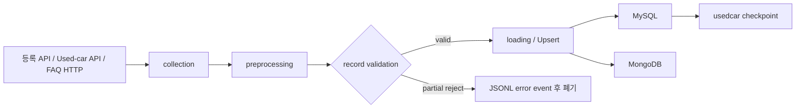
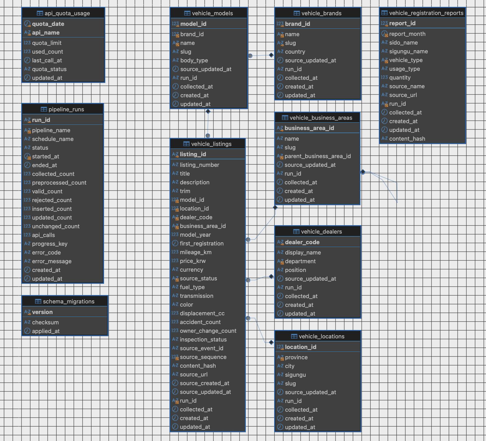

# 중고 자동차 영업·고객지원 데이터 통합 솔루션

> 구현 기준일: 2026-08-13
>
> 실행 진입점: `python -m src.main`

전국 판매망을 운영하는 중고 자동차 판매사를 가상의 고객사로 두고, 자동차 등록현황·중고차 매물·FAQ를 수집하고 검증한 뒤 MySQL과 MongoDB에 멱등하게 적재하는 Python 데이터 파이프라인이다. 현재 저장소의 제품 범위는 **수집 → 전처리 → 검증 → Upsert → 체크포인트**까지이며, 사용자용 조회 API와 대시보드는 아직 구현하지 않았다.

## 1. 팀

- 팀명: `MLO-01-03`

| 이름 | 역할 | GitHub |
|---|---|---|
| 김남동 | 팀장 | [@rlaskaehd](https://github.com/rlaskaehd) |
| 신성민 | 팀원 | [@gururr-lab](https://github.com/gururr-lab) |
| 이인건 | 팀원 | [@2eelogan](https://github.com/2eelogan) |
| 이재원 | 팀원 | [@vvjeffvv3](https://github.com/vvjeffvv3) |

## 2. 현재 구현 범위

| 파이프라인 | 원천 | 전처리·식별 기준 | 운영 저장소 | 상태 관리 |
|---|---|---|---|---|
| 자동차 등록현황 | 국토교통부 통계 Open API | 월별 wide 지표를 세부 지표로 정규화, `총계>*`와 `*>계` 제외, 월·지역·차종·용도 복합 키 | MySQL `vehicle_registration_reports` | 로컬 period state, SQL sink의 MySQL `api_quota_usage` |
| 중고차 | 프로젝트 통합 API의 snapshot/changes | `listing_id` 기준 canonical aggregate와 `content_hash`, sparse 증분 병합 | MySQL의 listing 및 5개 dimension 테이블 | MySQL `pipeline_runs.progress_key`, 로컬 checkpoint fallback |
| FAQ | 허용된 `/faqs` HTTP 경로 | `faq_id`와 `content_hash` | MongoDB `support_db.faq` | 별도 source checkpoint 없음 |

세 파이프라인은 `src/collection`, `src/preprocessing`, `src/loading`, `src/pipelines`로 분리되어 있다. `src.main`에서 `all`을 선택하면 매 cycle마다 **registration → usedcar → FAQ** 순서로 실행하며 하나의 top-level `run_id`를 공유한다.



## 3. 실행 환경

<details>
<summary>펼치기</summary>

### 3.1 저장소의 독립 환경 사용

프로젝트 루트의 `.venu`가 준비되어 있으면 Conda를 활성화하지 않고 바로 실행할 수 있다.

```bash
.venu/bin/python --version
.venu/bin/python -m src.main --help
```

새 checkout에서 환경을 다시 만들 때는 Python 3.12 이상을 사용한다.

```bash
python3 -m venv .venu
.venu/bin/python -m pip install --upgrade pip
.venu/bin/python -m pip install -r requirements.txt
```

현재 shell에서 일반 `python` 명령을 쓰고 싶으면 다음처럼 활성화한다.

```bash
source .venu/bin/activate
```

### 3.2 환경변수

`.env.example`을 `.env`로 복사한 뒤 실제 원천과 저장소 값을 입력한다. 비밀값은 Git에 커밋하지 않는다.

```bash
cp .env.example .env
```

Live SQL sink에는 `SQL_HOST` 또는 `SQL_JDBC_URL`, `SQL_USER`가 필요하다. `APP_ENV=production`에서는 SQL password와 credential이 포함된 명시적 `MONGODB_URI`도 필수다. 주요 조절값은 다음과 같다.

| 변수 | 기본/제약 | 용도 |
|---|---|---|
| `USED_CAR_BATCH_SIZE` | 기본 500, 최대 500 | 중고차 page 크기 |
| `USED_CAR_INITIAL_TARGET` | 기본 10,000 | initial snapshot 목표 건수 |
| `USED_CAR_INTERVAL_SECONDS` | 최소 1초 | 중고차 API 요청 간격 |
| `FAQ_MAX_PAGES` | 최대 2 | FAQ 탐색 범위 |
| `FAQ_MAX_QUESTIONS_PER_PAGE` | code 기본 500, `.env.example` 10 | 양수 호환 설정값이며 현재 collector는 원천 건수를 잘라내지 않음 |
| `FAQ_INTERVAL_SECONDS` | 최소 1초 | FAQ 요청 간격 |
| `REGISTRATION_DAILY_QUOTA` | 최대 3,000 | 등록현황 일일 호출 한도 |
| `REGISTRATION_START_PERIOD` | 선택값 `YYYY-MM` | CLI period 미지정 시 수집월 |
| `OUTPUT_DIR`, `LOG_PATH` | 기본 `output` 하위 | 결과·상태·JSONL 로그 경로 |

</details>

## 4. DB 준비

Forward migration은 기존 데이터를 보존하면서 아직 적용되지 않은 migration만 수행한다.

```bash
.venu/bin/python migrations/sql/run.py
.venu/bin/python migrations/mongo/ensure_indexes.py
```

MySQL migration은 `sales_support_db`의 10개 테이블과 6개 FK를 생성한다. Mongo migration은 `support_db.faq`에 strict validator와 `faq_id` unique index를 포함한 index를 보장한다. `application_logs` SQL 테이블은 현재 필수 운영 계약이 아니며 migration이 생성하지 않는다.

다음 명령은 대상 애플리케이션 DB의 테이블 또는 collection을 **전부 삭제하고 재생성**하므로, 백업과 대상 확인 없이 실행하면 안 된다.

```bash
.venu/bin/python migrations/sql/rebuild.py \
  --confirm-data-database sales_support_db

.venu/bin/python migrations/mongo/rebuild.py \
  --confirm-database support_db
```

## 5. 실행 방법

<details>
<summary>펼치기</summary>

### 5.1 전체 Live 무한 실행

`--profile live`에서 `--once`를 생략하면 기본 60초 간격으로 계속 실행한다. 실패한 cycle은 정제된 오류를 stderr에 남기고 다음 cycle을 계속 시도한다. `Ctrl+C`, `SIGINT`, `SIGTERM`을 받으면 현재 cycle 뒤 종료한다.

```bash
.venu/bin/python -m src.main \
  --pipeline all \
  --profile live \
  --registration-sink sql \
  --usedcar-sink sql \
  --faq-sink mongo \
  --mode auto
```

간격은 `--loop-interval-seconds 300`처럼 변경할 수 있다. 현재 구현은 source별 독립 scheduler가 아니라 하나의 공통 반복 주기를 사용한다.

### 5.2 한 cycle만 실행

```bash
.venu/bin/python -m src.main \
  --pipeline all \
  --profile live \
  --once \
  --registration-sink sql \
  --usedcar-sink sql \
  --faq-sink mongo \
  --mode auto
```

개별 실행 예시는 다음과 같다.

```bash
# 게시 데이터가 존재하는 월을 명시하는 등록현황 실행
.venu/bin/python -m src.main --pipeline registration --profile live --once \
  --sink sql --period 2026-07

# checkpoint 유무에 따라 initial/incremental을 자동 선택
.venu/bin/python -m src.main --pipeline usedcar --profile live --once \
  --sink sql --mode auto

.venu/bin/python -m src.main --pipeline faq --profile live --once \
  --sink mongo
```

`--dry-run`은 실제 source를 읽고 변환·검증하되 sink write와 상태 저장을 생략한다. `fixture` profile은 안전한 기본값이지만 선택한 각 파이프라인의 fixture 경로를 반드시 전달해야 하며 한 cycle만 실행한다.

</details>

## 6. 데이터 정합성 및 실패 정책

- business key가 없으면 insert, key와 내용이 모두 같으면 unchanged, 내용이 바뀌면 update한다.
- 현재 source에서 다시 보이지 않는 중고차·FAQ를 자동 삭제하지 않는다. 현재 FAQ transformer는 수집된 유효 문서를 `is_active=true`로 정규화한다.
- 중고차 SQL sink의 dimension과 listing, `pipeline_runs` checkpoint는 한 SQL transaction으로 처리한다.
- 중고차 checkpoint는 성공한 적재 뒤에만 전진하고, source sequence 역행이나 dataset epoch 변경은 적재 전에 차단한다.
- 일부 record만 거부되면 오류 로그를 남기고 해당 record를 버린 뒤 valid record 적재와 증분 처리를 계속한다.
- 수집된 record가 전부 거부되면 실행을 실패 처리하고 적재와 checkpoint 진행을 중단한다.
- 정상적인 빈 등록현황 응답과 중고차 steady state는 0건 성공으로 처리하며 기존 checkpoint를 유지한다.
- FAQ의 현재 Live 관측값은 24건이지만 제품 계약은 고정 24건이 아니라 source가 제공하는 유효 문서 전체다.

## 7. 저장 구조

### MySQL

- 중고차: `vehicle_brands`, `vehicle_models`, `vehicle_locations`, `vehicle_dealers`, `vehicle_business_areas`, `vehicle_listings`
- 등록현황: `vehicle_registration_reports`
- 운영: `pipeline_runs`(현재 중고차 SQL batch/checkpoint), `api_quota_usage`, `schema_migrations`

### MongoDB

- `support_db.faq`: FAQ 1건당 1 document, business key `faq_id`
- `uq_faq_id`, `ix_faq_brand_category`, `ix_faq_updated_at`
- four timestamp fields는 BSON Date로 저장하고 validator는 `strict/error`다.

## 8. 검증 기준선

2026-08-13 최종 구현 기준 검증 결과는 다음과 같다.

| 검증 | 결과 |
|---|---:|
| Mock 전체 | `98 passed` |
| Live 미포함 기본 전체 | `191 passed, 7 skipped` |
| 실제 격리 Live 단독 | `7 passed` |
| Live 포함 전체 | `198 passed` |
| DB 초기화 후 운영 관측 | 정확히 300초, 15회 invocation 모두 exit code 0 |

5분 관측 종료 시 중고차 listing 10,028건에서 business key 중복과 FK orphan은 모두 0이었고 checkpoint는 역행하지 않았다. FAQ는 24건 최초 insert 뒤 네 번의 동일 수집에서 총 96건 unchanged였다. 등록현황은 당시 기본값인 2026-08 원천이 0건을 반환했으므로 해당 관측 창만으로 Live Upsert를 재입증하지는 못했다.

```bash
.venu/bin/python -m pytest -q

MLO_LIVE_TESTS=1 MLO_LIVE_WRITE=1 \
  .venu/bin/python -m pytest -q tests/live/test_live_operational.py
```

Live 테스트는 실제 API와 격리 DB에 write한 뒤 정리한다. 환경변수와 write opt-in이 없으면 Live 테스트는 skip된다.

## 9. 현재 한계

- 사용자용 조회 API, 화면, 대시보드, 알림은 구현 범위 밖이다.
- source별 cron/스케줄러가 없고 `src.main`의 공통 반복 주기만 제공한다.
- 등록현황의 최신 게시월 탐색, 과거 15년 자동 backfill, 누락월 자동 보충은 구현하지 않았다.
- 동일 파이프라인의 여러 process 중복 실행을 막는 분산 lock은 없다.
- source에서 사라진 중고차·FAQ의 자동 삭제/tombstone 정책은 구현하지 않았다.
- AWS 고가용성 구성은 설계·PoC·비용 산정 대상이며 이 저장소가 실제 배포 상태를 증명하지 않는다.

## 10. 저장소 구조
<details>
<summary>펼치기</summary>

```text
src/
├── collection/       # API/HTML/fixture 수집과 retry
├── preprocessing/    # 정규화, validation, content hash
├── loading/          # JSONL/MySQL/Mongo Upsert와 transaction
├── pipelines/        # pipeline별 orchestration과 checkpoint 정책
├── common/           # 설정, 계약, 시간, 로그, hash
└── main.py           # 공통 CLI와 Live 반복 실행
...
migrations/
├── sql/              # V001, forward runner, destructive rebuild
└── mongo/            # FAQ validator/index, destructive rebuild
...
tests/
├── mock/             # 외부 연결 없는 운영 계약 검증
└── live/             # 실제 API + 격리 MySQL/MongoDB 검증
```

</details>


## 11. 한 줄 회고

| 이름 | 회고 |
|---|---|
| 김남동 | 팀장으로써 프로젝트 기획을 해보며 소통과 기획의 중요성에 대해서 느낄 수 있었고, 협업 과정에서 일어날 수 있는 다양한 경우를 경험하며 많이 성장할 수 있었습니다. |
| 신성민 | AWS 인프라를 직접 구축하고 문제를 해결하며 구조를 빠르게 이해할 수 있었고, 협업 과정에서도 많은 것을 배우고 느낄 수 있었습니다.  |
| 이인건 | 데이터 수집, 정제, 적재의 진행과정과 데이터 파이프라인의 이해도를 한층 높일 수 있었습니다. |
| 이재원 | 데이터 파이프라인의 이해도와 모듈화의 이해를 배웠고 협업에서처럼 깃허브와 깃을 많이 써볼 수 있었지만 문서화의 중요성과 개인 능력의 한계를 느껴 보완이 필요함을 느꼈습니다.  |

## 참고
**google slides의 경우 모바일 환경 등 특정 환경에서 호환성 이슈가 발생하는 것을 확인하였습니다. 정상적으로 보이지 않으신다면 pdf를 이용해주세요.**
[발표 프레젠테이션(google slides)](https://docs.google.com/presentation/d/1q6dqrgJ93li7-NxwBoWGouH_7fNKjvou/edit?usp=sharing&ouid=109121084513100010660&rtpof=true&sd=true)
[발표 프레젠테이션(pdf)](https://drive.google.com/file/d/1khzJeqOZpARSaCunnhhnLmzFZS9U2gVg/view?usp=sharing)
