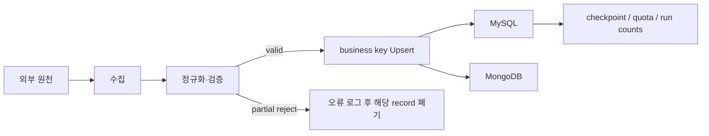

# BRD — 중고 자동차 영업·고객지원 데이터 통합 솔루션

| 항목 | 내용 |
|---|---|
| 문서 상태 | 현재 구현 기준선(As-built) |
| 기준일 | 2026-08-13 |
| 구현 범위 | 데이터 수집·전처리·검증·Upsert·체크포인트·운영 로그 |
| 구현 진입점 | `src/main.py` |
| 비용 정본 | [Cost_Estimation.md](Cost_Estimation.md) |
| 실행 검증 근거 | [운영 테스트 및 데이터 정합성 이슈 보고서](issues/operational_test_issues.md) |

이 문서는 비즈니스 목적과 현재 제품이 실제로 제공하는 범위를 함께 정의한다. 영업·고객지원 담당자가 사용할 최종 조회 경험은 비즈니스 목표이지만, 현재 저장소가 구현한 제품은 그 조회 경험에 필요한 **정합성 있는 데이터 파이프라인과 저장 계층**이다. 조회 API, 화면, 대시보드가 아직 없는 항목은 데이터 기반 구현과 최종 사용자 기능을 구분해 표시한다.

## 1. 프로젝트 개요

### 1.1 프로젝트명

중고 자동차 영업·고객지원 데이터 통합 솔루션

### 1.2 배경

자동차 등록현황, 중고차 매물, 고객 FAQ는 출처·형식·갱신 방식이 서로 다르다. 담당자가 각 원천을 직접 찾아 수작업으로 비교하면 다음 문제가 발생한다.

- 동일 지표의 집계·세부 행이 섞여 시장 규모가 이중 집계될 수 있다.
- 같은 매물이 반복 수집되거나 변경된 매물이 신규 건으로 오인될 수 있다.
- 중고차의 제조사·모델·지역·딜러·영업권역 관계가 일관되게 유지되지 않을 수 있다.
- FAQ의 중복·변경·출처를 체계적으로 확인하기 어렵다.
- 외부 API 오류, 부분 불량 데이터, 적재 실패와 마지막 성공 위치를 운영자가 구분하기 어렵다.

따라서 데이터별 business key, 변경 판정, 검증, 저장 및 증분 처리 규칙을 통합한 파이프라인이 필요하다.

## 2. 비즈니스 문제 정의

### 2.1 시장 데이터

지역·차종·용도별 자동차 등록현황은 영업 권역과 차량 확보 전략의 기초 자료다. 원천의 wide 지표에는 세부값과 `총계>*`, `*>계` 집계값이 함께 포함될 수 있어, 이를 그대로 저장하거나 합산하면 잘못된 의사결정으로 이어질 수 있다.

### 2.2 중고차 매물

매물은 가격·상태·주행거리뿐 아니라 제조사·모델·지역·딜러·영업권역과 연결된다. 신규·동일·변경 이벤트를 구분하고, 여러 매물이 공유하는 dimension이 바뀌어도 최종 aggregate와 hash가 일치해야 한다.

### 2.3 FAQ

FAQ는 질문·답변뿐 아니라 브랜드, 카테고리, 출처, 라이선스와 갱신 시각을 보존해야 한다. 현재 원천에서 24건이 관측되지만 이 숫자를 제품 규칙으로 고정하면 원천 증감에 대응할 수 없다.

### 2.4 운영

운영자는 단순 적재 건수보다 다음을 확인할 수 있어야 한다.

- 수집·전처리·유효·거부·insert·update·unchanged·API 호출 수
- 실패한 단계와 정제된 오류 코드
- 중고차의 마지막 성공 sequence와 checkpoint 비후퇴 여부
- 등록현황 API quota 사용량
- DB business key 중복, FK orphan, MongoDB validator/index 상태

## 3. 프로젝트 목적

1. 세 원천을 재현 가능한 공통 pipeline 구조로 수집한다.
2. business key와 canonical content를 기준으로 데이터 정합성을 유지한다.
3. 반복 실행 시 중복을 만들지 않고 실제 변경만 갱신한다.
4. 부분 불량은 정상 데이터와 격리하고, 전체 불량은 진행 위치를 보존한다.
5. 운영자가 실행 결과와 마지막 성공 상태를 확인할 수 있는 근거를 남긴다.
6. 향후 조회 API와 화면이 사용할 수 있는 신뢰 가능한 저장 기반을 만든다.

## 4. 목표와 현재 제공 수준

| 목표 | 현재 제공 수준 |
|---|---|
| 지역·차종·용도별 시장 데이터 확보 | MySQL 세부 지표 적재 구현. 사용자 조회 UI는 미구현 |
| 현재 중고차 매물 기반 확보 | MySQL 정규화 적재 및 변경 Upsert 구현. 조회 API/UI는 미구현 |
| 브랜드·카테고리별 FAQ 기반 확보 | MongoDB document 적재 구현. 검색 UI는 미구현 |
| 중복·변경·불량 데이터 통제 | 세 pipeline의 business key, content hash, reject 정책 구현 |
| 증분 처리와 복구 가능성 | 중고차 sequence checkpoint 구현. 등록현황은 선택 월 state, FAQ는 checkpoint 없음 |
| 운영 상태 확인 | JSONL structured event와 CLI 결과 구현. SQL `pipeline_runs`는 현재 중고차만 기록 |
| source별 최적 스케줄 | 미구현. 현재 공통 Live loop가 모든 선택 pipeline에 같은 주기를 적용 |
| AWS 고가용성 운영 | 설계·PoC·비용 산정 단계이며 현재 저장소가 배포 상태를 증명하지 않음 |

## 5. 이해관계자

| 이해관계자 | 필요한 가치 | 현재 직접 사용 가능 여부 |
|---|---|---|
| 영업 담당자 | 지역 시장 규모, 조건별 매물, 영업권역 정보 | 데이터는 적재되지만 전용 조회 제품은 없음 |
| 고객지원 담당자 | 브랜드·카테고리별 최신 FAQ | 데이터는 적재되지만 전용 검색 제품은 없음 |
| 데이터 운영자 | 실행·거부·변경·checkpoint·quota 확인 | CLI, JSONL, MySQL/MongoDB로 확인 가능 |
| 개발자 | 모듈별 계약, migration, 재현 가능한 테스트 | 코드·migration·Mock/Live suite 제공 |
| 관리자/의사결정자 | 구축·운영 범위와 비용 추정 | 문서 기반으로 제공, 실제 청구·배포 근거는 아님 |

## 6. As-Is와 To-Be

### 6.1 As-Is

- 데이터 원천마다 호출·형식·식별자가 달라 동일한 기준으로 관리하기 어렵다.
- 반복 수집에서 신규·변경·동일 건을 안정적으로 구분하기 어렵다.
- 집계행과 세부행, sparse change payload, 공유 dimension 변경이 정합성 문제를 만들 수 있다.
- 실패 이후 어디부터 다시 처리해야 하는지 일관된 기준이 없다.

### 6.2 현재 MVP To-Be

- 자동차 등록현황은 집계 지표를 제외하고 월·지역·차종·용도 grain으로 저장한다.
- 중고차는 정규화된 dimension과 listing을 한 transaction에서 Upsert한다.
- FAQ는 strict validator가 적용된 MongoDB document로 저장한다.
- 동일 입력은 unchanged, 실제 업무값 변경은 update로 분류한다.
- 부분 거부는 증분 처리를 계속하고 전체 거부는 실패 처리한다.

### 6.3 후속 To-Be

- 영업·고객지원 조회 API와 사용자 화면
- source별 scheduler와 서비스 운영 배포
- 등록현황 게시월 탐색·과거 backfill·누락월 보충
- 다중 process 중복 실행 방지와 고가용성 운영 절차

## 7. 프로젝트 범위

### 7.1 In Scope — 현재 구현

- 등록현황, 중고차, FAQ의 Live/fixture collection
- raw record 정규화, validation, content hash 생성
- record 단위 valid/rejected 분리
- JSONL, MySQL, MongoDB sink
- business key 기반 insert/update/unchanged
- 중고차 initial snapshot 및 sequence 기반 incremental
- 중고차 SQL checkpoint와 local fallback
- 등록현황 API quota 및 선택 월 state
- MySQL forward migration과 안전 확인이 필요한 destructive rebuild
- MongoDB validator/index migration과 destructive rebuild
- 공통 CLI, 단일 cycle, Live 무한 loop, graceful signal 종료
- Mock 및 격리 Live 운영 검증

### 7.2 Out of Scope — 현재 미구현

- 영업·고객지원 사용자용 API, 검색 화면, 대시보드
- 원천 데이터의 소유권·상용 라이선스 계약
- 등록현황 자동 최신 게시월 탐색, 15년 backfill, gap 보충
- source별 독립 cron 또는 workflow scheduler
- 동일 pipeline의 분산 lock과 다중 host leader election
- 원천에서 사라진 매물·FAQ의 자동 삭제 또는 tombstone 처리
- 원본 파일 장기 보관, 자동 백업·복구, 알림 시스템
- AWS production 배포, MySQL replication, MongoDB replica set의 실제 운영 보증
- 중고차 이미지 저장·전송 및 CDN

## 8. Business Requirements

상태 정의는 다음과 같다.

- **구현**: 현재 저장소에서 해당 비즈니스 기반을 직접 제공한다.
- **부분**: 데이터 기반은 제공하지만 사용자 경험이나 일부 운영 기능이 없다.
- **계획**: 문서상 목표이며 현재 코드에는 없다.

| ID | 구분 | 비즈니스 요구사항 | 우선순위 | 현재 상태 |
|---|---|---|---|---|
| BR-01 | 시장 정보 | 지역별 자동차 등록현황을 활용할 수 있어야 한다. | Must | 부분 — 세부 데이터 적재, 조회 UI 없음 |
| BR-02 | 시장 정보 | 지역·차종·용도별 시장 규모를 비교할 수 있어야 한다. | Must | 부분 — 비교 가능한 grain 적재, 분석 화면 없음 |
| BR-03 | 시장 정보 | 특정 차량 유형의 지역별 비중을 확인할 수 있어야 한다. | Must | 부분 — 계산 가능한 세부 grain 적재, 비중 지표/UI 없음 |
| BR-04 | 매물 정보 | 현재 수집된 중고차 매물을 활용할 수 있어야 한다. | Must | 부분 — 최신 관측 상태 적재, 조회 UI 없음 |
| BR-05 | 매물 정보 | 차량 조건과 dimension으로 매물을 탐색할 수 있어야 한다. | Must | 부분 — 필드·관계·index 제공, 검색 API 없음 |
| BR-06 | 매물 정보 | 차량 상태와 판매 상태를 확인할 수 있어야 한다. | Must | 부분 — source status 적재, 조회 UI 없음 |
| BR-07 | 매물 정보 | 지역·딜러·영업권역별 매물을 구분할 수 있어야 한다. | Should | 부분 — 관계형 데이터 제공, 화면 없음 |
| BR-08 | 영업 활용 | 시장 데이터와 매물 데이터를 함께 분석할 수 있어야 한다. | Should | 부분 — 같은 MySQL에 저장, 결합 서비스/지표 없음 |
| BR-09 | 고객지원 | FAQ를 브랜드·카테고리별로 활용할 수 있어야 한다. | Must | 부분 — MongoDB/index 제공, 검색 UI 없음 |
| BR-10 | 고객지원 | 고객 문의 대응 정보를 신속하게 탐색할 수 있어야 한다. | Must | 부분 — 검색 가능한 index 제공, 검색 UI 없음 |
| BR-11 | 데이터 품질 | 업무 데이터는 정의된 schema와 business key를 충족해야 한다. | Must | 구현 |
| BR-12 | 운영 | 실행 성공·실패와 오류 단계를 확인할 수 있어야 한다. | Must | 구현 — CLI/JSONL |
| BR-13 | 운영 | 처리 과정에서 발생한 문제를 확인할 수 있어야 한다. | Must | 구현 — stage/logic/error JSONL event |
| BR-14 | 운영 | 데이터별 마지막 정상 갱신 시점을 확인할 수 있어야 한다. | Should | 부분 — event·row timestamp 제공, 통합 화면 없음 |
| BR-15 | 운영 | pipeline별 처리 규모와 Upsert 결과를 확인할 수 있어야 한다. | Should | 부분 — CLI/JSONL, SQL run history는 중고차만 |
| BR-16 | 비용 관리 | 주요 구축·운영 비용 항목을 식별할 수 있어야 한다. | Must | 문서 구현 |
| BR-17 | 비용 관리 | 예상 운영비 범위를 산정할 수 있어야 한다. | Must | 문서 구현 |
| BR-18 | 빌링 | 솔루션 제공 비용의 산정 기준을 정의해야 한다. | Must | 계획 — 후보 기준만 정의 |
| BR-19 | 빌링 | 실제 범위 확정 후 예상 서비스 비용을 제시할 수 있어야 한다. | Must | 계획 — 계약·실측 후 확정 필요 |
| BR-20 | 데이터 품질 | 등록현황의 집계행과 세부행을 중복 합산하지 않아야 한다. | Must | 구현 — `총계>*`, `*>계` 제외 |
| BR-21 | 운영 | 부분 거부와 전체 거부를 구분하고 데이터 유실 없이 처리해야 한다. | Must | 구현 |
| BR-22 | 매물 정보 | 같은 매물의 실제 업무값 변경과 동일 재수집을 구분해야 한다. | Must | 구현 — canonical content/hash 기반 |

## 9. Business Rules

기존 비즈니스 규칙 ID의 의미를 유지하고 현재 충족 상태를 함께 표시한다.

### 9.1 기존 비즈니스 규칙

| ID | 규칙 | 현재 상태 |
|---|---|---|
| BRULE-01 | 시장 데이터는 지역을 구분할 수 있어야 한다. | 구현 |
| BRULE-02 | 시장 데이터는 차량 유형을 구분할 수 있어야 한다. | 구현 |
| BRULE-03 | 지역별 차량 유형 비중은 동일 기준의 전체 차량 규모로 산정한다. | 부분 — 세부 데이터만 제공, 비중 산식/제품 없음 |
| BRULE-04 | 불완전한 시장 데이터는 정상 데이터와 구분한다. | 구현 — record reject |
| BRULE-05 | 각 중고차 매물을 개별 식별할 수 있어야 한다. | 구현 — `listing_id` |
| BRULE-06 | 판매 중과 판매 완료 상태를 구분한다. | 구현 — source status 보존 |
| BRULE-07 | 반복 확인된 동일 매물을 신규 매물로 판단하지 않는다. | 구현 — Upsert |
| BRULE-08 | 가격·상태 등 주요 정보 변경을 확인할 수 있어야 한다. | 구현 — content 비교/update |
| BRULE-09 | 주요 정보가 누락된 매물은 정상 매물과 구분한다. | 구현 — record reject |
| BRULE-10 | 차량 상태·이력은 원본 의미가 왜곡되지 않도록 보존한다. | 구현 — canonical transform/sparse merge |
| BRULE-11 | FAQ는 문의 유형 또는 카테고리를 가져야 한다. | 구현 |
| BRULE-12 | 불완전한 FAQ는 정상 FAQ와 구분한다. | 구현 — record reject |
| BRULE-13 | 반복 확보된 동일 FAQ의 중복 여부를 확인한다. | 구현 — `faq_id`/hash |
| BRULE-14 | 데이터는 업무 활용 전에 처리 성공 여부를 확인한다. | 구현 — lifecycle event/result |
| BRULE-15 | 처리 문제와 정상 데이터를 구분한다. | 구현 — reject/failure event |
| BRULE-16 | 데이터 갱신 성공 여부를 확인할 수 있어야 한다. | 구현 — CLI/JSONL, 중고차 SQL run |
| BRULE-17 | 마지막 정상 갱신 시점을 확인할 수 있어야 한다. | 부분 — event와 row timestamp, 통합 화면 없음 |
| BRULE-18 | 데이터 변경 주기가 다르므로 동일 갱신 주기를 일괄 적용하지 않는다. | 미충족 — 현재 `all`은 공통 loop interval 사용 |

### 9.2 현재 구현에서 확정한 추가 규칙

| ID | 규칙 | 현재 상태 |
|---|---|---|
| BRULE-19 | 등록현황의 `vehicle_type == 총계` 또는 `usage_type == 계`는 quantity 검증과 hash 전에 제외한다. | 구현 |
| BRULE-20 | 등록현황 business key는 `report_month + sido_name + sigungu_name + vehicle_type + usage_type`다. | 구현 |
| BRULE-21 | 등록현황 한 실행은 CLI period, 설정 period, 현재 KST 월 순으로 선택한 정확히 한 달을 조회한다. | 구현 |
| BRULE-22 | 매물 business key는 `listing_id`이며 `listing_number`는 속성이다. | 구현 |
| BRULE-23 | sparse 중고차 payload는 기존 값과 병합한 최종 aggregate로 hash를 계산하고 공유 dimension 변경의 영향을 함께 반영한다. | 구현 |
| BRULE-24 | 중고차 SQL sink의 data write와 `pipeline_runs.progress_key`가 같은 transaction에서 성공해야 SQL checkpoint가 전진한다. | 구현 |
| BRULE-25 | FAQ 24건은 관측값이지 고정 제품 수량이 아니다. source의 유효 FAQ 전체를 처리한다. | 구현 |
| BRULE-26 | 일부 record만 거부되면 폐기 후 valid data 처리를 계속하고, 전부 거부되면 적재와 checkpoint 진행을 중단한다. | 구현 |
| BRULE-27 | source에서 한 번 보이지 않았다는 이유만으로 중고차·FAQ를 자동 삭제하지 않는다. 수집된 FAQ는 현재 `is_active=true`로 정규화한다. | 구현 |
| BRULE-28 | `application_logs` SQL 테이블은 필수 계약이 아니며 공통 운영 event는 JSONL을 기준으로 한다. | 구현 |
| BRULE-29 | Live `all`의 runtime 실패는 뒤 pipeline을 같은 cycle에서 중단하지만 process는 다음 cycle을 계속한다. | 구현 |
| BRULE-30 | fixture·sink·정적 설정 오류는 첫 pipeline 실행 전에 모두 검증한다. | 구현 |

## 10. 비즈니스 활용 시나리오

### 10.1 지역 시장 분석

운영자가 게시 데이터가 있는 월을 지정해 등록현황을 적재한다. 집계 지표는 제외되고 세부 지표만 composite key로 저장된다. 이후 조회 서비스는 월·지역·차종·용도별 시장 비교를 제공할 수 있다.

### 10.2 매물 동기화

초기 실행은 bounded snapshot을 적재하고 증분 watermark를 확정한다. 이후 실행은 마지막 성공 sequence 이후의 changes를 읽는다. 동일 매물은 중복 생성하지 않고 실제 변경만 갱신한다.

### 10.3 고객 문의 데이터 준비

FAQ를 허용된 경로에서 수집해 strict schema로 검증하고 MongoDB에 Upsert한다. 후속 고객지원 제품은 브랜드·카테고리 index를 이용해 검색할 수 있다.

### 10.4 불량 데이터 대응

한 batch의 일부 데이터만 불량이면 해당 record를 로그로 남기고 정상 데이터를 처리한다. 전부 불량이면 checkpoint를 유지해 수정 전 데이터 유실을 방지한다. 이 정책은 poison batch가 수정될 때까지 반복 실패할 수 있다는 운영 비용을 수반한다.

### 10.5 반복 운영

운영자는 Live loop를 실행하고 JSONL event, CLI 결과, MySQL `pipeline_runs`, quota 및 최종 DB 정합성을 확인한다. `all`은 하나의 transaction이 아니므로 앞 pipeline이 성공한 뒤 뒤 pipeline이 실패할 수 있다.

## 11. 성공 기준

### 11.1 제품 수용 기준

- 저장소에 business key가 없으면 insert한다.
- 같은 key와 같은 canonical content는 중복 write 없이 unchanged다.
- 같은 key의 business content 변경은 update된다.
- row/document 수와 distinct business key 수가 일치한다.
- 중고차 SQL schema의 FK와 parent-child 관계에 orphan이 없다.
- 중고차 checkpoint는 성공 적재 뒤에만 전진하며 역행하지 않는다.
- FAQ validator와 필수 index가 migration 정의와 일치한다.
- 처리 건수는 pipeline별 collection/preprocess/validation/load 의미에 맞게 기록된다.
- 비밀값이 CLI 결과와 JSONL event에 노출되지 않는다.

### 11.2 2026-08-13 검증 기준선

| 항목 | 결과 |
|---|---:|
| Mock 전체 | `98 passed` |
| 기본 전체 | `191 passed, 7 skipped` |
| 격리 Live | `7 passed` |
| Live 포함 전체 | `198 passed` |
| DB 재구축 후 Live 관측 | 300초, 15회 invocation 모두 exit code 0 |
| 중고차 최종 | 10,028 listings, duplicate 0, FK orphan 0 |
| FAQ 최종 | 24 documents, duplicate `faq_id` 0 |
| JSONL 관측 | INFO 156, ERROR 0 |

위 24건은 FAQ 제품 요구량이 아니라 해당 관측 시점의 원천 결과다. 등록현황은 2026-08 원천이 5회 모두 0건을 반환해 이 5분 창에서는 실데이터 Upsert가 재발생하지 않았다.

## 12. 제약사항 및 가정

### 12.1 제약사항

- 외부 API의 schema, 가용성, sequence 및 게시 시점에 의존한다.
- 현재 CLI loop는 process-local이며 서비스 관리자나 분산 scheduler가 아니다.
- `all` cycle은 pipeline 간 원자성을 제공하지 않는다.
- SQL canonical checkpoint는 현재 중고차에만 적용된다.
- JSONL 보존 기간, rotation, 중앙 수집과 알림은 구현하지 않았다.
- destructive rebuild는 애플리케이션 데이터를 삭제하므로 별도 백업과 명시적 확인이 필요하다.

### 12.2 가정

- `listing_id`, `faq_id`, 등록현황 composite key가 원천의 안정된 논리 식별자다.
- 중고차 changes API의 sequence와 dataset epoch 계약이 유지된다.
- 운영 DB credential과 네트워크 접근은 실행 환경에서 안전하게 제공된다.
- 조회 제품은 현재 저장 schema와 index를 기반으로 별도 구현한다.

## 13. 위험 요소

| ID | 위험 | 영향 | 현재 대응/후속 |
|---|---|---|---|
| RISK-01 | 외부 API 중단·schema 변경 | 수집 실패 또는 전체 거부 | retry, validation, 정제된 오류; 원천 계약 모니터링 필요 |
| RISK-02 | poison batch 전체 거부 | checkpoint 유지로 반복 실패 | 데이터 유실 방지 우선; 원천/전처리 수정 운영 절차 필요 |
| RISK-03 | 현재월 등록현황 미게시 | 정상 0건이 반복되어 freshness 저하 | 게시월을 명시; 자동 최신월 탐색은 후속 |
| RISK-04 | 다중 process 동시 실행 | quota·중복 호출·경합 | DB key/transaction은 보호하나 분산 lock은 후속 |
| RISK-05 | `all` 중간 runtime 실패 | 앞 pipeline만 적재된 부분 cycle | 실행 결과별 독립 확인; pipeline-level scheduler 후속 |
| RISK-06 | source 삭제 이벤트 부재 | 사라진 항목이 저장소에 남음 | 자동 삭제 금지; 명시적 tombstone 정책 필요 |
| RISK-07 | 임시 backup만 존재 | rebuild 이전 데이터 복구 불가 | 영구 backup/retention 체계 필요 |
| RISK-08 | 문서상 AWS 목표와 실제 배포 혼동 | 비용·가용성 과대 해석 | 목표 아키텍처와 현재 로컬/검증 구현을 분리 표기 |

## 14. 기대 효과

### 14.1 영업

- 시장 지표와 매물 데이터의 business grain이 명확해진다.
- 중복과 집계 오염 없이 후속 분석·조회 제품을 만들 수 있다.
- 지역·모델·딜러·영업권역 관계를 일관되게 활용할 수 있다.

### 14.2 고객지원

- FAQ의 중복과 내용 변경을 안정적으로 구분한다.
- 브랜드·카테고리·갱신 시각 기반 검색을 위한 저장 구조를 제공한다.

### 14.3 운영

- 부분 오류와 전체 실패, 정상 0건을 구분할 수 있다.
- 마지막 성공 checkpoint와 API quota를 복구·감사할 수 있다.
- migration과 실제 sink를 함께 검증해 schema drift 위험을 줄인다.

## 15. 비용 및 빌링

비용 수치와 가정의 정본은 [Cost_Estimation.md](Cost_Estimation.md)다. 아래 값은 서울 리전의 **목표 AWS 구성**을 전제로 한 계획 예산이며 현재 저장소의 실제 배포·청구 금액이 아니다.

| 구분 | 계획 예산 |
|---|---:|
| 초기 구축비 범위 | 약 6,000만~9,000만 원 |
| 초기 구축 기준 예산 | 약 8,100만 원 |
| 월 AWS 인프라 | 약 80만~300만 원 |
| 월 DB·운영 유지보수 | 약 560만~900만 원 |
| 월 총 운영비 | 약 640만~1,200만 원 |
| 중고차 데이터 공급료 포함 | 약 670만~1,350만 원 |
| 부가가치세 | 별도 |

실제 구현은 중고차와 등록현황을 MySQL, FAQ를 MongoDB에 저장한다. 비용 문서의 AWS topology·노드 수·Dashboard는 목표 설계이므로 실제 배포 범위 확정 시 현재 저장 책임과 다시 산정해야 한다. 최종 빌링은 사용량, 데이터 공급 계약, 보관 기간, 장애 대응 수준, 조회 제품 범위를 확정한 뒤 결정한다.

## 16. 구현 결정과 미확정 사항

### 16.1 확정된 결정

- 부분 거부는 유효 데이터 처리와 증분 진행을 계속한다.
- 전체 거부는 실패 처리하고 checkpoint를 유지한다.
- 등록현황의 `총계>*`, `*>계`는 적재 전에 제거한다.
- FAQ 24건은 관측값이며 제품 고정 수량이 아니다.
- `application_logs` SQL 적재는 정상 동작의 필수 조건이 아니다.
- Live profile은 `--once`가 없으면 기본 60초 간격의 무한 loop다.

### 16.2 후속 결정 필요

- 등록현황 최신 게시월 탐색과 backfill 우선순위
- source별 운영 주기와 scheduler 기술
- 동일 pipeline 분산 lock
- 명시적 삭제/tombstone 처리
- JSONL 중앙화·보존·알림 정책
- 사용자용 조회 API/UI의 범위와 SLA
- production AWS topology와 비용 재산정

## 17. 참고 및 ID 기준

| 문서 | 역할 |
|---|---|
| [README](../README.md) | 설치·migration·운영 실행 안내 |
| [PRD](Product_Requirements_Document.md) | 실제 기능·데이터·운영 계약 |
| [Data Specification](Data_Specification.md) | 데이터 명세 |
| [Requirements Traceability](Requirements_Traceability.md) | 요구사항과 근거 연결 |
| [MySQL 리포트](MySQL_Migration_and_Live_Operation_Report_2026-08-13.md) | SQL 관계·migration·Live 정합성 |
| [MongoDB 리포트](MongoDB_Migration_and_Live_Operation_Report_2026-08-13.md) | FAQ schema·index·Live 정합성 |

ID는 `BR-XX`(비즈니스 요구사항), `BRULE-XX`(비즈니스 규칙), `RISK-XX`(위험) 형식을 사용한다. 기존 ID는 삭제되더라도 다른 의미로 재사용하지 않는다.

## 변경 이력

| 날짜 | 변경 |
|---|---|
| 2026-08-13 | 현재 `src`, migration, Mock/Live 및 5분 운영 결과에 맞춰 구현/부분/계획 상태를 구분하고 실행·정합성·거부·비용 경계를 최신화 |
