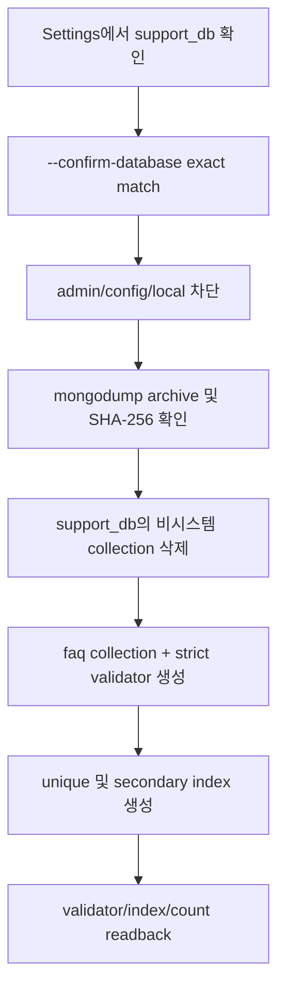

# MongoDB Migration 및 Live 운영 검증 리포트

- **프로젝트:** 자동차 렌탈·리스 기업 시장 분석 솔루션
- **작업일:** 2026-08-13
- **대상 DB / Collection:** `support_db.faq`
- **Migration 기준:** `migrations/mongo/ensure_indexes.py`
- **재구축 진입점:** `migrations/mongo/rebuild.py`
- **Live 관측 구간:** 2026-08-13 13:51:53 ~ 13:56:53 KST, 정확히 300.0초
- **검증 원칙:** document 수가 아니라 `faq_id` 유일성, strict validator, BSON type, index, insert/update/unchanged 분류를 기준으로 판정
- **보안 경계:** MongoDB URI와 credential은 본 보고서와 관측 로그에 기록하지 않음

---

## 1. 작업 개요와 최종 판정

설정에서 확인한 MongoDB 애플리케이션 DB는 `support_db`, collection은 `faq`였다. 시스템 DB인 `admin`, `config`, `local`은 삭제 대상에서 명시적으로 제외하였다.

삭제 전 archive backup을 생성하고 SHA-256을 확인한 뒤 `support_db`의 비시스템 collection을 삭제하였다. 이후 canonical migration으로 `faq` collection, strict validator, index를 재생성하고 FAQ Live pipeline을 5분 동안 5회 실행하였다.

| 항목 | 판정 | 근거 |
|---|---|---|
| Migration 재현 | 정상 | 빈 collection 생성, strict/error validator와 3개 명시 index 적용 |
| 최초 적재 | 정상 | 실제 source 24건 → insert 24 |
| 동일 source 재실행 | 정상 | 4회×24건 → unchanged 96, document 수 24 유지 |
| Update | 미발생 | 관측 창 안에 source 내용 변경이 없어 update 0 |
| Business key 유일성 | 정상 | duplicate `faq_id` 0 |
| BSON validator | 정상 | required field와 네 timestamp의 BSON Date 계약 일치 |
| 거부·오류 | 정상 | 5회 모두 rejected 0, return code 0, ERROR event 0 |

FAQ가 현재 24건이라는 사실은 관측값이다. migration과 pipeline은 24를 제품 고정값으로 사용하지 않으며 source가 반환한 전체 document 수를 동적으로 처리한다.

---

## 2. FAQ Collection의 제품상 역할

`faq` collection은 제조사·카테고리별 고객지원 질문과 답변을 검색·제공하기 위한 비정형 document 저장소다.

이 collection이 없으면 다음 문제가 발생한다.

1. 고객지원 화면이나 검색 기능이 질문·답변을 조회할 source of truth를 잃는다.
2. source URL, license, attribution이 보존되지 않아 콘텐츠 provenance를 확인할 수 없다.
3. 같은 FAQ를 반복 수집할 때 신규·변경·동일 상태를 구분할 수 없다.
4. brand/category별 탐색과 갱신 시각 기준 운영 확인이 불가능하다.
5. HTML source의 변동으로 malformed document가 들어와도 storage boundary에서 차단할 수 없다.

Document grain은 FAQ 항목 1개당 1 document이며 business key는 `faq_id`다. MongoDB 내부 `_id`는 저장 엔진 식별자이고, 제품 Upsert와 중복 판단은 `faq_id`를 사용한다.

---

## 3. Document Schema와 BSON Type

### 3.1 Required field

| Field | BSON type | 소유 단계 | 의미 / 필요성 |
|---|---|---|---|
| `faq_id` | `string` | preprocessing | 안정 business key, Upsert와 중복 방지 기준 |
| `question` | `string` | preprocessing | 사용자에게 노출되는 질문 본문 |
| `answer` | `string` | preprocessing | 고객지원 답변 본문 |
| `brand` | `string` | preprocessing | 제조사별 탐색·분류 |
| `category` | `string` | preprocessing | 업무 주제별 탐색·분류 |
| `source_url` | `string` | collection/preprocessing | 원문 provenance와 검토 경로 |
| `source_updated_at` | `date` | preprocessing → repository 변환 | source 콘텐츠 기준 변경 시각 |
| `license` | `string` | preprocessing | 콘텐츠 이용 조건 |
| `attribution` | `string` | preprocessing | 출처 표기 정보 |
| `content_hash` | `string` | preprocessing | 같은 `faq_id`의 실제 내용 변경 판정 |
| `is_active` | `bool` | preprocessing | 현재 사용 가능한 FAQ인지 표시 |
| `run_id` | `string` | pipeline | 수집 실행 provenance |
| `collected_at` | `date` | collection → repository 변환 | source 수집 시각 |
| `created_at` | `date` | loading | document 최초 생성 시각, update 시 보존 |
| `updated_at` | `date` | loading | 실제 insert/update write 시각 |

Python stage 사이에서는 timestamp를 canonical ISO 8601 문자열로 운반한다. Mongo repository 경계에서 `source_updated_at`, `collected_at`, `created_at`, `updated_at`을 timezone-aware UTC `datetime`으로 변환해 BSON Date로 저장한다.

### 3.2 Strict validator가 필요한 이유

Migration은 다음 validation contract를 적용한다.

```text
validationLevel = strict
validationAction = error
validator = FAQ JSON Schema
```

- `strict`는 신규 insert뿐 아니라 기존 document update에도 schema를 적용한다.
- `error`는 잘못된 type이나 필수 field 누락을 경고로 통과시키지 않고 write 자체를 실패시킨다.
- timestamp를 string과 date로 혼용하면 정렬·기간 검색·TTL 확장·driver readback이 불안정해지므로 BSON Date로 고정한다.
- `question`, `answer`, provenance, hash가 누락된 document는 제품 검색 결과로 사용하기에 불완전하므로 required로 강제한다.
- pipeline loader도 migration 적용 여부와 네 date property를 확인하므로 validator 없는 collection에 자동 적재하지 않는다.

삭제 전 기존 `faq` collection에는 24개 document가 있었지만 validator는 이전 field/type 계약이었다. 전면 초기화 후 canonical migration이 현재 required field와 BSON Date 계약을 가진 validator로 재생성하였다.

---

## 4. Index 설계 근거

| Index | 정의 | 필요성 | 없을 때 문제 |
|---|---|---|---|
| `_id_` | MongoDB 기본 `_id` ascending | storage engine 내부 document identity | MongoDB collection 기본 동작 불가 |
| `uq_faq_id` | `faq_id` ascending, unique | 제품 business key 중복 방지와 단건 Upsert | 같은 FAQ가 여러 document로 누적되어 검색·count 오염 |
| `ix_faq_brand_category` | `(brand, category)` ascending | 제조사·카테고리 복합 필터 | 고객지원 탐색 시 collection scan 증가 |
| `ix_faq_updated_at` | `updated_at` descending | 최근 변경 문서 조회와 freshness 확인 | 최신 갱신 목록·운영 확인 비용 증가 |

`content_hash`는 현재 단건 `faq_id` 조회 후 값 비교에 사용되므로 별도 index가 필요하지 않다. 무분별한 index 추가는 write 비용과 메모리 사용을 증가시키므로 실제 조회 계약이 있는 세 index만 명시적으로 유지한다.

---

## 5. SQL과 직접 FK가 없는 이유

MongoDB FAQ document와 MySQL 중고차·등록현황 table 사이에는 직접 FK가 없다.

1. FAQ는 고객지원 콘텐츠이고, 중고차 listing 및 등록현황은 영업·시장 데이터로 제품 bounded context가 다르다.
2. FAQ `brand`는 source 분류 문자열이며 MySQL `vehicle_brands.brand_id`와 동일한 master key 계약이 아니다.
3. MongoDB는 MySQL FK를 강제할 수 없고, 임의의 cross-store 참조를 만들면 한 DB 장애가 다른 pipeline 적재를 막는다.
4. 세 pipeline은 공통 CLI와 `run_id` 형태를 공유하지만 각 sink의 transaction 수명은 독립적이다.
5. FAQ의 runtime 증거는 CLI 반환값과 JSONL structured event에 남고, 중고차 checkpoint는 MySQL `pipeline_runs`에 남는다.

따라서 두 저장소의 결합이 필요할 경우 application/service layer에서 명시적인 mapping을 사용해야 하며, 현재 schema에 존재하지 않는 brand FK 관계를 추정해서는 안 된다.

---

## 6. Migration과 Rebuild 흐름

### 6.1 적용 파일

| 파일 | 역할 |
|---|---|
| `migrations/mongo/ensure_indexes.py` | `faq` 생성 또는 `collMod`, canonical validator와 index 보장 |
| `migrations/mongo/rebuild.py` | 정확한 DB명 확인 후 설정된 app DB의 비시스템 collection을 삭제하고 canonical migration 재적용 |

### 6.2 안전한 재구축 흐름



`rebuild.py`는 `system.*` collection을 건너뛰고 `admin`, `config`, `local` DB를 거부한다. 입력 DB명이 `Settings.mongo_database`와 정확히 일치하지 않으면 작업을 중단한다.

### 6.3 백업과 복구 경계

| 대상 | 임시 파일 | 크기 | SHA-256 |
|---|---|---:|---|
| `support_db` | `/private/tmp/mlo-db-backup-20260813-s9gwfB/mongodb-support-db.archive.gz` | 6,259 bytes | `f1419f7cc9a9204db0bdc3f0520c0251f61beaa1382ea917c5bb69928d02ce3a` |

이 archive는 `/private/tmp`의 임시 복구 지점이다. 영구 보존이 아니며 파일이 정리된 뒤에는 삭제 전 document를 복구할 수 없다.

---

## 7. 초기화 전후 Count와 Metadata

| 상태 | Collection | Document 수 | Validator | Index |
|---|---|---:|---|---|
| 삭제 전 | `support_db.faq` | 24 | 이전 FAQ 계약 | `_id_`, `uq_faq_id`, `ix_faq_brand_category`, `ix_faq_updated_at` |
| 재구축 직후 | `support_db.faq` | 0 | canonical strict/error, BSON Date | 동일 4개 |
| 5분 Live 종료 | `support_db.faq` | 24 | canonical contract 일치 | 동일 4개 |

최종 metadata readback 결과는 다음과 같다.

- collection 목록: `faq`
- document 수: 24
- duplicate `faq_id`: 0
- validator equality: true
- validation level: `strict`
- validation action: `error`
- index: `_id_`, `uq_faq_id`, `ix_faq_brand_category`, `ix_faq_updated_at`

---

## 8. 5분 Live 실행 결과

FAQ pipeline은 관측 시점의 `--once` CLI를 매 분 1회 실행하였다. 관측 종료 후 `src/main.py`가 갱신되어 현재 live profile은 `--once`를 생략하면 기본 60초 간격으로 계속 실행한다.

| 회차 | 시작 KST | 수집 | 유효 | 거부 | Insert | Update | Unchanged | 최종 document |
|---:|---|---:|---:|---:|---:|---:|---:|---:|
| 1 | 13:52:14 | 24 | 24 | 0 | 24 | 0 | 0 | 24 |
| 2 | 13:52:54 | 24 | 24 | 0 | 0 | 0 | 24 | 24 |
| 3 | 13:53:54 | 24 | 24 | 0 | 0 | 0 | 24 | 24 |
| 4 | 13:54:54 | 24 | 24 | 0 | 0 | 0 | 24 | 24 |
| 5 | 13:55:54 | 24 | 24 | 0 | 0 | 0 | 24 | 24 |
| **합계** |  | **120** | **120** | **0** | **24** | **0** | **96** | **24** |

동일 source 재실행은 `content_hash`가 같아 DB write를 생략하고 unchanged로 집계됐다. 최초 `created_at`과 저장 document 수가 유지되므로 idempotent Upsert가 확인됐다.

이 5분 창에는 source content 변경이 없었으므로 update는 0이다. 이는 update 기능 실패가 아니라 변경 입력 부재를 뜻한다. 실제 update 판정은 같은 `faq_id`에서 `content_hash`가 달라질 때만 발생한다.

### 8.1 최종 정합성

| 검증 | 결과 |
|---|---:|
| `faq_id` duplicate key | 0 |
| Validator 불일치 | 0 |
| 필수 index 누락 | 0 |
| Pipeline reject | 0 |
| Pipeline process error | 0 |
| JSONL ERROR event | 0 |
| URI / credential 의심 pattern | 0 |
| 종료 후 pipeline/monitor process | 0 |

---

## 9. 운영 주의사항

1. `migrations/mongo/rebuild.py`는 설정된 app DB의 비시스템 collection을 전부 삭제하는 파괴적 운영 도구다. 영구 backup과 정확한 DB 확인 없이 실행하지 않는다.
2. source의 실제 FAQ 수는 현재 24건이지만 제품·migration 계약은 이를 고정값으로 사용하지 않는다.
3. validator 변경 시 기존 document가 새 계약을 만족하는지 먼저 확인해야 한다. 이번 작업은 collection을 비운 뒤 재생성했으므로 legacy type 변환이 필요하지 않았다.
4. FAQ와 SQL dimension을 `brand` 문자열만으로 JOIN하면 동명이인·표기 차이 문제가 생길 수 있다. 별도 master mapping이 확정되기 전에는 직접 관계로 해석하지 않는다.
5. 이 작업에서는 새 테스트를 추가·수정·실행하지 않았다. 검증은 migration compile/lint, DB metadata와 실제 Live readback으로 수행했다.
