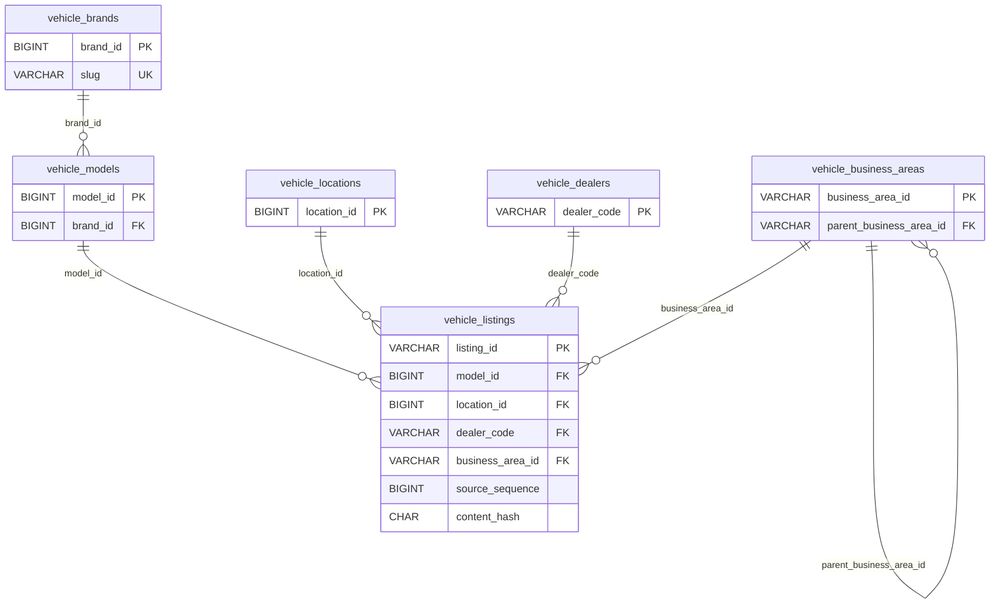

# MySQL Migration 및 Live 운영 검증 리포트

- **프로젝트:** 자동차 렌탈·리스 기업 시장 분석 솔루션
- **작업일:** 2026-08-13
- **대상 DB:** `sales_support_db`
- **Migration 기준:** `migrations/sql/V001__mvp_schema.sql`
- **재구축 진입점:** `migrations/sql/rebuild.py`
- **Live 관측 구간:** 2026-08-13 13:51:53 ~ 13:56:53 KST, 정확히 300.0초
- **검증 원칙:** 적재량 임계치가 아니라 business key, 중복, FK, orphan, checkpoint 비후퇴와 실행별 count를 기준으로 판정
- **보안 경계:** DB credential, JDBC URL, password는 본 보고서와 관측 로그에 기록하지 않음

---

## 1. 작업 개요와 최종 판정

설정에서 확인한 MySQL 애플리케이션 데이터베이스는 `sales_support_db`였다. 시스템 데이터베이스인 `mysql`, `information_schema`, `performance_schema`, `sys`는 삭제 대상에서 명시적으로 제외하였다.

삭제 전 임시 복구용 dump를 생성하고 SHA-256을 확인한 뒤 `sales_support_db`의 모든 테이블을 삭제하였다. 이후 V001을 적용해 빈 스키마를 재생성하고 세 pipeline의 Live CLI를 5분 동안 반복 실행하였다.

최종 판정은 다음과 같다.

| 항목 | 판정 | 근거 |
|---|---|---|
| Migration 재현 | 정상 | V001 적용, 10개 테이블 재생성, ledger checksum 일치 |
| 중고차 적재 | 정상 | 10,028개 listing, business key 중복 0, FK orphan 0 |
| 중고차 증분 | 정상 | checkpoint `24356 → 24384 → 24384 → 24384 → 24384`, 역행 0 |
| 등록현황 적재 | 조건부 | 5회 호출은 성공했으나 현재월 `2026-08` 원천 응답이 모두 0건 |
| 거부·오류 | 정상 | 전체 pipeline `rejected_count=0`, JSONL ERROR event 0 |
| 잔존 process | 정상 | monitor 및 `python -m src.main` 잔존 process 0 |
| `application_logs` | 필수 계약 아님 | 사용자 결정에 따라 migration에서 제거하고 정상 판정 기준에서 제외 |

등록현황 0건은 migration 또는 SQL write 실패가 아니다. 원천이 현재월 데이터 0건을 정상 응답했고 pipeline도 `collected_count=0`으로 반환하였다. 따라서 테이블의 Upsert 정합성을 이 5분 창만으로 추가 입증할 수는 없으며, 실제 데이터가 제공되는 기준월 실행이 별도로 필요하다.

---

## 2. Migration과 재구축 계약

### 2.1 적용 파일

| 파일 | 역할 |
|---|---|
| `migrations/sql/V001__mvp_schema.sql` | `sales_support_db`와 10개 테이블, FK, unique/index 생성 |
| `migrations/sql/run.py` | `V*__*.sql` 순차 적용, SHA-256 checksum과 `schema_migrations` 검증 |
| `migrations/sql/rebuild.py` | 정확한 DB명 확인 후 `sales_support_db`의 base table만 삭제하고 forward migration 재적용 |

재구축 코드는 다음 안전장치를 가진다.

1. `--confirm-data-database` 값이 현재 `Settings.sql_database`와 정확히 같아야 한다.
2. 설정 DB가 V001의 canonical target인 `sales_support_db`와 다르면 삭제를 거부한다.
3. MySQL 시스템 DB 이름은 코드에서 거부한다.
4. DB와 table 이름은 영문·숫자·underscore 식별자만 허용한다.
5. FK 검사를 일시 중단한 상태에서 확인된 애플리케이션 table만 삭제하고 즉시 복원한다.
6. DB 자체는 삭제하지 않고 table만 제거한 뒤 기존 forward migration을 적용한다.

### 2.2 백업과 복구 경계

삭제 직전 다음 임시 백업을 생성하였다.

| 대상 | 임시 파일 | 크기 | SHA-256 |
|---|---|---:|---|
| MySQL 애플리케이션 DB | `/private/tmp/mlo-db-backup-20260813-s9gwfB/mysql-app-databases.sql` | 3,236,070 bytes | `aaa3eb19343849d05e05acb7c9cc136334e2ae410b310a77e4fbe3fd258337f7` |

이 파일은 `/private/tmp`에 있으므로 영구 백업이 아니다. 운영 환경이나 OS가 임시 파일을 정리하면 삭제 전 데이터는 복구할 수 없다. 별도 원격 백업 또는 보존 정책 없이 동일 작업을 다시 수행해서는 안 된다.

### 2.3 Migration metadata 검증

| 검증 | 결과 |
|---|---|
| V001 SQL statement 수 | 12 |
| V001 SHA-256 | `aefd54fe73ab308847de0dc81fba8b60ec51de4729db12c9089e9bac03d2f241` |
| `schema_migrations.V001` checksum | 로컬 V001과 일치 |
| runner 재진입 | `status=OK`, `applied=[]` |
| FK 수 | 6 |
| Compile / Ruff / diff whitespace | 모두 성공 |

`application_logs` 제거로 V001 checksum이 변경되었지만 `sales_support_db`의 실제 table 구조는 변경 전후 동일함을 metadata로 확인하였다. 그 후 ledger의 V001 checksum을 새 canonical 파일과 동기화하고 runner 재진입을 확인하였다.

---

## 3. 테이블 목록과 제품 계약

### 3.1 테이블별 grain, key, 주요 column

| 테이블 | Row grain | PK / Business Key | 주요 column | 소유 pipeline | 없을 때 발생하는 문제 |
|---|---|---|---|---|---|
| `schema_migrations` | 적용된 migration version 1개당 1행 | PK `version` | `checksum`, `applied_at` | migration runner | 동일 migration의 변조·중복 적용을 식별할 수 없어 환경별 schema drift가 발생함 |
| `vehicle_brands` | 중고차 제조사 1개당 1행 | PK `brand_id`, unique `slug` | `name`, `country`, source/load timestamp, `run_id` | usedcar | model의 제조사 참조가 끊기고 제조사 기준 탐색·정규화가 불가능함 |
| `vehicle_models` | 차량 model 1개당 1행 | PK `model_id` | FK `brand_id`, `name`, `slug`, `body_type` | usedcar | listing의 차종 관계와 제조사→모델 계층이 유실됨 |
| `vehicle_locations` | source location 1개당 1행 | PK `location_id` | `province`, `city`, `sigungu`, `slug` | usedcar | 지역별 listing 조회와 지역 정합성 검증이 불가능함 |
| `vehicle_dealers` | dealer code 1개당 1행 | PK `dealer_code` | `display_name`, `department`, `position` | usedcar | listing 판매자 provenance와 dealer 기준 분석이 유실됨 |
| `vehicle_business_areas` | 영업 권역 1개당 1행 | PK `business_area_id` | self FK `parent_business_area_id`, `name`, `slug` | usedcar | 상위·하위 영업 권역 계층과 listing의 담당 권역 연결이 끊김 |
| `vehicle_listings` | 중고차 listing 1개당 1행 | PK/business key `listing_id` | 4개 dimension FK, 가격·주행거리·연식·상태, `source_sequence`, `content_hash` | usedcar | 제품의 핵심 매물 조회 대상과 증분 Upsert 대상이 사라짐 |
| `vehicle_registration_reports` | 기준월×시도×시군구×차종×용도 1개당 1행 | PK `report_id`, unique 5차원 business key | `quantity`, `source_name`, `source_url`, `content_hash` | registration | 지역·차종·용도별 시장 규모 조회가 불가능하고 중복 집계 위험이 생김 |
| `pipeline_runs` | 중고차 적재 batch 또는 checkpoint 확정 1회당 1행 | PK `run_id` | stage count, Upsert count, `api_calls`, `progress_key`, status/error | usedcar SQL sink | 마지막 성공 checkpoint와 batch count를 DB에서 복구·감사할 수 없음 |
| `api_quota_usage` | KST 일자×외부 API 1개당 1행 | PK `(quota_date, api_name)` | `quota_limit`, `used_count`, `last_call_at`, `quota_status` | registration | 재시도·동시 실행에서 일일 API quota 초과를 원자적으로 차단할 수 없음 |

`run_id`, `collected_at`, `created_at`, `updated_at`은 주요 데이터 table에 공통으로 존재한다. `created_at`은 최초 생성 시각을 보존하고, 실제 business content 변경 시에만 `updated_at`과 대상 row를 갱신하는 것이 loading 계약이다.

### 3.2 관계 구조



등록현황, quota, migration ledger와 pipeline run은 위 listing dimension graph에 FK로 연결하지 않는다. 이 table들은 서로 다른 grain과 수명주기를 가진 운영·시장 데이터이며, `run_id`는 provenance 값이지 삭제 전파가 필요한 entity FK가 아니다.

### 3.3 모든 FK와 관계 의미

| Constraint | Child → Parent | 관계 | nullable | 필요성 |
|---|---|---|---|---|
| `fk_model_brand` | `vehicle_models.brand_id` → `vehicle_brands.brand_id` | 1 brand : N models | Yes | 존재하지 않는 제조사를 model이 참조하는 것을 차단 |
| `fk_business_area_parent` | `vehicle_business_areas.parent_business_area_id` → 동일 table `business_area_id` | 1 parent : N child areas | Yes | 영업 권역 self-reference의 orphan 차단 |
| `fk_listing_model` | `vehicle_listings.model_id` → `vehicle_models.model_id` | 1 model : N listings | Yes | listing의 잘못된 model 참조 차단 |
| `fk_listing_location` | `vehicle_listings.location_id` → `vehicle_locations.location_id` | 1 location : N listings | Yes | listing의 잘못된 지역 참조 차단 |
| `fk_listing_dealer` | `vehicle_listings.dealer_code` → `vehicle_dealers.dealer_code` | 1 dealer : N listings | Yes | listing의 잘못된 dealer 참조 차단 |
| `fk_listing_business_area` | `vehicle_listings.business_area_id` → `vehicle_business_areas.business_area_id` | 1 area : N listings | Yes | listing의 잘못된 영업 권역 참조 차단 |

FK가 nullable인 이유는 source의 부분·증분 payload가 일부 dimension을 제공하지 않을 수 있기 때문이다. `NULL`은 허용하지만 존재하지 않는 non-null parent key는 허용하지 않는다.

### 3.4 적재 순서와 transaction 경계

중고차 batch는 다음 순서로 한 transaction 안에서 처리된다.

```text
brand
  → model
  → location
  → dealer
  → business-area parent
  → business-area child
  → listing
  → pipeline_runs SUCCESS / progress_key
  → COMMIT
```

- 신규·변경 row만 Upsert하고 동일 row는 write하지 않는다.
- sparse 증분은 기존 non-null 값을 병합한 후 canonical hash를 계산한다.
- 공유 dimension 변경은 이를 참조하는 batch 밖 listing까지 같은 transaction에서 재해시한다.
- 어느 단계든 실패하면 dimension, listing, `pipeline_runs`를 모두 rollback하고 checkpoint를 전진시키지 않는다.
- local checkpoint는 SQL commit 이후에만 저장한다.

등록현황은 한 실행에서 business key를 deduplicate하고 기존 `content_hash`와 비교한 뒤 변경 대상만 하나의 transaction으로 commit한다. API quota 예약은 외부 요청 전에 `api_quota_usage`에서 별도 원자 transaction으로 먼저 확정한다. 따라서 API 호출이 이미 소비된 뒤 source 또는 적재가 실패해도 quota count는 되돌리지 않는다.

---

## 4. Index와 Unique Constraint 설계 근거

| 테이블 | Index / Constraint | 목적 |
|---|---|---|
| `vehicle_brands` | `PRIMARY(brand_id)`, `UNIQUE uq_brand_slug(slug)`, `ix_brand_name(name)` | source ID Upsert, slug 충돌 방지, 제조사명 검색 |
| `vehicle_models` | `PRIMARY(model_id)`, `ix_model_brand(brand_id)`, `ix_model_name(name)` | FK lookup과 제조사별 model 조회 |
| `vehicle_locations` | `PRIMARY(location_id)`, `ix_location_region(province,city,sigungu)` | 지역 계층 필터 |
| `vehicle_dealers` | `PRIMARY(dealer_code)`, `ix_dealer_department(department)` | dealer Upsert와 조직별 조회 |
| `vehicle_business_areas` | `PRIMARY(business_area_id)`, `ix_business_area_parent(parent_business_area_id)` | self-FK parent lookup과 하위 권역 조회 |
| `vehicle_listings` | `PRIMARY(listing_id)` | listing business key 중복 방지와 Upsert |
| `vehicle_listings` | model/location/dealer/business-area별 index | FK 검사 및 dimension별 listing 조회·fan-out 재해시 |
| `vehicle_listings` | `ix_listing_source_status`, `ix_listing_run`, `ix_listing_source_sequence` | 판매 상태, 실행 provenance, 증분 sequence 조회 |
| `vehicle_registration_reports` | `UNIQUE uq_registration_business` | 5차원 business grain의 중복 적재 방지 |
| `vehicle_registration_reports` | 월·지역, 차종·용도, run index | 시장 조회와 실행 단위 감사 |
| `pipeline_runs` | pipeline/status/start, started_at index | 마지막 성공 run과 운영 이력 조회 |
| `api_quota_usage` | composite PK `(quota_date, api_name)` | 동일 일자·API quota row를 하나로 강제하고 원자 증가 지원 |

---

## 5. `pipeline_runs`의 checkpoint와 count 역할

`pipeline_runs`는 현재 중고차 SQL sink의 canonical checkpoint 저장소다.

- `progress_key`는 JSON object text이며 `after_seq`, `after_id`, `dataset_epoch`, `initialized`, `mode`를 포함한다.
- `status='SUCCESS'`이면서 `progress_key IS NOT NULL`인 최신 행을 다음 `auto` 실행의 시작점으로 사용한다.
- `collected_count`, `preprocessed_count`, `valid_count`, `rejected_count`는 batch 입력·검증 상태를 나타낸다.
- `inserted_count`, `updated_count`, `unchanged_count`는 실제 DB write 분류다.
- `api_calls`는 batch 요청 수이며 initial watermark 호출은 마지막 batch 기록에 합산된다.
- checkpoint와 data write가 같은 transaction이므로 성공하지 않은 batch가 진행 위치만 앞당길 수 없다.

현재 FAQ와 등록현황 실행은 `pipeline_runs`에 기록되지 않는다. FAQ는 Mongo sink와 JSONL run event를 사용하고, 등록현황은 일자·API quota와 local period state를 사용한다. 따라서 `pipeline_runs=24`는 5분 창의 세 pipeline 전체 run 수가 아니라 중고차 SQL batch 이력 수다.

---

## 6. 초기화 전후 행 수

| 테이블 | 삭제 전 | Migration 직후 | 5분 Live 종료 |
|---|---:|---:|---:|
| `schema_migrations` | 1 | 1 | 1 |
| `vehicle_brands` | 12 | 0 | 12 |
| `vehicle_models` | 50 | 0 | 50 |
| `vehicle_locations` | 49 | 0 | 49 |
| `vehicle_dealers` | 933 | 0 | 1,737 |
| `vehicle_business_areas` | 1,248 | 0 | 2,786 |
| `vehicle_listings` | 1,452 | 0 | 10,028 |
| `vehicle_registration_reports` | 5,520 | 0 | 0 |
| `pipeline_runs` | 11 | 0 | 24 |
| `api_quota_usage` | 2 | 0 | 1 |

기존 등록현황 5,520행은 전면 초기화로 제거되었다. 그 안에 포함됐던 `총계>*`, `*>계` 집계행도 함께 제거되었으며, 신규 preprocessing은 해당 패턴을 다시 생성하지 않는다. 다만 관측 당시 현재월 원천이 0건이어서 세부 등록현황도 재적재되지 않았다.

---

## 7. 5분 Live 실행 결과

관측 시점에는 `python -m src.main --profile live --once` 계약을 사용해 매 분마다 registration → usedcar → FAQ 순서로 실행하였다. 첫 중고차 실행은 `initial`, 이후는 `auto`로 실행하였다. 관측 종료 후 `src/main.py`를 갱신하여 현재 `--profile live`는 `--once`가 없으면 기본 60초 간격으로 계속 실행하고, `SIGINT`·`SIGTERM`에서 진행 중 회차를 마친 뒤 종료한다.

### 7.1 MySQL 소유 pipeline 실행별 count

| 회차 | Pipeline / mode | 수집 | 유효 | 거부 | Insert | Update | Unchanged | API call |
|---:|---|---:|---:|---:|---:|---:|---:|---:|
| 1 | registration / daily | 0 | 0 | 0 | 0 | 0 | 0 | 1 |
| 1 | usedcar / initial | 10,000 | 10,000 | 0 | 10,000 | 0 | 0 | 21 |
| 2 | registration / daily | 0 | 0 | 0 | 0 | 0 | 0 | 1 |
| 2 | usedcar / incremental | 28 | 28 | 0 | 28 | 0 | 0 | 1 |
| 3 | registration / daily | 0 | 0 | 0 | 0 | 0 | 0 | 1 |
| 3 | usedcar / incremental | 0 | 0 | 0 | 0 | 0 | 0 | 1 |
| 4 | registration / daily | 0 | 0 | 0 | 0 | 0 | 0 | 1 |
| 4 | usedcar / incremental | 0 | 0 | 0 | 0 | 0 | 0 | 1 |
| 5 | registration / daily | 0 | 0 | 0 | 0 | 0 | 0 | 1 |
| 5 | usedcar / incremental | 0 | 0 | 0 | 0 | 0 | 0 | 1 |

합계는 usedcar 수집·유효·insert 10,028건, reject/update/unchanged 0건이며 registration은 API call 5회, quota used 5, 데이터 0건이다. 이 관측 창에는 실제 변경 event가 없어 update 경로는 발생하지 않았다.

### 7.2 최종 정합성

| 검증 | 결과 |
|---|---:|
| `vehicle_listings` business key 중복 | 0 |
| 등록현황 5차원 business key 중복 | 0 |
| `vehicle_models → vehicle_brands` orphan | 0 |
| listing → model orphan | 0 |
| listing → location orphan | 0 |
| listing → dealer orphan | 0 |
| listing → business area orphan | 0 |
| business area self-reference orphan | 0 |
| 등록현황 `총계>*` 또는 `*>계` row | 0 |
| checkpoint 역행 | 0 |
| JSONL structured event | INFO 156, ERROR 0 |
| credential 의심 패턴 | 0 |
| 종료 후 pipeline/monitor process | 0 |

---

## 8. `application_logs` 경계와 잔여사항

사용자 결정에 따라 `application_logs` SQL 적재는 현재 제품의 필수 계약이 아니다. pipeline 정상 여부는 반환 status, JSONL event, `pipeline_runs`, 데이터 정합성으로 판단한다.

이에 따라 다음 코드를 제거하였다.

- V001의 `CREATE DATABASE application_logs`
- V001의 `USE application_logs`
- V001의 `application_logs` table DDL
- SQL rebuild의 log DB 확인 인자와 log DB table 삭제 범위

현재 실제 DB에는 이전 V001 적용으로 생성된 빈 `application_logs.application_logs` table이 0행 상태로 남아 있다. 사용자 지시에 따라 이를 추가로 DROP하지 않았다. clean migration 또는 다음 `sales_support_db` rebuild에는 이 DB가 더 이상 생성·관리되지 않는다.

---

## 9. 운영 주의사항

1. `migrations/sql/rebuild.py`는 파괴적 운영 도구다. 정확한 DB명 확인과 영구 백업 없이는 실행하지 않는다.
2. 현재월 등록현황이 0건이어도 pipeline은 정상 종료한다. 제품에서 source 미게시와 정상 무데이터를 구분하려면 기준월 정책 또는 freshness 경보가 추가로 필요하다.
3. `pipeline_runs`는 중고차 batch grain이다. 세 pipeline 전체 run ledger로 해석하면 안 된다.
4. 5분 창에서 usedcar update event가 없었으므로 update=0은 오류가 아니라 source 변화가 없었다는 관측 결과다.
5. 이 작업에서는 새 테스트를 추가·수정·실행하지 않았다. 검증은 migration parse, compile, Ruff, checksum, DB metadata와 실제 Live readback으로 수행했다.
