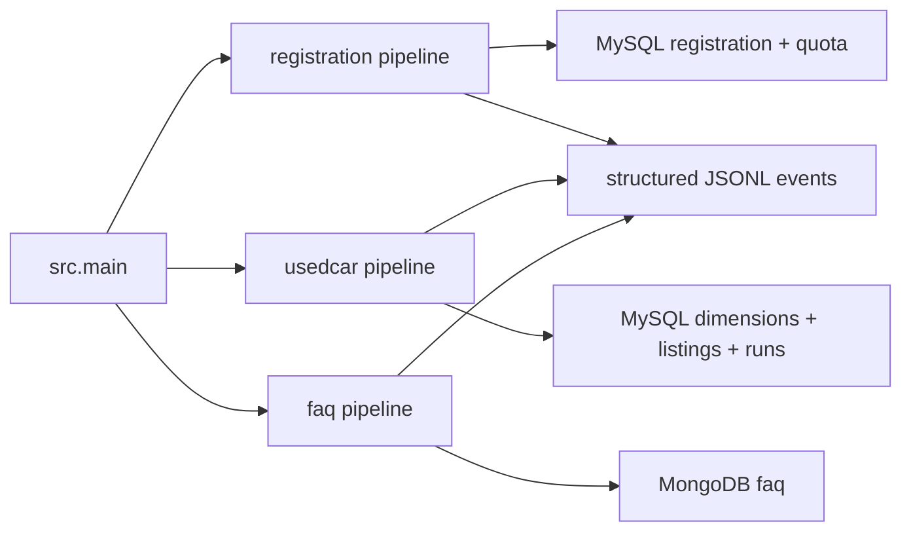

# PRD — 중고 자동차 영업·고객지원 데이터 통합 솔루션

| 항목 | 내용 |
|---|---|
| 문서 상태 | 현재 구현 기준선(As-built) |
| 기준일 | 2026-08-13 |
| 제품 범위 | Python batch pipeline, MySQL/MongoDB persistence, migration, 운영 검증 |
| 기준 코드 | `src/*`, `migrations/*` |
| 상위 요구사항 | [Business Requirements Document](Business_Requirements_Document.md) |
| 검증 근거 | [운영 테스트 및 데이터 정합성 이슈 보고서](issues/operational_test_issues.md) |

## 1. 문서 목적

이 문서는 현재 코드가 제공하는 기능·데이터·운영 계약을 제품 요구사항으로 고정한다. 과거 기획에 있던 등록현황 자동 backfill, source별 개별 scheduler, 분산 lock, 사용자용 조회 API·대시보드는 현재 구현과 구분한다.

요구사항 상태는 다음과 같다.

| 상태 | 의미 |
|---|---|
| 구현 | 현재 코드와 검증 근거가 모두 존재 |
| 부분 | 핵심 기반은 있으나 요구 경험 또는 일부 운영 기능이 없음 |
| 미구현 | 목표 또는 후속 항목이며 현재 코드에 없음 |

## 2. 제품 정의와 MVP 범위

### 2.1 제품 정의

세 외부 원천을 수집하고 source별 규칙으로 정규화한 뒤 business key 기반으로 MySQL/MongoDB에 Upsert하는 운영형 데이터 파이프라인이다.



### 2.2 포함 범위

- Live HTTP/API와 fixture collection
- collection → preprocessing → loading 계층 분리
- source schema 해석, type 정규화, timestamp canonicalization
- record 단위 validation과 rejected record 분리
- business key 및 content hash 기반 Upsert
- 중고차 initial/incremental과 성공 후 checkpoint
- 등록현황 일일 quota와 선택 월 state
- MySQL/MongoDB migration 및 guarded rebuild command
- 공통 CLI, 한 cycle 실행, Live 반복 실행
- JSONL 운영 event와 중고차 SQL run/checkpoint metadata
- Mock 전체와 실제 격리 DB Live 검증

### 2.3 제외 범위

- 사용자용 REST/GraphQL API, 웹 화면, 대시보드
- source별 독립 cron/workflow scheduler
- 등록현황 최신 게시월 자동 탐색, 15년 backfill, gap fill
- distributed lock, leader election, multi-host orchestration
- source에서 사라진 entity의 자동 delete 및 tombstone 처리
- 원본 payload 장기 archive와 운영 backup 자동화
- 중앙 로그 수집, 알림, SLA/SLO 자동 판정
- AWS production 배포 및 HA topology 보증

## 3. Source 정의

| Source | 설정/경로 | 현재 호출 계약 |
|---|---|---|
| 자동차 등록현황 | `REGISTRATION_API_URL`, 국토교통부 form 5498/style 2 | 선택한 한 달을 한 logical request로 조회, 일일 최대 3,000 호출 |
| 중고차 | `USED_CAR_BASE_URL` | initial snapshot, changes, incremental watermark; page 최대 500건, 요청 간격 최소 1초 |
| FAQ | `FAQ_SOURCE_URL` | allowlist의 `/faqs` 계열만 허용, 최대 2 pages, 요청 간격 최소 1초 |

외부 API key, SQL password, MongoDB URI는 문서·로그·반환 payload에 기록하지 않는다. 원천의 실제 availability와 내용은 실행 시점에 달라질 수 있다.

## 4. Runtime 및 CLI 계약

### FR-RUN-01 — Canonical entry point `구현`

모든 공통 실행은 다음 형식을 사용한다.

```bash
python -m src.main --pipeline {registration|usedcar|faq|all}
```

`--pipeline all`의 실행 순서는 registration → usedcar → FAQ다. 한 cycle은 하나의 top-level UUID `run_id`를 공유한다. 중고차 SQL batch는 checkpoint 이력을 보존하기 위해 별도의 batch `run_id`를 사용한다.

### FR-RUN-02 — Profile `구현`

- 기본 profile은 `fixture`다.
- fixture profile은 선택한 각 pipeline의 fixture 파일이 필요하며 항상 한 cycle만 실행한다.
- Live profile에는 fixture를 함께 전달할 수 없다.
- `--dry-run`은 collection·preprocessing·validation을 수행하지만 sink write와 state 저장을 하지 않는다.

### FR-RUN-03 — Live 반복 실행 `구현`

- `--profile live`에서 `--once`가 없으면 process는 무한 반복한다.
- cycle 종료 뒤 기본 60초를 기다리며 `--loop-interval-seconds`로 양수를 지정할 수 있다.
- `SIGINT`, `SIGTERM`, `KeyboardInterrupt`를 받으면 현재 cycle 뒤 종료한다.
- cycle에서 runtime 예외가 발생하면 정제된 `FAILED` JSON을 stderr에 남기고 다음 cycle을 계속한다.
- `all` 내부의 한 pipeline이 실패하면 같은 cycle의 뒤 pipeline은 실행하지 않는다. pipeline 간 원자성도 없다.

### FR-RUN-04 — Preflight `구현`

첫 worker가 state를 변경하기 전에 다음 정적 조건을 모두 검증한다.

- 모든 fixture 존재 여부와 profile 충돌
- pipeline별 허용 sink
- `all`에서 공통 `--sink` 사용 금지
- non-dry-run SQL host/user와 MongoDB URI
- 등록현황 period 형식
- loop interval 양수

따라서 결정 가능한 설정 오류 때문에 일부 pipeline만 먼저 적재되는 것을 막는다. 외부 API/DB runtime 장애는 preflight 대상이 아니다.

### FR-RUN-05 — Sink 선택 `구현`

| Pipeline | 허용 sink | 운영 권장 |
|---|---|---|
| registration | `json`, `sql` | `sql` |
| usedcar | `json`, `sql` | `sql` |
| faq | `json`, `mongo` | `mongo` |

`--pipeline all`에서는 `--registration-sink`, `--usedcar-sink`, `--faq-sink`를 각각 사용한다.

## 5. 공통 Pipeline 계약

### FR-COM-01 — Data Contract `구현`

각 pipeline은 다음 단계 계약을 따른다.

```text
collector → CollectionEnvelope(records, metadata)
transformer → valid records + rejected records
pipeline → PreparedBatch
sink → LoadStats(inserted, updated, unchanged)
```

timestamp는 timezone-aware canonical ISO 8601로 stage 사이를 이동하고 DB adapter 경계에서 각 저장 형식으로 변환한다.

### FR-COM-02 — Record 단위 Reject `구현`

일부 record가 validation을 통과하지 못하면:

1. 해당 record를 sink로 보내지 않는다.
2. stable key, reject count, error code를 포함한 `records_rejected` event를 남긴다.
3. `discard_policy=log_only`로 격리 저장소 없이 폐기한다.
4. valid record는 계속 적재한다.
5. 증분 source는 valid record 적재가 성공하면 checkpoint를 진행한다.

### FR-COM-03 — 전체 Reject와 빈 Source `구현`

- 수집 record가 있고 전부 rejected이면 `all_records_rejected`로 실패하며 sink와 checkpoint를 진행하지 않는다.
- 정상 등록현황 0건 응답은 성공이며 선택 period state를 기록한다.
- 중고차 빈 incremental page는 정상 steady state이며 기존 checkpoint를 유지한다.
- FAQ collector가 기대한 FAQ 구조를 찾지 못하면 source/schema 오류로 처리할 수 있다.

### FR-COM-04 — 외부 상태 표현 `구현`

- CLI/pipeline 반환 상태: `OK` 또는 `FAILED`
- JSONL lifecycle event: `run_started`, `run_succeeded`, `run_failed`
- MySQL `pipeline_runs.status`: 현재 중고차 SQL batch에 대해 `SUCCESS`
- 현재 runtime에는 일반적인 `SKIPPED` 상태가 없다. Live 테스트의 pytest skip과 pipeline 상태를 혼동하지 않는다.

### FR-COM-05 — 성공 조건 `구현`

수집·전처리·검증·필수 적재·state update와 owned resource close가 모두 끝난 뒤에만 `run_succeeded`를 기록한다. close-only 실패를 성공으로 남기지 않는다.

### FR-COM-06 — 실패 및 Cleanup `구현`

- 실패는 stage·logic·정제된 error code로 기록한다.
- secret, URI, 원문 driver error 전체를 CLI payload에 반환하지 않는다.
- 본래 collect/load 오류와 cleanup 오류가 함께 발생하면 본래 예외 identity/code를 보존하고 cleanup failure를 별도 event로 남긴다.
- registration은 sink와 quota 중 하나의 close가 실패해도 둘 다 close를 시도한다.
- internally-owned HTTP client만 내부에서 닫고 injected client의 수명은 호출자가 소유한다.

### FR-COM-07 — 멱등 재처리 `구현`

동일 business key의 재처리는 insert를 반복하지 않는다. 같은 canonical content는 unchanged, 실제 내용 변경은 update로 분류한다. 다만 source 삭제가 없고 pipeline 간 단일 transaction도 없으므로 모든 의미의 exactly-once를 보장한다고 표현하지 않는다.

### FR-COM-08 — 동일 Pipeline 중복 실행 금지 `미구현`

현재 code-level distributed lock은 없다. DB primary/unique key와 transaction은 중복 row를 제한하지만 API 중복 호출, quota 경합, 실행 metric 중복을 모두 막지는 않는다. 운영 배포 전 process manager 또는 DB lease 기반 lock이 필요하다.

### FR-COM-09 — Run Metadata `부분`

모든 pipeline은 JSONL과 CLI 결과에 다음 값을 남긴다.

- `run_id`, pipeline/stage/logic
- collected/preprocessed/valid/rejected
- inserted/updated/unchanged
- `api_calls`, `dry_run`, error code

`pipeline_runs`에는 현재 중고차 SQL batch와 checkpoint만 저장한다. registration·FAQ 실행 이력의 SQL 통합 저장은 구현하지 않았다. `application_logs` SQL 테이블은 제품 필수 계약이 아니며 migration에서 제거되었다.

### FR-COM-10 — 상태와 Checkpoint `부분`

| Pipeline | Canonical/보조 상태 |
|---|---|
| usedcar SQL | 최신 성공 `pipeline_runs.progress_key`가 canonical, local JSON은 SQL commit 뒤 fallback |
| usedcar JSON | local JSON checkpoint |
| registration SQL | MySQL quota ledger + local last-success-period state |
| registration JSON | local quota/period state |
| FAQ | source checkpoint 없음 |

## 6. 자동차 등록현황 Pipeline

### FR-REG-01 — 실행 주기 `부분`

별도의 등록현황 일 1회 scheduler는 없다. 공통 Live loop를 사용하면 매 cycle마다 호출된다. 한 `run_once`는 정확히 한 month를 처리하고 logical source request 1회를 사용한다.

### FR-REG-02 — 최신 기준일 확인 `미구현`

Source의 최신 게시월을 별도 endpoint나 응답 metadata로 탐색해 DB 최신월과 비교하는 기능은 없다. 현재 대상 월은 아래 FR-REG-11 규칙으로 명시 또는 계산한다.

### FR-REG-03 — 최초 적재 `구현`

선택한 한 달의 응답을 wide record에서 long measure로 변환하고 business key가 없는 세부 지표를 insert한다. 최초 실행이 자동으로 최신 게시월을 탐색하거나 모든 과거 데이터를 적재하지 않는다.

### FR-REG-04 — Historical Backfill `미구현`

15년 backfill, 이전 월 cursor, 일별 남은 quota를 활용한 자동 과거 진행은 구현하지 않았다. 과거 월은 운영자가 `--period`로 개별 실행해야 한다.

### FR-REG-05 — 최신 데이터 우선·Gap Fill `미구현`

DB 최신월과 source 최신월을 비교해 신규 기간을 우선 적재하고 gap을 자동 보충하는 기능은 없다. 현재월이 0건이어도 자동으로 이전 게시월을 찾지 않는다.

### FR-REG-06 — API Budget `구현`

- `REGISTRATION_DAILY_QUOTA`는 양수이며 최대 3,000이다.
- SQL sink는 `api_quota_usage`의 KST date/API row를 원자적으로 예약한다.
- JSON sink는 local state quota를 사용한다.
- dry-run은 in-memory quota를 사용한다.
- 외부 요청 전에 예약하므로 요청 이후 실패해도 소비된 quota는 되돌리지 않는다.
- quota 소진 시 source를 호출하지 않고 실패한다.

### FR-REG-07 — Backfill 완료 상태 `미구현`

historical completion flag와 backfill cursor가 없다. local state의 `last_success_period`는 마지막 성공 호출 정보이지 backfill 완료 증명이 아니다.

### FR-REG-08 — 중복 방지 및 Upsert `구현`

business key는 다음 5개 필드다.

```text
report_month + sido_name + sigungu_name + vehicle_type + usage_type
```

- key가 없으면 insert한다.
- 같은 hash면 unchanged이고 write하지 않는다.
- quantity 등 canonical content가 바뀌면 update한다.
- MySQL unique constraint가 최종 중복을 차단한다.

### FR-REG-09 — 세부 지표 정규화 `구현`

원천의 `차종>용도` metric을 row로 펼친다. `vehicle_type == "총계"` 또는 `usage_type == "계"`인 aggregate metric은 quantity validation과 content hash 전에 제외한다. 기존 DB에 이미 존재하는 aggregate row를 이 전처리 단계가 자동 삭제하지는 않는다.

### FR-REG-10 — 0건 및 Reject `구현`

- 정상 schema의 0건 응답은 `OK`, count 0, API call 1이다.
- 일부 raw row가 잘못되면 해당 raw row에서 파생될 metric 전체를 reject하고 다른 valid row를 처리한다.
- 모든 수집 row가 reject되면 load/state advance 없이 실패한다.

### FR-REG-11 — 대상 월 선택 `구현`

우선순위는 다음과 같다.

1. CLI `--period`/`--stat-month`
2. `REGISTRATION_START_PERIOD`
3. 현재 `TIMEZONE`의 `YYYY-MM`

형식은 `YYYY-MM` 또는 정규화 가능한 동등 월 형식이어야 한다. source 최신 게시월을 자동 조회하는 기능은 없다.

## 7. 중고차 Pipeline

### FR-LST-01 — 실행 주기 `부분`

현재 source 전용 5분 scheduler는 없다. 공통 Live loop의 기본 주기는 60초이며 CLI로 변경한다. 동일 source에 맞는 운영 주기는 배포 설정에서 정해야 한다.

### FR-LST-02 — Initial Snapshot `구현`

- `mode=auto`에서 initialized checkpoint가 없으면 initial을 선택한다.
- 기본 batch size는 500, initial target은 10,000, max batches는 기본적으로 `ceil(target/batch_size)`다.
- page 요청 간격은 최소 1초다.
- data page 전에 incremental watermark를 조회한다.
- 모든 initial batch가 성공한 뒤 최종 checkpoint를 확정한다.
- watermark를 포함한 실제 API 호출 수가 결과와 SQL run count 합계에 반영된다.
- 이 bounded snapshot은 source 전체가 10,000건을 넘는 경우 무제한 전체 적재를 의미하지 않는다.

### FR-LST-03 — Sequence 기반 Incremental `구현`

`mode=incremental`은 committed `after_seq` 이후 changes를 요청한다. page는 `high_water_seq` 또는 정상 empty steady-state 계약을 제공해야 한다. dataset epoch가 기존 checkpoint와 달라지면 안전하게 실패한다.

### FR-LST-04 — Checkpoint `구현`

checkpoint는 다음 값을 보존할 수 있다.

```json
{
  "initialized": true,
  "mode": "initial|incremental",
  "after_seq": 24384,
  "after_id": "optional-source-cursor",
  "dataset_epoch": "source-dataset-id",
  "updated_at": "ISO-8601"
}
```

- SQL sink에서는 data와 SQL checkpoint를 같은 transaction으로 commit한다.
- SQL 성공 후에만 local fallback을 저장한다.
- 기존 sequence보다 작은 next sequence는 initial/incremental 모두 load 전에 차단한다.
- initial finalization이 실패하면 local checkpoint를 생성·전진시키지 않는다.

### FR-LST-05 — 동일 매물 식별 `구현`

매물 business key는 `listing_id`다. source `id` 또는 정규화된 안정 식별자에서 생성한다. `listing_number`는 조회 가능한 속성이지만 primary/business key가 아니다.

### FR-LST-06 — Upsert 처리 `구현`

| 상태 | 조건 | 동작 |
|---|---|---|
| inserted | `listing_id` 없음 | dimensions와 listing 신규 저장 |
| unchanged | 최종 canonical business content 동일 | listing 중복 생성·불필요 write 없음 |
| updated | listing 또는 공유 dimension 업무값 변경 | 최종 row/hash와 영향 listing 갱신 |

### FR-LST-07 — 최신 상태와 Canonical Hash `구현`

- `content_hash`는 listing과 연결 dimension의 canonical business content를 나타낸다.
- sparse incremental payload는 기존 DB non-null 값과 병합한 최종 aggregate로 hash를 다시 계산한다.
- 공유 brand/model/location/dealer/business-area가 변경되면 그 dimension을 참조하는 배치 밖 listing도 fan-out rehash한다.
- dimension의 listing별 `source_updated_at` 흔들림은 business content 변경으로 오인하지 않는다.

### FR-LST-08 — 상태 및 Event Metadata 변경 `구현`

가격, 판매 상태, 주행거리 등 business field 변경은 update다. event id/sequence만 새 값이고 canonical business content가 같으면 unchanged로 집계하되 최신 source event metadata는 보존할 수 있다.

### FR-LST-09 — 미수집 매물 `구현`

한 snapshot/change run에서 보이지 않았다는 이유만으로 row를 삭제하거나 `SOLD`로 변경하지 않는다. 명시적인 source status/change event가 있을 때만 해당 값을 갱신한다.

### FR-LST-10 — 정규화 관계 및 Transaction `구현`

한 SQL transaction의 부모-자식 적재 순서는 다음과 같다.

```text
brand → model → location → dealer
→ business-area parent → business-area child
→ listing → pipeline_runs SUCCESS/progress_key → COMMIT
```

어느 단계든 실패하면 dimension, listing, run checkpoint를 모두 rollback한다.

### FR-LST-11 — 부분·전체 거부 및 정상 Empty `구현`

- mixed valid/reject page는 valid만 적재한 뒤 checkpoint를 진행한다.
- all-rejected page는 적재하지 않고 checkpoint를 유지한다.
- 증분 watermark에 도달한 empty page는 `OK`, count 0이며 기존 checkpoint를 유지한다.

## 8. FAQ Pipeline

### FR-FAQ-01 — 실행 주기 `부분`

FAQ 전용 일 1회 scheduler는 없다. `all` Live loop에서는 공통 주기마다 수집하며 독립 실행도 가능하다.

### FR-FAQ-02 — 데이터 수집 `구현`

- absolute HTTP(S) URL과 허용된 path만 요청한다.
- 최대 2 pages, 요청 간격 최소 1초다.
- 429와 일부 5xx, 연결 오류를 제한된 횟수로 재시도하고 non-retryable HTTP 오류는 실패 처리한다.
- response에서 발견한 FAQ 전체를 동적으로 처리한다.
- 현재 Live 24건은 관측값이며 고정 수량 acceptance criterion이 아니다.

### FR-FAQ-03 — 동일 FAQ 식별 `구현`

business key는 `faq_id`다. MongoDB unique index `uq_faq_id`가 최종 중복을 차단한다.

### FR-FAQ-04 — FAQ Upsert `구현`

- key 없음: insert
- key와 `content_hash` 동일: unchanged
- 같은 key의 질문·답변·분류·업무 내용 변경: update

### FR-FAQ-05 — Document 계약 `구현`

질문, 답변, brand, category, source URL, source update time, license, attribution, content hash, active flag, run/load timestamps를 보존한다. source 및 load timestamp는 MongoDB adapter에서 BSON Date로 저장한다.

### FR-FAQ-06 — 미수집 FAQ `구현`

단일 실행에서 보이지 않았다는 이유로 기존 document를 삭제하거나 비활성화하지 않는다. 현재 transformer는 수집된 유효 FAQ를 `is_active=true`로 정규화하며 source tombstone/비활성 이벤트는 처리하지 않는다.

### FR-FAQ-07 — MongoDB Validator와 Index `구현`

- collection: `support_db.faq`(환경변수로 app DB/collection 선택 가능)
- validation level/action: `strict/error`
- required field 및 네 timestamp의 BSON Date 강제
- `uq_faq_id` unique
- `ix_faq_brand_category`
- `ix_faq_updated_at` descending

Migration은 canonical validator 전체를 적용한다. Loader는 collection 존재 여부와 필수 timestamp의 BSON Date validator 경계를 다시 확인하고 필수 index를 보장한다.

## 9. 저장 책임과 데이터 모델

### 9.1 MySQL

| Table | Grain/책임 | Key |
|---|---|---|
| `vehicle_brands` | 제조사 1개 | `brand_id`, unique `slug` |
| `vehicle_models` | 모델 1개 | `model_id`, FK `brand_id` |
| `vehicle_locations` | source location 1개 | `location_id` |
| `vehicle_dealers` | dealer 1개 | `dealer_code` |
| `vehicle_business_areas` | 영업권역 1개 | `business_area_id`, self FK parent |
| `vehicle_listings` | 중고차 매물 1개 | `listing_id`, 4개 dimension FK |
| `vehicle_registration_reports` | 월×시도×시군구×차종×용도 | surrogate PK + composite unique |
| `pipeline_runs` | 중고차 SQL batch/checkpoint 확정 1회 | `run_id` |
| `api_quota_usage` | KST 일자×API | composite PK |
| `schema_migrations` | migration version | `version`, checksum |

`application_logs` DB/table은 현재 V001에 없고 정상 동작 조건이 아니다.

### 9.2 MongoDB

FAQ 1건을 한 document로 저장한다. MySQL brand와 MongoDB FAQ brand는 동일 master key 계약이 없으므로 cross-store FK를 추정하지 않는다.

### 9.3 JSON sink

JSON/JSONL sink는 fixture·개발·fallback 검증에 사용할 수 있다. 운영 SQL/MongoDB의 FK, transaction, unique index, validator를 대체하지 않는다.

### 9.4 Cross-pipeline 원자성

registration, usedcar, FAQ는 서로 다른 transaction과 state를 소유한다. `all` 한 cycle 전체를 하나의 transaction으로 rollback하지 않는다.

## 10. Observability

### 운영 event 및 run metadata

JSONL structured event가 모든 pipeline의 기본 운영 로그다. event에는 secret을 제외한 run/stage/logic/count/error code가 포함된다. SQL `pipeline_runs`는 중고차 batch count와 checkpoint를 제공하지만 세 pipeline 통합 run ledger는 아니다.

Pipeline 결과의 공통 필드는 다음과 같다.

```text
status, run_id, collected_count, preprocessed_count,
valid_count, rejected_count, inserted_count, updated_count,
unchanged_count, api_calls, dry_run, checkpoint_path
```

source별 추가 필드는 usedcar의 `mode`/`batches`, registration의 `period`/quota, FAQ의 source 처리 정보다.

## 11. Migration 및 운영 준비

### FR-MIG-01 — SQL Forward Migration `구현`

`migrations/sql/run.py`는 `V*__*.sql`을 순서대로 적용하고 SHA-256을 `schema_migrations`와 비교한다. 적용된 version의 파일 checksum이 바뀌면 임의 재적용하지 않고 실패한다.

### FR-MIG-02 — MongoDB Ensure Migration `구현`

`migrations/mongo/ensure_indexes.py`는 FAQ collection을 생성하거나 `collMod`로 canonical validator를 맞추고 필수 index를 보장한다.

### FR-MIG-03 — Destructive Rebuild `구현/운영자 전용`

- SQL rebuild는 exact `sales_support_db` 확인, system/noncanonical/unsafe identifier 차단 후 app table을 삭제하고 forward migration을 재적용한다.
- Mongo rebuild는 exact 설정 DB 확인과 `admin/config/local` 차단 후 non-system collection을 삭제하고 FAQ migration을 적용한다.
- rebuild는 자동 backup을 생성하지 않는다. 별도 backup과 대상 확인이 선행되어야 한다.

## 12. 비기능 요구사항

| ID | 요구사항 | 상태 | 현재 계약 |
|---|---|---|---|
| NFR-01 | Collector/전처리/Loader 격리 | 구현 | package와 interface 분리 |
| NFR-02 | DB 비공개 네트워크 | 미구현 | 애플리케이션 코드가 아닌 배포 인프라 책임 |
| NFR-03 | 관리 접근 통제 | 미구현 | credential 환경변수 지원만 존재 |
| NFR-04 | MySQL replication/장애전환 | 미구현 | 목표 AWS 설계·PoC 항목 |
| NFR-05 | MongoDB replica set | 미구현 | standalone/replica URI 사용 가능하나 구성 자동화 없음 |
| NFR-06 | Idempotency | 구현 | business key + canonical hash + unique constraints |
| NFR-07 | Recoverability | 부분 | usedcar checkpoint와 rollback, registration state/quota; backup 자동화 없음 |
| NFR-08 | Pipeline isolation | 부분 | 모듈/state는 분리, `all` runtime 실패 시 뒤 pipeline은 같은 cycle에서 미실행 |
| NFR-09 | Observability | 부분 | JSONL/CLI/usedcar SQL run; 중앙 로그·알림 없음 |
| NFR-10 | Credential security | 부분 | `.env`/environment와 sanitized output; secret manager/rotation은 인프라 책임 |
| NFR-11 | API quota/rate compliance | 구현 | usedcar·FAQ 최소 1초, 등록현황 quota 최대 3,000 |
| NFR-12 | Resource cleanup | 구현 | owned client/sink/quota close 및 primary failure 보존 |
| NFR-13 | Data integrity | 구현 | unique, FK, validator, transaction, checkpoint 비후퇴 |

## 13. Scheduler·Concurrency·Recovery 정책

| 항목 | 현재 동작 | 후속 필요 |
|---|---|---|
| 반복 실행 | `src.main` process-local loop, 기본 60초 | service manager와 source별 schedule |
| 한 cycle | 순차 registration→usedcar→FAQ | pipeline별 독립 job 여부 결정 |
| cycle 실패 | stderr `FAILED`, 다음 cycle 계속 | alert/retry/backoff 정책 |
| 동시 실행 | lock 없음 | DB lease/distributed lock |
| 중고차 재시작 | SQL latest successful progress, local fallback | retention/repair runbook |
| 등록현황 재시작 | 명시 period 또는 설정/current month | latest published month/backfill state |
| FAQ 재시작 | 전체 재수집 후 idempotent Upsert | 삭제/tombstone 정책 |

## 14. Acceptance Criteria

### AC-REG — 자동차 등록현황

1. 빈 DB에 유효 세부 metric을 실행하면 composite key별 insert된다.
2. 같은 period와 같은 값의 재실행은 전건 unchanged이고 중복 row가 없다.
3. 같은 key의 quantity가 바뀌면 해당 row만 update된다.
4. `총계>*`, `*>계` metric은 sink에 전달되지 않는다.
5. partial reject는 valid row를 적재하며 all reject는 state를 전진시키지 않는다.
6. 정상 0건 response는 `OK`, count 0, API call 1이다.
7. quota 소진 시 source 호출이 없으며 quota ledger 오류는 rollback된다.
8. 이 기준은 자동 backfill/latest discovery를 요구하지 않는다. 해당 기능은 미구현이다.

### AC-LST — 중고차

1. checkpoint가 없는 `auto`는 initial을 선택하고 bounded snapshot을 적재한 뒤 watermark를 확정한다.
2. 미존재 `listing_id`는 insert된다.
3. 동일 final aggregate 재실행은 unchanged이고 row 수가 증가하지 않는다.
4. listing 업무값 변경은 update되고 `content_hash`가 최종 row와 일치한다.
5. shared dimension 변경은 영향 listing의 hash까지 정합하게 갱신한다.
6. sparse payload는 기존 값 보존 후 merged aggregate로 판정한다.
7. event metadata만 바뀐 동일 content는 unchanged로 집계한다.
8. data/FK/run write 중간 실패는 전체 SQL transaction을 rollback하고 checkpoint를 유지한다.
9. multi-batch count와 `pipeline_runs` 합계, 마지막 local/SQL checkpoint가 일치한다.
10. empty incremental은 성공하고 checkpoint가 유지된다.
11. checkpoint regression과 dataset epoch 변경은 load 전에 실패한다.
12. 한 번 미수집된 listing은 임의 삭제·상태 변경되지 않는다.

### AC-FAQ — FAQ

1. source가 반환한 유효 FAQ 전체를 처리하며 24건을 고정값으로 요구하지 않는다.
2. 미존재 `faq_id`는 insert된다.
3. 같은 content의 재실행은 unchanged이고 document가 중복되지 않는다.
4. 같은 `faq_id`의 내용 변경은 update된다.
5. partial reject는 valid FAQ를 적재하고 all reject는 실패한다.
6. strict validator, BSON Date와 exact index 계약을 만족한다.
7. 내부 생성 client는 성공/실패 모두 close하며 injected client는 닫지 않는다.
8. 미수집 document를 임의 삭제하지 않는다.

### AC-COM — 공통 운영

1. `all`의 모든 fixture/sink/static setting 오류는 첫 worker 전에 검출된다.
2. Live `--once`는 한 cycle 뒤 종료하고, 생략하면 설정 간격으로 반복한다.
3. loop cycle 실패는 sanitized `FAILED`를 남기고 다음 cycle을 계속한다.
4. SIGINT/SIGTERM은 현재 cycle 뒤 정상 종료한다.
5. success는 필수 resource close 후에만 기록한다.
6. primary failure와 cleanup failure가 동시에 발생해도 primary error identity/code가 보존된다.
7. 로그와 CLI payload에 API key, password, connection URI를 노출하지 않는다.
8. Mock gate는 실제 socket/DNS 연결을 차단한 상태에서 adapter 계약을 검증한다.
9. Live gate는 실제 API와 run-owned 격리 SQL/MongoDB에 write/readback 후 모든 test DB를 정리한다.
10. Live 완료 판정은 `skipped`가 아니라 실제 `passed` 결과가 있어야 한다.

분산 lock, registration backfill, source별 scheduler는 현재 Acceptance Criteria가 아니라 후속 개발 항목이다.

## 15. 검증 기준선

2026-08-13 최종 snapshot의 실행 증거다.

| 검증 | 결과 | 범위 |
|---|---:|---|
| Mock | `98 passed` | network/DNS 차단, adapters, transaction, retry, cleanup, checkpoint |
| 기본 전체 | `191 passed, 7 skipped` | Live opt-in 제외 전체 |
| 격리 Live | `7 passed` | 실제 API + 격리 MySQL/MongoDB write/readback |
| Live 포함 전체 | `198 passed` | 동일 snapshot의 전체 suite |
| DB rebuild 후 관측 | 300초, 15/15 exit 0 | 실제 app DB migration 후 5 cycles |

운영 관측 종료 상태:

- 중고차 10,028 listings, business key duplicate 0, 모든 FK orphan 0
- checkpoint `24356 → 24384 → 24384 → 24384 → 24384`
- FAQ 24 documents, 최초 insert 24, 이후 unchanged 96, duplicate 0
- 등록현황 2026-08 source는 다섯 번 모두 정상 0건
- JSONL INFO 156, ERROR 0, credential/URI 의심 pattern 0

실제 source 변경 event가 관측 창에 없었으므로 usedcar/FAQ update count는 0이었다. update 기능은 변경 입력을 만든 Mock 및 격리 Live 시나리오에서 검증했다.

## 16. 설정 계약

| 변수 | 규칙 |
|---|---|
| `APP_ENV` | `production`/`prod`이면 SQL host/user/password와 explicit Mongo URI 필수 |
| `USED_CAR_BATCH_SIZE` | 양수, 최대 500 |
| `USED_CAR_INITIAL_TARGET` | 양수, 기본 10,000 |
| `USED_CAR_MAX_BATCHES` | 양수, 미지정 시 target/batch size로 계산 |
| `USED_CAR_INTERVAL_SECONDS` | 최소 1초 |
| `FAQ_ALLOWED_PATHS` | 하나 이상 |
| `FAQ_MAX_PAGES` | 양수, 최대 2 |
| `FAQ_MAX_QUESTIONS_PER_PAGE` | 양수. code 기본 500, `.env.example` 10인 호환 설정값이며 현재 collector는 truncation/실패 기준으로 사용하지 않음 |
| `FAQ_INTERVAL_SECONDS` | 최소 1초 |
| `REGISTRATION_FORM_ID` | 5498 고정 |
| `REGISTRATION_STYLE_NUM` | 2 고정 |
| `REGISTRATION_DAILY_QUOTA` | 양수, 최대 3,000 |
| `SQL_DATABASE` | migration canonical DB는 `sales_support_db` |
| `MONGODB_DATABASE` / collection | 기본 `support_db` / `faq` |

## 17. 별도 산출물과 경계

| 산출물 | 정본 역할 |
|---|---|
| [README](../README.md) | 설치·실행·migration quick start |
| [BRD](Business_Requirements_Document.md) | 비즈니스 목표·범위·비용 요약 |
| [Data Specification](Data_Specification.md) | 데이터 항목 명세 |
| [Requirements Traceability](Requirements_Traceability.md) | 요구사항-구현-검증 연결 |
| [MySQL Migration Report](MySQL_Migration_and_Live_Operation_Report_2026-08-13.md) | SQL table 관계·존재 이유·migration/운영 readback |
| [MongoDB Migration Report](MongoDB_Migration_and_Live_Operation_Report_2026-08-13.md) | FAQ validator/index·존재 이유·운영 readback |
| [Cost Estimation](Cost_Estimation.md) | 목표 AWS 예산 수치와 가정 |

Data Specification과 Requirements Traceability에 과거 PRD 표현이 남아 있을 수 있으므로, 이 문서의 현재 기준선과 충돌하면 `src/*`, migration, 실제 실행 증거를 우선하고 해당 companion 문서는 별도 동기화 대상으로 다룬다.

## 18. 후속 개발 항목

| ID | 항목 | 완료 조건 |
|---|---|---|
| TBD-01 | 등록현황 최신 게시월 discovery | 0건 current month와 미게시 상태를 구분하고 검증된 period를 선택 |
| TBD-02 | 등록현황 historical backfill | cursor, quota 우선순위, gap/완료 상태와 재시작 검증 |
| TBD-03 | source별 scheduler | 독립 주기, 실패 격리, service restart 정책 |
| TBD-04 | distributed lock | 다중 process에서 한 pipeline lease 1개 보장 |
| TBD-05 | delete/tombstone | 명시 source event와 retention에 근거한 안전한 비활성화 |
| TBD-06 | 통합 run ledger | 세 pipeline의 cycle/run 관계와 공통 status schema 결정 |
| TBD-07 | 중앙 관측/알림 | JSONL 수집, 보존, dashboard, alert 임계치 |
| TBD-08 | 조회 제품 | 영업·고객지원 API/UI와 권한·SLA 정의 |
| TBD-09 | production HA | 실제 MySQL/MongoDB topology, backup, restore, failover 검증 |

## 19. 요구사항 ID 기준

| Prefix | 의미 |
|---|---|
| `FR-RUN-XX` | 공통 CLI와 runtime |
| `FR-REG-XX` | 자동차 등록현황 pipeline |
| `FR-LST-XX` | 중고차 pipeline |
| `FR-FAQ-XX` | FAQ pipeline |
| `FR-COM-XX` | 공통 데이터·실패·상태 계약 |
| `FR-MIG-XX` | migration과 rebuild |
| `NFR-XX` | 비기능 요구사항 |
| `AC-XXX` | Acceptance Criteria |
| `TBD-XX` | 후속 개발 항목 |

기존 ID는 삭제되더라도 다른 의미로 재사용하지 않는다.

## 변경 이력

| 날짜 | 변경 |
|---|---|
| 2026-08-13 | 실제 `src.main`, 세 pipeline, SQL/Mongo migration, Mock/Live와 5분 운영 결과에 맞춰 요구사항 상태·CLI·Upsert·거부·checkpoint·관측·수용 기준 전면 최신화 |
