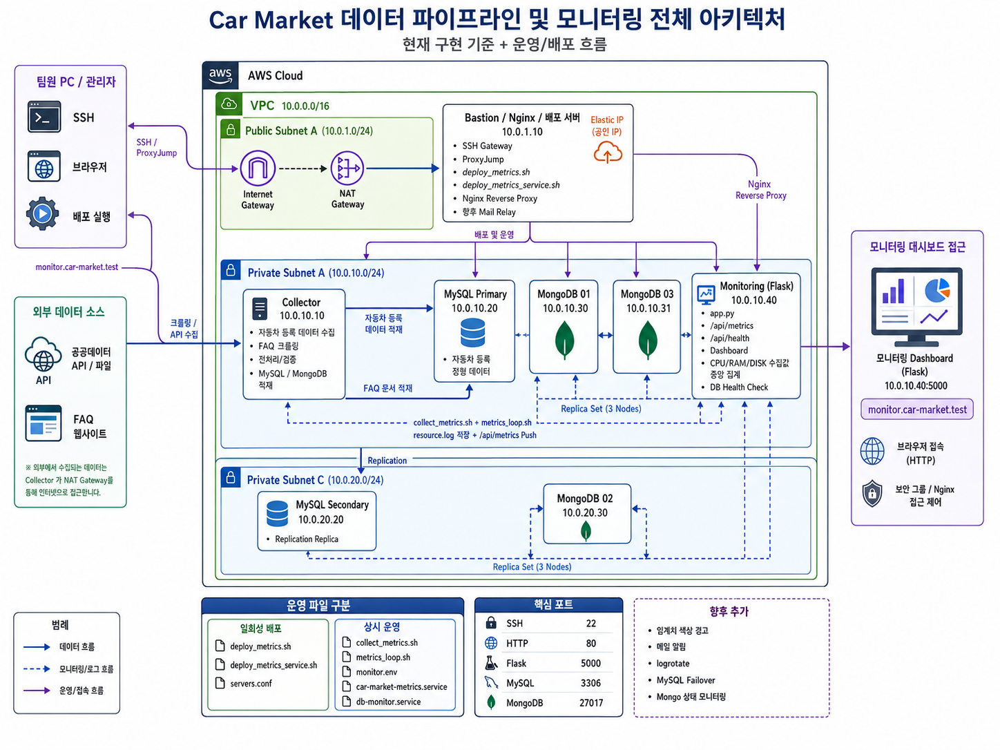
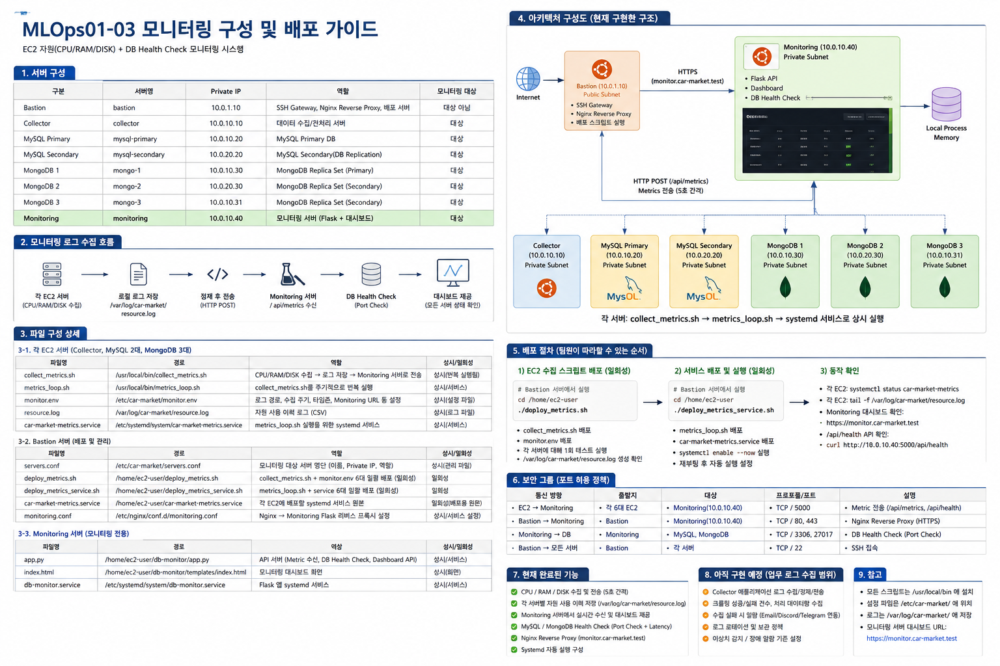
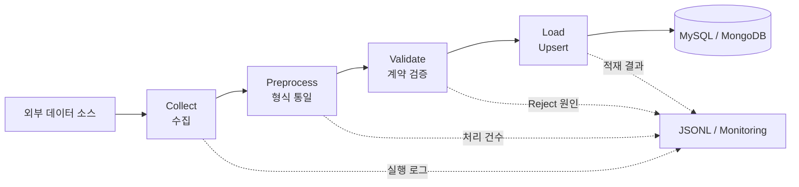
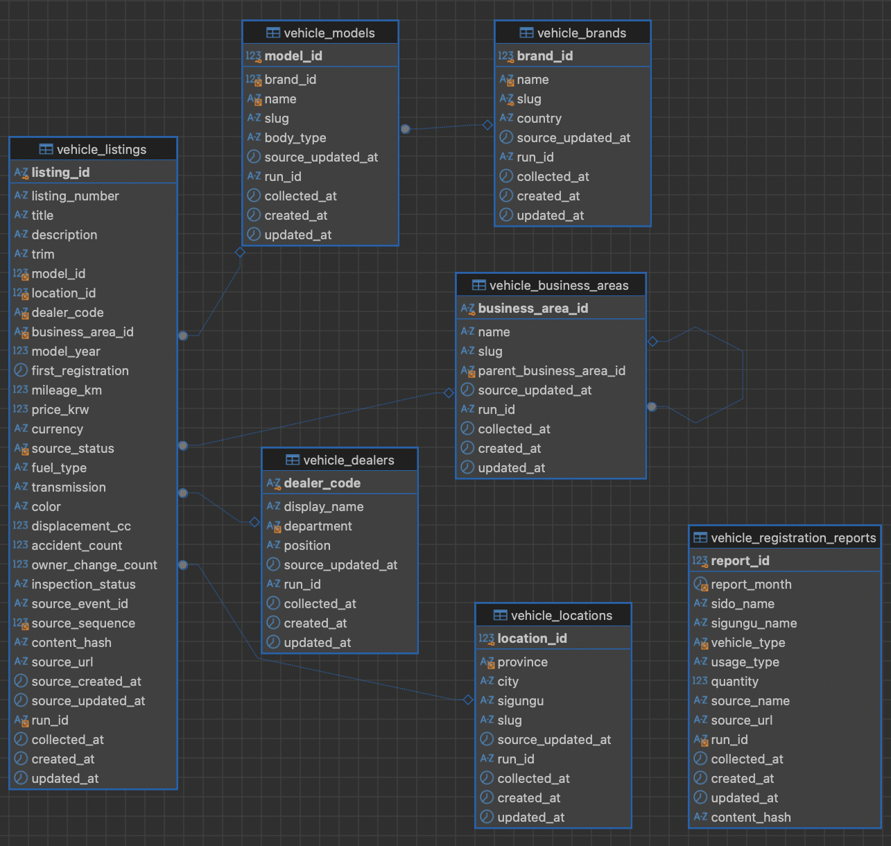

<!-- _class: lead -->

# MLO-01-03

## 중고 자동차 영업·고객지원 데이터 통합 솔루션

분산된 자동차 데이터를 안전하게 수집하고, 업무에서 바로 조회할 수 있는 형태로 연결합니다.

---

# 우리 팀은 수집부터 운영까지 하나의 흐름으로 연결했습니다

**MLO-01-03**은 서로 다른 방식으로 제공되는 자동차 데이터를 하나의 운영 가능한 파이프라인으로 통합한 팀입니다.

- 자동차 등록현황: 지역 시장의 규모와 변화 추이를 보여 주는 **시장 데이터**
- 중고차 매물: 현재 판매 가능한 차량을 보여 주는 **공급 데이터**
- 자동차 FAQ: 고객 문의 대응을 돕는 **고객지원 데이터**
- 공통 목표: `수집 → 전처리 → 검증 → 적재 → 모니터링` 전 과정을 반복 가능하게 운영

> 핵심은 데이터를 한곳에 모으는 데 그치지 않고, 최신성과 신뢰성을 유지하며 다시 실행해도 안전한 구조를 만드는 것입니다.

---

# 네 명이 하나의 데이터 흐름을 나누어 책임졌습니다

| 팀원 | 역할 | 주요 책임 |
|---|---|---|
| **김남동** | **팀장** | 프로젝트 방향과 일정 조율, 팀 산출물 통합 |
| **신성민** | **인프라** | AWS 네트워크·서버 구성, DB 복제, 배포 및 모니터링 환경 구축 |
| **이인건** | **크롤링** | 웹 데이터 수집, 페이지 파싱, 수집 안정성 및 원본 구조 검증 |
| **이재원** | **API 수집 및 통합** | 공공·중고차 API 연동, 수집 모듈과 파이프라인 통합 |

각 담당 영역은 독립적으로 개발하되, 공통 설정·로그·데이터 계약을 통해 하나의 실행 흐름으로 연결했습니다.

---

# 가상 고객사는 필요한 정보를 매번 여러 곳에서 찾아야 했습니다

가상의 고객사는 전국 판매망을 운영하는 중고 자동차 판매사입니다.

| 사용자 | 기존 문제 | 필요한 정보 |
|---|---|---|
| 영업 담당자 | 등록현황과 매물 사이트를 따로 확인하고 직접 비교 | 지역 시장 특성, 판매 가능한 차량, 가격·연식·주행거리 |
| 고객지원 담당자 | 제조사·브랜드별 FAQ를 반복 검색 | 구매·판매·보증·정비 관련 공식 안내 |
| 운영 담당자 | 데이터별 갱신 상태와 실패 원인을 개별 확인 | 마지막 성공 시점, 처리 건수, 오류 위치 |

**문제의 본질:** 출처도 다르고 갱신 방식도 다른 데이터를 사람이 반복해서 찾고 가공해야 했습니다.

---

# 세 데이터를 두 가지 업무 흐름으로 제공합니다

## 영업 의사결정 지원

`자동차 등록현황 + 중고차 매물 → 지역 시장 특성과 현재 공급 현황 비교`

- 지역별 자동차 등록 규모와 차종 구성을 확인합니다.
- 가격·연식·주행거리·지역 조건에 맞는 매물을 조회합니다.
- 두 정보를 함께 보고 영업 및 차량 확보 전략의 근거로 활용합니다.

## 고객지원 업무 지원

`자동차 FAQ → 브랜드·카테고리별 검색 가능한 지식 데이터`

- 고객지원 담당자가 여러 사이트를 다시 탐색하는 시간을 줄입니다.
- FAQ를 최신 상태로 구조화하여 반복 문의 대응을 지원합니다.

> 자동차 등록현황은 직접적인 구매 수요가 아니라, 지역 시장 특성을 파악하기 위한 **간접 지표**입니다.

---

# 현재 구현 아키텍처는 데이터·운영·모니터링을 함께 연결합니다



---

# 아키텍처의 강점은 격리, 복제, 관측 가능성입니다

| 특징 | 구성 | 장점 |
|---|---|---|
| 네트워크 격리 | Bastion·NAT는 Public, Collector·DB·Monitoring은 Private Subnet | DB 직접 노출을 막고 관리 경로를 단일화 |
| 수집 서버 분리 | Collector가 외부 API·FAQ 수집과 전처리·검증 담당 | 수집 장애가 DB 서버에 직접 확산되는 범위를 축소 |
| SQL 복제 | MySQL Primary와 Secondary를 서로 다른 AZ에 배치 | 데이터 복제와 장애 복구 기반 확보 |
| 문서 DB 복제 | MongoDB 3-Node Replica Set | FAQ 데이터 가용성과 확장성 확보 |
| 운영 진입점 | Bastion이 SSH, 배포, Nginx Reverse Proxy 담당 | 접근 정책과 배포 경로를 한곳에서 관리 |
| 모니터링 분리 | Flask Monitoring 서버가 자원 지표와 DB 상태 수집 | 파이프라인과 인프라 상태를 한 화면에서 확인 |

**총 8대 구성:** Bastion 1 + Collector 1 + MySQL 2 + MongoDB 3 + Monitoring 1

---

# 모니터링은 수집, 전송, 확인, 배포까지 운영 흐름으로 구성했습니다



---

# 5초 단위 자원 지표와 DB 상태를 한곳에 모읍니다

## 현재 구성된 기능

- Collector·MySQL·MongoDB 서버의 CPU, RAM, DISK 지표를 5초 간격으로 수집
- 각 서버의 로컬 로그를 Monitoring API의 `/api/metrics`로 전송
- MySQL 3306, MongoDB 27017 포트 기반 DB Health Check
- Flask Dashboard와 `/api/health` 제공
- Nginx Reverse Proxy와 보안 그룹을 통한 제한된 접근
- `systemd` 기반 상시 실행 및 배포 스크립트 기반 일괄 배포

## 추가 예정 기능

- 업무 로그 수집, 임계치 색상 경고, Slack·Email 알림
- `logrotate`, 보존 정책, MySQL Failover, MongoDB 상태 모니터링 고도화

---

# 모든 데이터는 같은 5단계 파이프라인을 통과합니다



- `src/main.py`가 실행 전 설정·Sink 조합을 검증하고 세 파이프라인을 선택합니다.
- 각 파이프라인은 개별 CLI와 모듈로 실행할 수 있어 Source·Schema 변경의 영향을 데이터 흐름별로 분리합니다.
- 공통 JSONL 로그에는 단계, 로직, 처리 건수, 오류 코드가 기록되며 Secret 값은 마스킹됩니다.

---

# 데이터 특성에 맞춰 수집과 저장 방식을 다르게 설계했습니다

| 파이프라인 | 수집 방식 | 핵심 전처리·검증 | 저장소·식별 키 |
|---|---|---|---|
| 자동차 등록현황 | 국토교통 통계 API, 월 단위 요청 | 응답 스키마 확인, Wide → Long 변환, 음수·필수값 검증 | MySQL `vehicle_registration_reports`, 5개 필드 복합 Business Key |
| 중고차 매물 | Cursor 초기 수집 + `after_seq` 증분 API | 관계형 Aggregate 변환, 상태 Enum·숫자·시각 검증, `content_hash` 생성 | MySQL 정규화 테이블, `listing_id` |
| 자동차 FAQ | 허용된 HTML 페이지 순차 크롤링 | Selector 검증, 텍스트·URL·날짜 정규화, `content_hash` 생성 | MongoDB `faq`, `faq_id` Unique Index |

공통 원칙은 **정상 레코드는 계속 처리하고, 잘못된 레코드는 Reject 사유를 남기며, 동일 데이터를 다시 받아도 중복을 만들지 않는 것**입니다.

---

# 재실행해도 안전하도록 성공 지점만 상태로 남깁니다

1. Source 응답의 Host·Path·Schema·크기를 먼저 확인합니다.
2. 전처리 단계에서 필수값과 데이터 타입을 검증합니다.
3. `content_hash`로 기존 데이터와 실제 변경 여부를 비교합니다.
4. 신규 데이터는 `INSERT`, 변경 데이터는 `UPDATE`, 동일 데이터는 `UNCHANGED`로 분류합니다.
5. 중고차 Checkpoint와 등록현황 상태는 적재 성공 후에만 전진합니다.
6. SQL 오류가 발생하면 Transaction을 `ROLLBACK`하고 마지막 성공 지점을 유지합니다.

**결과:** At-least-once 방식으로 재처리하더라도 논리적 중복을 억제하고 실패 지점부터 복구할 수 있습니다.

---

# SQL ERD



---

# ERD는 매물 본체와 반복 참조 정보를 분리합니다

## 중고차 매물 정규화

- `vehicle_listings`: 가격, 주행거리, 상태 등 매물의 최신 상태
- `vehicle_models → vehicle_brands`: 모델과 브랜드 관계
- `vehicle_locations`: 지역 정보
- `vehicle_dealers`: 딜러 정보
- `vehicle_business_areas`: 부모·자식 업무영역 Self-FK

## 자동차 등록현황

- `vehicle_registration_reports`: 기준월·시도·시군구·차종·용도별 등록대수
- 5개 필드 복합 Unique Key로 동일 통계 행의 중복 적재 방지

## 운영 테이블

ERD 이미지 밖에서는 `pipeline_runs`, `api_quota_usage`, `schema_migrations`가 실행 이력·API 호출량·마이그레이션 버전을 관리합니다.

---

# 핵심 모듈은 단계별 책임이 섞이지 않도록 나눴습니다

```text
src/
├── main.py             # 공통 실행 진입점과 사전 검증
├── common/             # Settings, 계약, 시간, 로그, Hash
├── collection/         # 외부 HTML·API 응답 수집
├── preprocessing/      # 순수 변환과 레코드 검증
├── loading/            # JSONL·MySQL·MongoDB Upsert
└── pipelines/          # 단계 조합, 상태, Checkpoint, 결과 집계

migrations/
├── sql/                # MySQL 스키마와 Forward Migration
└── mongo/              # FAQ Validator와 Index
```

이 구조 덕분에 수집 방식이 바뀌어도 전처리·저장 계약을 분리해서 수정하고, Fixture와 Live 데이터를 같은 변환 경로로 검증할 수 있습니다.

---

# 인프라 핵심 로직 — 설정과 접근 정책을 중앙화했습니다

**핵심 파일:** `src/common/config.py`, `src/common/logging_utils.py`, 인프라 배포·모니터링 이미지

```python
batch_size = _positive_int(values, "USED_CAR_BATCH_SIZE", 500)
if batch_size > 500:
    raise ValueError("USED_CAR_BATCH_SIZE must not exceed 500")

interval_seconds = _positive_float(values, "USED_CAR_INTERVAL_SECONDS", 1.0)
if interval_seconds < 1.0:
    raise ValueError("USED_CAR_INTERVAL_SECONDS must be at least 1 second")
```

- Source, SQL, MongoDB, 출력 경로를 환경변수 기반 `Settings` 한곳에서 관리합니다.
- 실행 전에 Source URL, Batch, 호출 간격, Sink 연결정보를 검증합니다.
- API Key, DB Password, Token, Webhook, MongoDB URI는 구조화 로그에서 마스킹합니다.
- 네트워크는 Bastion·Security Group·Private Subnet으로 접근 경계를 제한합니다.

---

# 크롤링 핵심 로직 — 안전한 범위만 순차 수집합니다

**핵심 파일:** `src/collection/faq.py`, `src/preprocessing/faq.py`, `src/pipelines/faq.py`

```python
page = parse_faq_html(self._get(page_url), page_url)
yield page
next_url = self._safe_url(page.next_url) if page.next_url else None
```

- Host와 Path Allowlist로 다음 페이지 링크가 수집 범위를 벗어나지 못하게 합니다.
- 요청 사이에 최소 1초 간격을 두고, 일시적 오류는 제한된 횟수만 재시도합니다.
- BeautifulSoup Selector가 바뀌거나 질문·답변·식별자가 없으면 조용히 누락하지 않고 실패로 처리합니다.
- Live HTML과 Fixture HTML에 동일한 Parser를 적용해 재현 가능한 테스트 경로를 유지합니다.
- 정규화된 `faq_id`와 `content_hash`를 기준으로 MongoDB에 Upsert합니다.

---

# API 핵심 로직 — 초기 수집과 증분 수집을 하나의 계약으로 묶었습니다

**핵심 파일:** `src/collection/api.py`, `src/collection/usedcar.py`, `src/collection/registration.py`, `src/pipelines/usedcar.py`

```python
if selected_mode == "auto":
    selected_mode = "incremental" if checkpoint.get("initialized") else "initial"

stats = sink.save(
    prepared.records,
    checkpoint=next_checkpoint,
    run_id=batch_run_id,
)
last_checkpoint = next_checkpoint
if not dry_run and selected_mode == "incremental":
    checkpoint_store.save(last_checkpoint)
```

- 공통 API Client는 Origin·Endpoint Allowlist를 검사하고 Key를 Header로 전달합니다.
- 403 발생 시 공개 Key를 한 번 갱신하며, 429·5xx에는 제한된 Backoff를 적용합니다.
- 중고차는 최대 500건을 1초 간격으로 순차 요청하고, 초기 Cursor 이후 `after_seq` 증분으로 전환합니다.
- Source가 Sequence 계약을 제공하지 않으면 임의 추정하지 않고 `incremental_contract_missing`으로 중단합니다.
- 자동차 등록 API는 승인된 Host와 월 형식을 검증하고 재시도까지 API Quota에 포함합니다.

---

# SQL 핵심 로직 — FK 순서와 Checkpoint를 하나의 Transaction으로 보호합니다

**핵심 파일:** `migrations/sql/V001__mvp_schema.sql`, `migrations/sql/run.py`, `src/loading/usedcar.py`, `src/loading/registration.py`

```text
brand → model → location → dealer → business_area → listing
                         │
                         └─ pipeline_runs + checkpoint
                                   │
                               COMMIT
                         실패 시 ROLLBACK
```

- PK·FK·Unique Key로 관계와 Business Key를 DB에서도 강제합니다.
- 변경되지 않은 행은 `content_hash` 비교로 Write를 생략합니다.
- Incremental Event에서 빠진 값은 기존의 유효한 값을 보존합니다.
- 중고차 SQL 적재와 `pipeline_runs.progress_key`를 같은 Transaction에 기록합니다.
- Migration 파일은 버전과 SHA-256 Checksum을 기록하여 이미 적용된 스키마의 무단 변경을 탐지합니다.

---

<!-- _class: lead -->

# 핵심 메시지

## 세 가지 데이터를 각각의 특성에 맞게 수집하고, 하나의 운영 원칙으로 연결했습니다

- **영업:** 지역 시장의 맥락과 현재 매물을 함께 조회
- **고객지원:** 분산된 FAQ를 구조화해 빠르게 탐색
- **운영:** 격리된 인프라, 복제 DB, Upsert, 성공 기반 Checkpoint, 모니터링으로 신뢰성 확보

> MLO-01-03의 결과물은 단순 수집기가 아니라, 반복 실행과 장애 복구를 고려한 데이터 파이프라인입니다.

상세 근거: [Business Scenario](Business_Scenario.md) · [PRD](Product_Requirements_Document.md) · [AWS PoC Report](AWS_DB_Infrastructure_PoC_Report_2026-08-11.md) · [SQL Schema](../migrations/sql/V001__mvp_schema.sql) · [Pipeline Entrypoint](../src/main.py)
