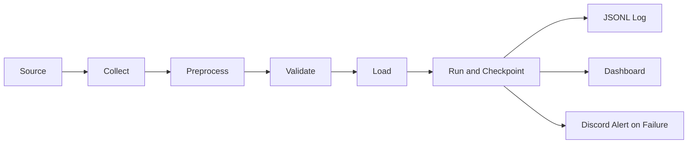

# Implementation Plan — 데이터 수집·전처리·운영 MVP

- document_id: IMPL-MLO-001
- version: v5
- document_state: Review
- brd_reference: [BRD](02_Business_Requirements_Document.md)@v3
- prd_reference: [PRD](03_Product_Requirements_Document.md)@v3
- traceability_reference: [Requirements Traceability](04_requirements-traceability.md)@v3
- data_contract_reference: [Data Specification](05_Data%20Specification.md)@v2
- architecture_reference: [Architecture](06_architecture.md)@v1
- source_registry_reference: [Source Registry](07_source-registry.md)@v2
- target_runtime: Amazon Linux 2023
- baseline_date: 2026-08-12
- provenance: BRD·PRD·Data Specification·Architecture와 사용자 구현 요구사항
- owner_role: <TODO>
- reviewer_roles: [<TODO>]

이 문서는 MVP를 실제 코드로 구현하고, 로컬에서 검증한 뒤 Amazon Linux 2023 Backend 서버로 배포하기 위한 실행 기준이다. 구현 완료를 의미하지 않으며, `planned` 항목은 코드와 Evidence가 생성된 뒤 `pass`로 변경한다.

현재 구현 범위는 세 Source의 `Collect → Preprocess → Validate → Load`와 SQL/MongoDB migrations다. 실시간 Source는 현재 접근할 수 없지만, `.env` 기반 로컬 MongoDB/MySQL 연결·migration·fixture 적재는 검증했다. 실시간 Source 수집 성공과 운영 DB migration 성공은 별도 서버 Smoke Test로 판정한다.

단계 간 결합도를 낮추기 위해 구현 코드는 수집·전처리·적재·파이프라인 폴더로 분리한다. 각 단계는 `common/contracts.py`의 `CollectionEnvelope`와 `PreparedBatch`를 경계 계약으로 사용하며, Pipeline만 세 단계를 조합한다. 운영 진입점은 `pipelines/` 아래에 둔다.

## 1. 구현 목표와 범위

### 1.1 구현 목표

다음 흐름을 Backend 서버의 Python 애플리케이션으로 구현한다.



- FAQ: 매일 09:00 KST 수집 → 전처리·검증 → MongoDB `faq` Upsert
- 중고차: 단일 장기 실행 Worker → 1초 간격 순차 호출 → 500건 Batch → SQL Insert/Upsert → 증분 Checkpoint
- 중고차 SQL: 반복 참조 객체를 `vehicle_brands`, `vehicle_models`, `vehicle_locations`, `vehicle_dealers`, `vehicle_business_areas`로 분리하고 `vehicle_listings`가 FK로 참조
- 자동차등록현황보고: 매일 1회 `start_dt=end_dt=YYYYMM` 호출 → `formList`의 모든 지표를 정규화 → SQL Upsert
- 공통: `run_id`, stage, logic, count, sanitized error, Checkpoint를 기록하고 운영 Dashboard와 Discord에 노출

### 1.2 MVP에서 하지 않는 것

- SQL Primary–Replica 실제 구성, 자동 Failover, 읽기 분산
- MongoDB 3노드 Replica Set 실제 운영, quorum 선출, 자동 Failover
- 고객용 검색·추천·BI·공개 API·AI 응답
- 중고차 과거 상태 이력 테이블과 FAQ 변경 이력 Collection
- Source가 제공하지 않은 API path·field·증분 기준값의 추정

현재 저장소에는 세 Pipeline의 fixture/live bounded entrypoint와 DB Sink가 있다. Dashboard·Discord·systemd 운영 파일은 이 구현 범위에 포함하지 않고 후속 단계로 남긴다.

## 2. 고정 구현 결정과 확인이 필요한 결정

| 항목 | MVP 구현 결정 | 확인 조건 |
|---|---|---|
| 운영체제 | Amazon Linux 2023 | 서버 AMI의 release version을 배포 Evidence에 기록 |
| Python | 애플리케이션 기준 Python 3.11, 3.9 이상 호환 | 로컬·서버 `python --version`이 지원 범위인지 확인 |
| 시스템 Python | `/usr/bin/python3`는 변경하지 않음 | AL2023 시스템 Python symlink를 덮어쓰지 않음 |
| 패키지 관리 | AL2023는 `dnf` 사용 | `yum` 명령을 새 설치 스크립트의 기준으로 사용하지 않음 |
| 정기 실행 | Shell entrypoint + systemd timer | AL2023 기본값은 `cronie`가 아니므로 timer를 기본으로 사용 |
| SQL | MySQL-compatible SQL을 기준으로 구현 | Day 1에 실제 SQL 엔진·버전 확정 후 Driver와 DDL 확정 |
| SQL Driver | 기본안 `PyMySQL` | 실제 엔진이 다르면 Repository 계층만 교체 |
| MongoDB | 단일 서버 standalone | MongoDB 버전·공식 Repository·인증 설정을 서버 착수 전에 확정 |
| MongoDB Driver | `pymongo` | 단일 서버 URI와 향후 Replica Set URI를 환경변수로 분리 |
| 시간 | DB·로그는 UTC, 스케줄과 Dashboard 표시만 KST | `datetime.now(timezone.utc)` 외의 naive datetime 금지 |
| Source | 사용자 지정 Source와 versioned fixture | Source 계약이 확인되기 전에는 fixture로만 검증 |
| 비밀정보 | 로컬 `.env`, 서버 `/etc/mlo/mlo.env` 또는 AWS Parameter Store | Git·로그·Dashboard·Discord에 기록하지 않음 |

Amazon Linux 2023의 `/usr/bin/python3`는 시스템 Python이므로 애플리케이션이 임의로 symlink를 변경하지 않는다. AL2023의 기본 패키지 관리자는 DNF이며, 전통적인 cron은 기본 제공되지 않으므로 FAQ·등록현황의 Shell entrypoint는 systemd timer가 호출한다. 자세한 근거는 [AWS Python in AL2023](https://docs.aws.amazon.com/linux/al2023/ug/python.html), [AWS Package Management](https://docs.aws.amazon.com/linux/al2023/ug/package-management.html), [AWS systemd timers](https://docs.aws.amazon.com/linux/al2023/ug/cron.html)를 따른다.

## 3. 저장소 목표 구조

```text
.
├── docs/
│   └── 00_implementation.md
├── src/
│   ├── common/                   # Config·계약·로그·SQL 변환
│   │   ├── config.py
│   │   ├── contracts.py
│   │   ├── logging_utils.py
│   │   └── sql_utils.py
│   ├── collection/               # 외부 Source·HTTP·fixture adapter
│   │   ├── api.py
│   │   ├── usedcar.py
│   │   ├── faq.py
│   │   └── registration.py
│   ├── preprocessing/            # Raw contract → Prepared contract
│   │   ├── usedcar.py
│   │   ├── faq.py
│   │   └── registration.py
│   ├── loading/                  # SQL·MongoDB·JSONL·checkpoint·quota
│   │   ├── common.py
│   │   ├── usedcar.py
│   │   ├── faq.py
│   │   └── registration.py
│   ├── pipelines/                # 단계 조합과 one-shot CLI
│   │   ├── usedcar.py
│   │   ├── faq.py
│   │   └── registration.py
├── migrations/
│   ├── sql/
│   │   ├── V001__mvp_schema.sql
│   │   └── run.py
│   └── mongo/
│       └── ensure_indexes.py
├── tests/
│   ├── unit/
│   ├── integration/
│   └── fixtures/
├── requirements.in
├── requirements.txt
├── .env.example
└── .gitignore
```

`scripts/`, `deploy/systemd/`, Dashboard와 Discord는 운영 단계에서 추가할 디렉터리이며 현재 fixture 기반 수집·전처리·migration 범위의 완료 근거로 사용하지 않는다.

각 Pipeline은 `src/pipelines/`의 bounded entrypoint로 실행한다. `pipelines/usedcar.py`, `faq.py`, `registration.py`는 fixture 또는 live Source에서 한 번의 유한한 cycle을 수행하고 종료한다. JSONL Sink는 DB 없는 로컬 검증용이며, 운영에서는 `--sink sql` 또는 `--sink mongo`와 migration을 함께 사용한다. Dashboard·Discord·systemd 단위는 다음 구현 단계로 분리한다.

## 4. 환경 설정과 비밀정보

### 4.1 환경변수 계약

`.env.example`에는 이름과 형식만 기록하고 실제 값은 기록하지 않는다.

```dotenv
APP_ENV=local
APP_NAME=mlo-pipeline
LOG_LEVEL=INFO
TIMEZONE=Asia/Seoul
LOG_DIR=.run/logs
LOCK_DIR=.run/locks

USED_CAR_BASE_URL=http://192.168.0.51:4000
USED_CAR_API_KEY=
FAQ_SOURCE_URL=http://192.168.0.51:4000/faqs
FAQ_ALLOWED_PATHS=/faqs
FAQ_MAX_PAGES=100
FAQ_INTERVAL_SECONDS=1
FAQ_LICENSE=educational-sandbox-rewrite
FAQ_ATTRIBUTION=AutoData Lab educational snapshot; official source URL retained

USED_CAR_BATCH_SIZE=500
USED_CAR_INTERVAL_SECONDS=1
USED_CAR_INITIAL_TARGET=10000

REGISTRATION_API_URL=https://stat.molit.go.kr/portal/openapi/service/rest/getList.do
REGISTRATION_API_KEY=
REGISTRATION_FORM_ID=5498
REGISTRATION_STYLE_NUM=2
REGISTRATION_DAILY_QUOTA=3000       # 초과 방지 상한; 실행당 논리 호출은 1회
REGISTRATION_START_PERIOD=          # 비우면 KST 현재 월, fixture 검증 시 YYYY-MM 지정
REGISTRATION_STATE_PATH=output/registration_state.json

SQL_JDBC_URL=jdbc:mysql://localhost:3306/
SQL_HOST=                       # optional override of JDBC host
SQL_PORT=3306                   # optional override of JDBC port
SQL_DATABASE=sales_support_db   # optional override of JDBC database
SQL_USER=root
SQL_PASSWORD=                   # empty => Python None for local no-password MySQL
SQL_LOG_DATABASE=application_logs

MONGODB_URI=mongodb://localhost:27017/
MONGODB_HOST=localhost
MONGODB_PORT=27017
MONGODB_USER=
MONGODB_PASSWORD=               # empty => Python None for local standalone MongoDB
MONGODB_AUTH_SOURCE=admin
MONGODB_DATABASE=support_db
MONGODB_FAQ_COLLECTION=faq

DISCORD_WEBHOOK_URL=
DISCORD_ENABLED=false
```

애플리케이션 시작 시 다음을 검증한다.

- 숫자 환경변수는 양의 정수 또는 양의 실수인지 확인한다.
- `USED_CAR_BATCH_SIZE`는 500을 넘지 않도록 한다.
- `USED_CAR_INTERVAL_SECONDS`는 1.0 이상이어야 한다.
- 중고차 초기 동기화에서 `USED_CAR_INCREMENTAL_FIELD` 또는 Source 계약에 따른 cursor가 없으면 초기 동기화 후 `incremental_contract_missing`으로 중단한다.
- `REGISTRATION_DAILY_QUOTA`는 3,000을 넘는 값으로 설정하지 않는다.
- `DISCORD_ENABLED=true`인데 Webhook URL이 없으면 시작 실패한다.
- `APP_ENV=local`에서는 SQL/MongoDB 비밀번호가 비어 있으면 Python `None`으로 읽어 password-less 로컬 계정에 연결한다.
- `APP_ENV=production`에서는 SQL/MongoDB 사용자·비밀번호와 운영 URI를 명시하고, 빈 credential은 운영 보안 정책이 허용하는 경우에만 사용한다.

### 4.2 비밀정보 보관

로컬에서는 `.env`를 사용하되 `.gitignore`에 포함한다. 서버에서는 `/etc/mlo/mlo.env`를 `root:mlo`, mode `0640`으로 만들고 systemd `EnvironmentFile`로 읽는다. AWS IAM이 준비되면 Parameter Store 또는 Secrets Manager에서 배포 시 주입할 수 있으나, 3일 MVP의 필수 구현은 서버 외부 파일 주입으로 제한한다.

기존 `src/collection/api.py`처럼 URL을 `print`하는 코드는 API Key가 query string에 포함될 수 있으므로 운영 코드로 재사용하지 않는다. URL·Header·Exception을 출력하기 전에 공통 Sanitizer를 통과시킨다.

## 5. Python 구현 기준

### 5.1 공통 모듈 책임

| 모듈 | 책임 | 반드시 하지 않을 것 |
|---|---|---|
| `common/config.py` | 환경변수 파싱·형식 검증·불변 설정 객체 생성 | 요청마다 환경변수 직접 읽기 |
| `common/logging_utils.py` | 구조화 JSONL logic log·redaction | 비밀정보·원본 개인정보 기록 |
| `collection/*` | Source별 HTTP·HTML/JSON parsing·pagination·fixture adapter | 전처리 규칙·DB driver 직접 호출 |
| `preprocessing/*` | Raw mapping 정규화·타입 변환·Business Key·Reject | HTTP·파일·SQL/MongoDB 접근 |
| `loading/*` | SQL/MongoDB/JSONL upsert·checkpoint·quota·transaction | Source endpoint·전처리 규칙 직접 참조 |
| `pipelines/*` | Collect→Preprocess→Validate→Load 조합·stage log | Source 세부 파싱·DB SQL 세부 구현 |
| `common/sql_utils.py` | MySQL DATETIME/JSON 변환 | Source 수집·Business rule 소유 |
| `migrations/sql` | SQL table·unique key·index·forward runner | destructive rollback |
| `migrations/mongo` | FAQ collection/index idempotent ensure | collection/index 삭제 |

### 5.2 공통 데이터 객체

Python 표준 `dataclasses`를 기본으로 사용한다. Source 계약이 확정되기 전에는 `dict[str, Any]`를 Collector 경계에서만 허용하고, 전처리 이후에는 명시적 객체로 변환한다.

```python
from dataclasses import dataclass
from datetime import datetime
from typing import Any


@dataclass(frozen=True)
class RunContext:
    run_id: str
    pipeline_name: str
    schedule_name: str | None
    started_at: datetime


@dataclass(frozen=True)
class StageResult:
    stage_name: str
    collected_count: int = 0
    valid_count: int = 0
    rejected_count: int = 0
    inserted_count: int = 0
    updated_count: int = 0
    unchanged_count: int = 0
    progress_key: str | None = None
```

시간은 항상 timezone-aware UTC로 만든다.

```python
from datetime import datetime, timezone

now_utc = datetime.now(timezone.utc)
```

### 5.3 공통 Pipeline Runner

각 Pipeline의 `run_once`는 동일한 Runner protocol을 따르되, Source·전처리·적재 adapter는 주입된 경계 모듈에서 가져온다. MVP에서는 각 도메인의 상태/쿼리 차이를 억지로 하나의 거대 Runner에 넣지 않고, 공통 계약만 공유한다.

```text
collection/*  ──CollectionEnvelope──▶  pipelines/*  ──PreparedBatch──▶  loading/*
       │                                      │                              │
       └────────────── common/config ─────────┴──────── common/logging ──────┘
```

수집단의 retry·pagination·rate-limit 변경은 `collection/`에서 끝내고, 전처리단의 정규화 규칙 변경은 `preprocessing/`에서 끝낸다. 적재 정책·DB driver·transaction 변경은 `loading/`에서 끝낸다. 다른 단계는 계약 필드와 `content_hash`/Business Key 의미가 유지되는 한 내부 구현을 알 필요가 없다.

```text
1. Pipeline Lock 획득
2. run_id 생성
3. pipeline_runs에 RUNNING 기록
4. Collect
   - Source Guard
   - HTTP/API 호출
   - collected_count와 api_calls 기록
5. Preprocess
   - 정규화·타입 변환
6. Validate
   - 필수값·Business Key·Source 계약 검증
   - Reject count와 원인 기록
7. Load
   - SQL transaction 또는 MongoDB Upsert
8. 성공한 저장 단위의 Checkpoint만 확정
9. pipeline_runs SUCCESS 및 count 기록
10. Lock 해제
```

예외가 발생하면 다음 순서로 처리한다.

```text
1. 현재 DB transaction rollback
2. pipeline_runs를 FAILED로 갱신
3. JSONL File Log에 sanitized exception 기록
4. SQL Log Sink가 살아 있으면 application_logs에 기록
5. Discord 알림이 활성화되어 있으면 민감정보 없는 요약 전송
6. 실패한 Run의 Checkpoint를 다음 성공 기준값으로 사용하지 않음
7. process exit code를 1로 반환하거나 Worker는 supervisor에 재시작을 요청
```

예외 클래스는 최소 다음처럼 분리한다.

| 예외 | 처리 |
|---|---|
| `SourceBlockedError` | write 없이 `BLOCKED` 또는 `FAILED`, 재시도하지 않음 |
| `SchemaMismatchError` | write 없이 `FAILED`, 계약 확인 필요 |
| `RetryableSourceError` | 제한된 backoff 재시도 후 실패 기록 |
| `QuotaExhaustedError` | 추가 호출 없이 `QUOTA_EXHAUSTED` |
| `DataRejectedError` | Record 단위 Reject count 증가, 유효 Record는 정책에 따라 계속 처리 |
| `PersistenceError` | transaction rollback, 파일 로그와 Discord 기록 |
| `DuplicateRunError` | 현재 실행 종료, 기존 Run은 변경하지 않음 |

### 5.4 HTTP와 재시도

HTTP Client는 모든 요청에 connect/read timeout을 지정하고, 응답 Content-Type과 최대 응답 크기를 확인한다. 1초 Worker는 비동기·멀티스레드·동시 요청을 사용하지 않는다.

| 조건 | 재시도 | 정책 |
|---|---:|---|
| DNS·connect timeout·read timeout | 최대 3회 | exponential backoff + jitter, 최소 다음 호출 시각 1초 유지 |
| HTTP 429 | 최대 3회 | `Retry-After`가 있으면 우선 적용, API 호출 quota에는 실제 시도 모두 포함 |
| HTTP 500·502·503·504 | 최대 3회 | backoff 후 재시도 |
| HTTP 400·401·403 | 없음 | Source 또는 인증 오류로 즉시 실패 |
| JSON parse·Schema mismatch | 없음 | write 없이 실패 |

재시도는 응답을 받은 후에 결정한다. 재시도마다 API quota 사용량이 발생할 수 있으므로 자동차등록현황보고는 시도 전에 quota row를 잠그고 `used_count`를 증가시킨다. 다만 정상 실행의 논리적 호출은 하루 1회이며, retry는 장애 상황에서만 사용한다.

### 5.5 FAQ Pipeline

1. `FAQ_SOURCE_URL`에서 허용된 FAQ path만 요청한다.
2. Source Guard가 HTTP status, content type, selector, license·attribution 정책을 확인한다.
3. HTML에서 `faq_id`, 질문, 답변, category, source URL을 추출한다.
4. 태그·제어문자·불필요한 공백을 정규화한다.
5. Source ID가 없으면 `sha256(normalized_source_url + normalized_question)`을 `faq_id`로 만든다.
6. 정규화된 질문·답변·category로 `content_hash`를 계산한다.
7. 필수 ID·질문·답변·license·attribution이 없으면 Reject한다.
8. `faq_id` Unique Index를 확인한 후 MongoDB `update_one(..., upsert=True)`를 수행한다.
9. 동일 hash는 `unchanged_count`, 변경 hash는 `updated_count`, 신규 document는 `inserted_count`로 기록한다.

FAQ의 `license`와 `attribution`은 Source가 제공하는 값을 우선 보존한다. 실제 사용 허가가 확인되지 않은 HTML을 운영 DB에 적재하지 않고, fixture를 사용할 때도 fixture metadata에 출처·허가 기준을 함께 둔다.

### 5.6 중고차 Pipeline과 1초 Worker

#### 초기 동기화

- `listing_id` 또는 Source가 지정한 안정 Key가 없는 응답은 Reject한다.
- 요청 Batch size는 500을 넘지 않는다.
- 초기 목표가 10,000건이면 `ceil(10_000 / 500) = 20`회가 기준이다.
- 응답에 `next_cursor`가 있고 총량이 10,000건보다 많으면 Source 계약에 따라 범위를 결정한다. 20회 이후의 자동 무한 수집은 하지 않는다.
- Source가 500건보다 적게 반환하면서 종료 cursor를 주지 않으면 불완전 수집으로 실패한다.

#### 1초 순차 호출

호출 시작 시각을 기준으로 다음 요청을 예약한다. 응답이 1초보다 오래 걸리면 다음 요청은 응답 직후 시작하며, 요청을 겹치지 않는다.

```text
next_start = monotonic()

while has_next_batch:
    sleep(max(0, next_start - monotonic()))
    response = request_one_batch(limit=500, cursor=cursor)
    persist_batch_in_one_transaction(response)
    next_start = max(next_start + 1.0, monotonic())
```

실제 구현에서는 `time.monotonic()`을 사용하고, 테스트에서는 Clock을 주입하여 sleep 없이 간격을 검증한다. `time.sleep(1)`을 무조건 호출하는 방식은 응답 시간이 포함된 호출 간격을 잘못 계산할 수 있다.

#### 증분 동기화와 Checkpoint

- Source 계약에서 `sequence`, `updated_at`, `cursor` 중 하나를 확정한다.
- 마지막 **성공한** Batch의 값만 다음 요청의 `since` 또는 cursor로 사용한다.
- 한 Batch의 SQL Upsert가 commit되기 전에는 Checkpoint를 전진시키지 않는다.
- 실패 후 재실행은 마지막 성공 Batch부터 시작하며, 이미 처리한 Row는 SQL Unique Key와 Upsert로 중복 증가를 막는다.
- Source가 증분 기준값을 제공하지 않으면 `incremental_contract_missing`으로 중단한다.

중고차 Worker는 장기 실행 프로세스이므로 API Batch 단위를 독립 Run으로 기록하는 것을 기본으로 한다. 각 성공 Batch의 `pipeline_runs.status=SUCCESS`와 `progress_key`가 다음 Checkpoint 후보이며, Dashboard는 동일 실행 시간대의 Batch Run을 묶어 Worker Cycle로 표시한다. 이렇게 하면 중간 Batch 실패 뒤 마지막 성공 기준값을 잃지 않는다.

#### 중고차 전처리·적재

- 숫자형 가격·주행거리·연식은 변환 가능성을 검증한 뒤 SQL 타입으로 변환한다.
- Source 상태는 문서화된 enum을 검증한 뒤 `source_status`에 저장한다. 아직 별도 내부 상태 매핑이 없으므로 `normalized_status`를 중복 저장하지 않는다.
- `brand`, `model`, `location`, `dealer`, `businessArea`가 있으면 안정 ID를 검증하고 관계형 준비 aggregate의 별도 객체로 만든다.
- Loader는 참조 객체를 먼저 Upsert한 뒤 `vehicle_listings`에 model/location/dealer/business-area FK와 매물별 사실을 저장한다. 브랜드는 model→brand 조인으로 조회하고, 업무영역 부모는 self-FK로 조회한다. 한 Batch는 하나의 transaction으로 처리한다.
- 증분 이벤트가 일부 필드만 보내면 SQL Upsert의 `COALESCE` 정책으로 이미 저장된 non-null 값을 보존한다.
- 최초 `listing_id`는 Insert, 동일 ID는 변경 필드만 Upsert한다.
- 과거 상태 이력은 저장하지 않는다.
- SQL transaction이 성공한 Batch만 `progress_key`를 성공 상태로 기록한다.

### 5.7 자동차등록현황보고 Pipeline

1. 실행 시작 시 KST 날짜·API의 `api_quota_usage` Row를 생성하거나 조회한다.
2. API 호출 직전에 transaction으로 `used_count < quota_limit`를 확인하고 1을 증가시킨다.
3. `--period` 또는 `REGISTRATION_START_PERIOD`가 있으면 해당 `YYYYMM`, 없으면 KST 현재 월을 요청한다.
4. `start_dt`와 `end_dt`에 같은 월을 넣어 매일 논리적 API 호출 1회를 수행한다. 자동으로 과거 월을 순회하지 않는다.
5. `result_data.formList`의 각 원천 행에서 `date`, `시도명`, `시군구`를 추출하고 `승용>관용` 등 `>`가 있는 모든 지표를 개별 Row로 분해한다.
6. 분해된 Row의 `report_month`, `sido_name`, `sigungu_name`, `vehicle_type`, `usage_type`, `quantity`를 검증한다. `1,000`은 1000으로, `-`는 NULL로 저장한다.
7. `(report_month, sido_name, sigungu_name, vehicle_type, usage_type)` 기준으로 SQL Upsert한다.
8. 실제 호출·재시도 횟수는 quota에 반영하며, quota가 소진되면 다음 실행까지 추가 호출하지 않는다.

예를 들어 API 원천 행의 `승용>관용: 156`은 다음 한 Row가 된다.

```text
report_month=2026-06-01 | sido_name=서울 | sigungu_name=강남구
vehicle_type=승용       | usage_type=관용 | quantity=156
```

한 원천 행의 차량구분 5개(`승용`, `승합`, `화물`, `특수`, `총계`)와 용도구분 4개(`관용`, `자가용`, `영업용`, `계`)가 모두 있으면 SQL에는 20 Row가 생성된다.

현재 참고 수집기([`ref/molit_car_registration_daily.py`](../ref/molit_car_registration_daily.py))는 공식 API 접근과 월별 응답 형태를 확인하기 위한 참고 자료다. 운영 Pipeline은 이 파일을 그대로 실행하지 않고, Data Specification의 `formList` 분해·SQL Business Key·quota·run 기록을 적용한 Adapter로 실행한다.

## 6. Logging 구현

### 6.1 로그 저장 경계

| Sink | 목적 | 장애 시 |
|---|---|---|
| JSONL File Log | 즉시 기록, systemd/journal과 함께 운영 | 항상 먼저 기록하고 보존 |
| SQL `application_logs` migration | Dashboard 조회·Run별 추적을 위한 저장 계약 | 현재 bounded 구현에서는 schema만 준비; 실제 SQL log writer 연동은 DB 연결 단계 |

현재 bounded 구현은 `JsonlLogger`가 UTF-8 JSONL 파일과 stderr에 `run_id`, `pipeline_name`, `stage_name`, `logic_name`을 포함한 이벤트를 기록한다. 모든 Stage의 시작·성공·Reject·실패를 `INFO` 또는 `WARNING`/`ERROR`로 기록하고, Row 단위 정상 처리 로그는 남기지 않는다. SQL `application_logs`는 V001 migration으로 테이블 계약만 준비되어 있으며, 실제 SQL log writer와 `pipeline_runs` writer는 운영 DB 연결 단계의 후속 작업이다.

### 6.2 공통 로그 Event

```json
{
  "ts": "2026-08-11T00:00:00.123Z",
  "level": "INFO",
  "service": "mlo-pipeline",
  "run_id": "uuid",
  "pipeline_name": "used_car",
  "stage_name": "Load",
  "logic_name": "used_car.load",
  "event_name": "batch_committed",
  "message": "vehicle listing batch committed",
  "count": 500,
  "inserted_count": 320,
  "updated_count": 150,
  "unchanged_count": 30,
  "checkpoint": "C100",
  "error_code": null
}
```

필수 context는 `run_id`, `pipeline_name`, `stage_name`, `logic_name`이다. `record_key`를 남길 때도 원본 개인정보·전화번호·주소는 기록하지 않고 안정 ID 또는 해시만 사용한다.

### 6.3 Sanitizer와 Discord

다음 키와 패턴은 파일·SQL·Dashboard·Discord 전부에서 마스킹한다.

```text
api_key, key, token, access_token, password, secret, authorization,
webhook, mongodb_uri, sql_password, cookie, 주민등록번호, 전화번호
```

Discord 메시지는 다음 형식으로 제한한다.

```text
[MLO][FAILED] pipeline=used_car run_id=<uuid-prefix>
stage=Collect logic=used_car.collect error_code=HTTP_503
summary=upstream service unavailable retry exhausted
```

원본 응답 body, URL query의 key, DB URI, Webhook URL, traceback 전체는 전송하지 않는다. 동일 `run_id + error_code` 알림은 한 번만 전송하고, notify 성공·실패도 `discord.notify`로 기록한다.

### 6.4 파일 보존과 systemd

- 기본 경로: 로컬 `.run/logs/`, 서버 `/var/log/mlo/`
- 형식: UTF-8 JSONL
- Rotation: 날짜 단위 또는 100 MB 중 먼저 도달하는 기준
- 보존 기간: 운영 정책 확정 전까지 7일 예시, 실제 값은 TODO
- systemd stdout/stderr도 `journalctl -u <unit>`에서 확인한다.
- SQL Log Sink 장애가 Pipeline을 무조건 성공으로 바꾸지 않는다. 데이터 적재 상태와 Log Sink 상태를 별도 Event로 남긴다.

## 7. SQL 구현

### 7.1 SQL 서버와 계정

SQL 엔진이 MySQL-compatible로 확정되는 경우에만 Data Specification의 MySQL 계열 DDL을 실행한다. Backend에는 DB 관리자 계정을 두지 않고, 애플리케이션 전용 계정을 사용한다.

```text
sales_support_db     : vehicle_brands, vehicle_models, vehicle_locations,
                       vehicle_dealers, vehicle_business_areas, vehicle_listings,
                       vehicle_registration_reports,
                       pipeline_runs, api_quota_usage
application_logs     : application_logs
```

최소 권한은 다음과 같다.

- Backend 계정: 두 DB의 필요한 SELECT·INSERT·UPDATE·CREATE INDEX 권한
- 운영자 계정: Bastion에서만 사용, 애플리케이션 credential과 분리
- Migration 계정: 배포 시에만 사용, 상시 Service 환경변수에 두지 않음

SQL 서버 Security Group은 Backend와 Bastion의 관리 접속만 허용한다. Public inbound와 Backend 외부의 DB 접속을 허용하지 않는다.

### 7.2 Migration

모든 Schema 변경은 순서가 있는 파일로 관리한다.

```text
migrations/sql/V001__mvp_schema.sql
```

Migration Runner는 `schema_migrations(version, applied_at, checksum)`를 관리하고, 이미 적용된 파일을 다시 실행하지 않는다. 배포 전에 다음 순서를 지킨다.

```text
1. SQL 연결·권한 health check
2. Migration 파일 checksum 확인
3. V001 적용
4. Unique Key·Index 조회
5. Backend 애플리케이션 시작
```

`V001` 하나가 공통 MVP 테이블, 실제 API 응답에 맞는 중고차 관계형 구조, 등록현황 정규화 구조를 함께 만든다. 중고차 참조 테이블과 매물 본체를 별도 migration으로 쪼개지 않는 것은 3일 MVP 기준선에서 신규 설치와 검증 경로를 하나로 유지하기 위한 결정이다.

이번 중고차 정규화 보정도 사용자 결정에 따라 `V001`에 직접 반영했다. 이미 이전 checksum으로 V001이 적용된 DB는 새 파일을 자동 재실행하지 않으며 checksum mismatch가 발생한다. 기존 DB는 백업 후 새 V001 기준으로 재생성하거나, 승인된 점검 창에서 `brand_id`·`normalized_status`·`parent_name` 제거와 기존 조회 View 삭제를 수동 반영한 뒤 schema와 checksum을 함께 검증한다. checksum만 임의로 갱신하지 않는다.

2026-08-12 로컬 MySQL에서는 영향을 받는 `vehicle_listings`, `vehicle_business_areas`를 백업한 뒤 위 절차를 수행했다. 2026-08-12 후속 정리에서 불필요한 `vehicle_listing_detail` 조회 View도 삭제했다. 기존 행 수는 유지되었고(`vehicle_listings` 3건, `vehicle_business_areas` 4건), 이후 Migration Runner는 `{"status": "OK", "applied": []}`를 반환하여 V001 checksum과 실제 파일의 일치를 확인했다.

- `vehicle_brands`, `vehicle_models`, `vehicle_locations`, `vehicle_dealers`, `vehicle_business_areas`는 API 안정 ID를 Primary Key로 사용한다.
- `vehicle_listings` Primary Key: `listing_id`; model/location/dealer/business-area 4개 관계를 Foreign Key로 연결하고, 브랜드는 model→brand로 조인한다.
- `vehicle_registration_reports` Unique Key: `report_month, sido_name, sigungu_name, vehicle_type, usage_type`
- `pipeline_runs` Primary Key: `run_id`
- `api_quota_usage` Primary Key: `quota_date, api_name`
- `application_logs.application_logs`의 Run·Logic·시간 Index

### 7.3 Repository와 Transaction

SQL 입력은 모두 Parameterized Query로 전달한다. Repository는 Pipeline이 SQL 문법을 알지 않도록 한다.

```text
VehicleListingRepository.upsert_many(rows)
RegistrationRepository.upsert_many(rows)
RunRepository.start(run_context)
RunRepository.finish_success(run_id, counts, progress_key)
RunRepository.finish_failed(run_id, error_code, sanitized_message)
QuotaRepository.reserve_call(quota_date, api_name, limit)
LogRepository.append(event)
```

중고차 Batch의 transaction 경계는 다음과 같다.

```text
BEGIN
  vehicle_brands / vehicle_models / vehicle_locations /
    vehicle_dealers / vehicle_business_areas Upsert
  vehicle_listings INSERT ... ON DUPLICATE KEY UPDATE ...
  Batch count update
  성공한 progress_key 기록
COMMIT
```

`COMMIT` 전에 예외가 나면 Row와 Checkpoint를 함께 rollback한다. `pipeline_runs`의 실패 상태는 rollback 뒤 별도 transaction으로 기록한다. 동일 Batch 재실행은 Unique Key와 Upsert로 중복을 만들지 않아야 한다.

### 7.4 Quota 원자성

자동차등록현황보고의 호출 전 quota 예약은 `SELECT ... FOR UPDATE` 또는 엔진에 맞는 원자적 갱신으로 구현한다.

```text
BEGIN
  row = SELECT used_count, quota_limit
        FROM api_quota_usage
        WHERE quota_date=? AND api_name=?
        FOR UPDATE
  if row.used_count >= row.quota_limit:
      ROLLBACK
      raise QuotaExhaustedError
  UPDATE api_quota_usage
     SET used_count = used_count + 1,
         last_call_at = ?,
         updated_at = ?
COMMIT
HTTP request
```

실제 호출이 실패해도 요청이 전송되었다면 `used_count`를 되돌리지 않는다. 재시도 역시 새 호출이므로 별도 예약이 필요하다.

### 7.5 SQL Health Check

Dashboard와 배포 Smoke Test는 다음을 확인한다.

```sql
SELECT 1;
SELECT COUNT(*) FROM pipeline_runs;
SELECT COUNT(*) FROM vehicle_listings;
SELECT COUNT(*) FROM vehicle_registration_reports;
```

테이블 조회 실패를 0건으로 표시하지 않고 `DB_UNAVAILABLE`로 표시한다.

### 7.6 향후 Primary–Replica 경계

MVP에서는 `SQL_DSN` 하나를 Writer로 사용한다. 코드에 `sql-01` IP를 직접 쓰지 않고, 이후 다음 환경변수로 확장한다.

```text
SQL_WRITER_DSN
SQL_READER_DSN
```

모든 Upsert·Run·quota·log 쓰기는 Writer를 사용한다. 읽기 분산은 Replica lag과 Run 조회 일관성을 검증한 뒤 별도 변경 요청으로 진행한다.

## 8. MongoDB 구현

### 8.1 단일 서버 연결

MVP는 standalone MongoDB 한 대를 사용한다. Backend는 URI를 코드에 두지 않고 `MONGODB_URI`로 주입한다.

```text
MVP:
mongodb://<user>:<password>@<host>:27017/support_db?authSource=admin&retryWrites=false

Future Replica Set:
mongodb://<user>:<password>@mongo-01,mongo-02,mongo-03/support_db?
authSource=admin&replicaSet=rs0&retryWrites=true&w=majority
```

standalone MVP에서는 `retryWrites=false`를 사용하고, 3노드 Replica Set을 구성할 때 `replicaSet`, retryable writes, majority write concern을 함께 검증한다.

### 8.2 초기화와 Index

애플리케이션 시작 또는 별도 Migration Command에서 `support_db.faq`의 Index를 idempotent하게 생성한다.

```python
collection.create_index("faq_id", unique=True, name="uq_faq_id")
collection.create_index([("brand", 1), ("category", 1)], name="ix_faq_brand_category")
collection.create_index([("updated_at", -1)], name="ix_faq_updated_at")
```

Unique Index 생성에 실패하면 FAQ 적재를 시작하지 않는다. Index를 삭제하고 다시 만드는 작업은 운영 절차와 승인 없이 수행하지 않는다.

### 8.3 FAQ Upsert

```python
collection.update_one(
    {"faq_id": document["faq_id"]},
    {
        "$set": {
            "question": document["question"],
            "answer": document["answer"],
            "brand": document.get("brand"),
            "category": document.get("category"),
            "source_url": document["source_url"],
            "license": document["license"],
            "attribution": document["attribution"],
            "source_updated_at": document.get("source_updated_at"),
            "collected_at": document["collected_at"],
            "run_id": document["run_id"],
            "content_hash": document["content_hash"],
            "is_active": document["is_active"],
            "updated_at": document["updated_at"],
        },
        "$setOnInsert": {"created_at": document["created_at"]},
    },
    upsert=True,
)
```

적재 전 Document Validator가 `faq_id`, 질문, 답변, source, license, attribution을 확인한다. Reject는 MongoDB에 빈 Document로 저장하지 않고 Run·SQL Log로 남긴다. 동일 `content_hash`는 변경 없음으로 처리하여 불필요한 Update를 줄인다.

### 8.4 MongoDB 서버 운영 경계

- `mongod`는 Backend와 Bastion의 private IP만 bind/inbound 대상으로 한다.
- 인증을 활성화하고 애플리케이션 계정과 관리자 계정을 분리한다.
- MongoDB 버전과 AL2023 호환 공식 Repository는 배포 전에 고정한다. `latest` 패키지를 운영에 사용하지 않는다.
- 단일 서버 MVP는 Replica Set quorum과 자동 Failover를 보장하지 않는다.
- 향후 3노드 구성 시 세 노드의 Index·Replica Set 이름·time source·네트워크 접근을 동일 기준으로 관리한다.

## 9. 후속 Dashboard와 운영 명령

Dashboard와 운영 명령 통합은 이번 수집·전처리·migration 구현 뒤의 후속 범위다. 외부 사용자를 위한 서비스가 아니라 Bastion Tunnel을 통한 읽기 전용 운영 화면으로 구현한다.

### 9.1 Endpoint

| Endpoint | 내용 | 변경 가능 여부 |
|---|---|---:|
| `GET /healthz` | 프로세스 health | 없음 |
| `GET /api/summary` | 세 Pipeline 최근 상태·Count·Checkpoint | 없음 |
| `GET /api/runs` | 최근 Run 목록·오류 요약 | 없음 |
| `GET /api/db` | SQL/MongoDB 연결 상태 | 없음 |
| `GET /api/quota` | 등록현황 일일 quota | 없음 |
| `/` | 운영 요약 HTML | 없음 |

Dashboard는 `127.0.0.1:8000`에만 bind하고, Backend Security Group에서 public inbound 8000을 열지 않는다.

```bash
ssh -N -L 8000:127.0.0.1:8000 <bastion-user>@<bastion-host>
```

### 9.2 CLI

후속 단계에서 배포·검증 명령을 하나의 CLI로 통합한다. 현재 구현의 직접 실행 명령은 다음과 같다.

```text
python migrations/sql/run.py              # .env의 SQL_JDBC_URL/SQL_* 사용
python migrations/mongo/ensure_indexes.py # .env의 MONGODB_URI 또는 MONGODB_* 사용
python src/pipelines/faq.py --fixture tests/fixtures/faq.html --sink json
python src/pipelines/registration.py --fixture tests/fixtures/registration.json --period 2026-06
python src/pipelines/usedcar.py --mode initial --fixture tests/fixtures/usedcar_initial.json
python src/pipelines/usedcar.py --mode incremental --fixture tests/fixtures/usedcar_changes.json
```

`--fixture`는 Source 계약을 우회하는 운영 옵션이 아니다. Fixture 버전과 checksum을 Evidence에 기록하고, 운영 환경에서는 `APP_ENV=production`일 때 fixture 실행을 차단한다.

## 10. Amazon Linux 2023 배포

### 10.1 Backend 서버 준비

다음 명령은 예시이며 실제 Python minor version과 AL2023 release version을 확인한 뒤 실행한다.

```bash
sudo dnf check-update
sudo dnf install -y git tar gcc python3.11 python3.11-pip

sudo useradd --system --home-dir /opt/mlo --shell /sbin/nologin mlo
sudo install -d -o mlo -g mlo -m 0750 /opt/mlo
sudo install -d -o mlo -g mlo -m 0750 /var/lib/mlo
sudo install -d -o mlo -g mlo -m 0750 /var/log/mlo
sudo install -d -o root -g mlo -m 0750 /etc/mlo

sudo -u mlo python3.11 -m venv /opt/mlo/venv
```

`/usr/bin/python3` symlink을 바꾸거나 시스템 Python site-packages에 애플리케이션 의존성을 설치하지 않는다. DNF 업데이트는 배포 중 무계획으로 수행하지 않고, AL2023 release version과 보안 업데이트 Evidence를 함께 기록한다.

### 10.2 패키지 설치

```bash
sudo -u mlo /opt/mlo/venv/bin/python -m pip install --upgrade pip
sudo -u mlo /opt/mlo/venv/bin/pip install -r /opt/mlo/current/requirements.txt
```

운영 배포 전에는 `requirements.txt`의 허용 범위를 정확한 버전과 hash로 별도 잠근다. 현재 저장소의 최소 의존성은 다음과 같다.

```text
PyMySQL                # SQL sink와 migration runner
pymongo                # MongoDB FAQ sink와 index migration
pytest                 # 로컬 검증
```

HTTP 요청은 Python 표준 라이브러리 `urllib`로 처리하고, FAQ HTML 파싱·추출은 `beautifulsoup4`와 내장 `html.parser`를 사용한다. `lxml` 같은 별도 네이티브 parser는 MVP 의존성에 포함하지 않는다.

### 10.3 환경 파일과 릴리스 배치

```text
/opt/mlo/releases/<release_id>/   immutable release
/opt/mlo/current                  현재 release symlink
/opt/mlo/venv                      Python virtual environment
/var/lib/mlo                      lock·local state가 필요한 경우만
/var/log/mlo                      JSONL application log
/etc/mlo/mlo.env                   root:mlo, 0640
```

배포는 Bastion을 경유한다.

```text
로컬 검증 완료
  → release archive 생성
  → Bastion으로 전송
  → Backend /opt/mlo/releases/<release_id>에 압축 해제
  → requirements 설치
  → /opt/mlo/current symlink 교체
  → SQL migration·MongoDB Index
  → systemd daemon-reload
  → 서비스 재시작
  → Smoke Test
```

Release directory를 덮어쓰지 않고 새 디렉터리를 만들며, Rollback은 이전 symlink로 되돌린다. 이미 적용된 SQL Migration은 자동으로 되돌리지 않고 호환 가능한 Forward Migration으로 처리한다.

### 10.4 후속 systemd Service

현재 저장소에는 systemd unit과 Shell entrypoint가 없으며, 아래는 로컬 fixture·migration 검증 이후 서버 이관 시 추가할 기준이다.

#### 중고차 Worker

`deploy/systemd/mlo-used-car-worker.service`의 기준은 다음과 같다.

```ini
[Unit]
Description=MLO used-car incremental worker
After=network-online.target
Wants=network-online.target

[Service]
Type=simple
User=mlo
Group=mlo
WorkingDirectory=/opt/mlo/current
EnvironmentFile=/etc/mlo/mlo.env
ExecStart=/opt/mlo/venv/bin/python /opt/mlo/current/src/pipelines/usedcar.py --mode auto --sink sql
Restart=on-failure
RestartSec=10
NoNewPrivileges=true
PrivateTmp=true
ProtectHome=true
ReadWritePaths=/var/lib/mlo /var/log/mlo
StandardOutput=journal
StandardError=journal

[Install]
WantedBy=multi-user.target
```

동일 Worker를 여러 번 `systemctl start`하지 않으며, Python Lock을 추가로 사용한다. Worker가 정상 종료하지 않는 한 systemd가 재시작한다.

#### 일일 Shell Entry Point

```bash
#!/usr/bin/env bash
set -Eeuo pipefail

cd /opt/mlo/current
exec /opt/mlo/venv/bin/python src/pipelines/faq.py --sink mongo
```

Shell은 환경 확인과 단일 Python 명령 실행만 담당한다. 데이터 변환·SQL·MongoDB 로직을 Shell에 넣지 않는다.

#### FAQ Timer

```ini
[Unit]
Description=Run FAQ pipeline daily at 09:00 KST

[Timer]
OnCalendar=*-*-* 09:00:00 Asia/Seoul
Persistent=true
Unit=mlo-faq.service

[Install]
WantedBy=timers.target
```

등록현황 Timer의 시각은 요구사항에 지정되지 않았으므로 `REGISTRATION_SCHEDULE_KST`를 owner가 확정한 뒤 같은 방식으로 작성한다. 배포 전에 다음 명령으로 Calendar 표현식을 확인한다.

```bash
systemd-analyze calendar '*-*-* 09:00:00 Asia/Seoul'
sudo systemctl daemon-reload
sudo systemctl enable --now mlo-used-car-worker.service
sudo systemctl enable --now mlo-faq.timer
sudo systemctl list-timers 'mlo-*'
```

AL2023에서 전통적인 crontab이 반드시 필요하면 `cronie`를 별도로 설치할 수 있지만, MVP의 기본은 AWS 권고에 맞춘 systemd timer다. PRD의 “Shell/cron”은 Shell entrypoint와 정기 스케줄을 의미하며, AL2023에서는 timer로 구현한다.

### 10.5 SQL·MongoDB 서버 배치

#### SQL 서버

- Private Subnet의 private IP 또는 내부 DNS에만 bind
- Backend Security Group과 Bastion 관리 접속만 허용
- 애플리케이션 계정·Migration 계정·관리자 계정 분리
- `utf8mb4`, UTC 저장, Data Specification의 Unique Key 적용
- MVP는 단일 Writer이며 백업·복구 절차는 별도 운영 작업으로 기록

#### MongoDB 서버

- AL2023 호환 공식 MongoDB Repository와 버전을 사전 고정
- `mongod.conf`의 bind IP·authorization·port를 private 네트워크 기준으로 설정
- Backend와 Bastion만 27017 접근 허용
- `support_db.faq`와 Unique Index를 초기화
- standalone URI에서는 `retryWrites=false`, Replica Set 전환 시 URI·write concern을 함께 변경

실제 SQL/MongoDB package 설치 명령은 엔진·버전·Repository가 확정된 뒤 별도 Infra 변경으로 고정한다. 구현 문서에서 임의의 `latest` 패키지나 Public DB 주소를 사용하지 않는다.

## 11. 로컬 검증 절차

### 11.1 로컬 원칙

- Python 명령은 프로젝트 규칙에 따라 `conda activate sandbox` 후 실행한다.
- 처음부터 Live Source를 호출하지 않고 versioned fixture로 Pipeline 계약을 검증한다.
- SQL과 MongoDB는 로컬 단일 인스턴스에서 통합 검증하고, 연결이 없으면 unit test만 통과한 것으로 표시한다.
- 실제 API 호출을 수행한 경우에도 API Key·응답 원문·개인정보를 결과 파일에 남기지 않는다.

### 11.2 기본 명령

```bash
conda activate sandbox
python --version
python -m pip install -r requirements.txt

python -m compileall -q src migrations tests
python -m pytest -q

python migrations/sql/run.py              # .env의 SQL_JDBC_URL/SQL_* 사용
python migrations/mongo/ensure_indexes.py # .env의 MONGODB_URI 또는 MONGODB_* 사용
python src/pipelines/faq.py --fixture tests/fixtures/faq.html --sink json
python src/pipelines/usedcar.py --mode initial --fixture tests/fixtures/usedcar_initial.json
python src/pipelines/usedcar.py --mode incremental --fixture tests/fixtures/usedcar_changes.json
python src/pipelines/registration.py --fixture tests/fixtures/registration.json --period 2026-06
```

실시간 Source에 접근하지 못하는 상태에서는 live 수집 성공을 주장하지 않는다. 로컬 DB가 실행 중이면 `.env`를 읽는 migration·적재 명령과 DB 조회 결과를 별도 Evidence로 기록한다.

### 11.3 테스트 Matrix

| 영역 | 검증 내용 | 기대 결과 | Evidence |
|---|---|---|---|
| Config | 빈 credential·잘못된 limit·잘못된 interval | 시작 실패, 비밀정보 미출력 | `evidence/day1-config.md` |
| FAQ transform | HTML fixture 정상·누락·변경 | Document·Reject·hash 생성 | JSONL log·`pytest` |
| FAQ load | 동일 FAQ 2회, 답변 변경 | 중복 0, 변경만 Update | `evidence/day2-faq.md` |
| 중고차 rate | 500건 20 Batch fixture | 1초 미만 시작 간격 0, 동시 요청 0 | `evidence/day2-listing.md` |
| 중고차 checkpoint | C100 성공 후 C101 실패 | C100 유지, 재실행 C101부터 | `evidence/listing-checkpoint.md` |
| 중고차 upsert | 신규·변경·동일 Row | Insert·Update·Unchanged 분리 | `evidence/day2-listing.md` |
| 등록 호출 | 실제 API shape fixture와 quota 3,000 | 실행당 API 호출 1회, quota 초과 0 | `evidence/day2-registration.md` |
| 등록 분해 | `formList`의 20개 지표 fixture | 원천 행 2개 → 정규화 Row 40개 | `evidence/day2-registration.md` |
| 등록 Upsert | 같은 월·지역·차량·용도 fixture 2회 | Row 중복 0, 두 번째 실행 unchanged | `evidence/day2-registration.md` |
| Pipeline stage | 세 Pipeline 성공·Reject·실패 | Collect→Preprocess→Validate→Load 기록 | `evidence/day3-operations.md` |
| Layer boundary | 수집·전처리·적재 역참조·stage contract | 역참조 없음, `CollectionEnvelope`·`PreparedBatch` 통과 | `pytest`, `tests/test_layer_boundaries.py` |
| Retry | timeout·429·503·403 fixture | 허용 오류만 제한 재시도 | `evidence/retry-idempotency.md` |
| Log redaction | Query·Header·Exception·Discord payload scan | secret suspect 0 | `evidence/requirements-review.md` |
| Isolation | FAQ 실패·중고차 성공 동시 실행 | 각각 독립 Run | `evidence/day3-operations.md` |
| Dashboard | Run·DB·quota·오류 상태 | 읽기 전용 요약 확인 | `evidence/day3-observability.md` |
| Source guard | 403·Schema·license·증분 계약 실패 | write 없이 blocked/failed | `evidence/source-guard.md` |
| Deploy | clean release에서 설치·migration·health | 서버 Smoke Test 통과 | `evidence/final-verification.md` |

### 11.4 로컬 검증 통과 조건

다음 조건을 모두 만족해야 서버 이관을 시작한다.

- Unit·integration test가 모두 통과한다.
- FAQ MongoDB Upsert를 두 번 실행해도 `faq_id` 중복이 없다.
- 중고차 1만건 Fixture가 500건 단위 20회로 처리되고 호출 시작 간격이 1초 이상이다.
- 중고차 중간 실패 후 Checkpoint가 마지막 성공값으로 유지된다.
- 자동차등록현황보고는 실행당 1회만 호출하고 일일 quota 3,000을 넘지 않는다.
- 등록현황 `formList`의 각 차량구분·용도구분 수량이 누락 없이 정규화 SQL Row로 저장된다.
- SQL/MongoDB 재실행이 중복 데이터를 만들지 않는다.
- File Log·SQL Log·Dashboard·Discord payload에 secret suspect가 없다.
- AWS Backend에서 Source route smoke test가 성공하거나, 차단 Evidence와 fixture fallback이 준비되어 있다.

### 11.5 현재 로컬 DB 검증 결과

2026-08-11 기준 `.env`의 `SQL_JDBC_URL=jdbc:mysql://localhost:3306/`, `SQL_USER=root`, 빈 `SQL_PASSWORD`, `MONGODB_URI=mongodb://localhost:27017/`를 사용했다. 빈 비밀번호는 설정 객체에서 Python `None`으로 변환된다.

- SQL `V001` migration 적용 성공, 정규화 등록현황 테이블과 MongoDB `support_db.faq` validator·index 3개 적용 성공
- FAQ fixture: MongoDB 2 Document, 동일 fixture 재실행 `unchanged_count=2`
- 중고차 fixture: `vehicle_listings` 3 Row, `vehicle_brands`·`vehicle_models`·`vehicle_locations`·`vehicle_dealers` 각 3 Row, `vehicle_business_areas` 4 Row(상위 업무영역 stub 포함)로 반영
- 중고차 매물 본체에는 중복 브랜드 FK 없이 model→brand 관계와 location·dealer·business-area FK가 연결되고, 필요한 조회는 해당 FK를 기준으로 직접 조인
- 증분 매물 `listing_id=100053`이 `mileage_km=12500`, `price_krw=31500000`, `source_sequence=3`으로 반영되고 모델 차체 유형 `sedan`도 유지됨
- 등록현황 fixture: 원천 2 Row → 정규화 SQL 40 Row, 같은 `2026-06` 재실행 `unchanged_count=40`, SQL quota는 실행당 1회 증가
- 실시간 Source/API credential은 접근 불가로 미검증

## 12. 3일 구현 순서

| 일차 | 구현 작업 | 주요 산출물 | 완료 조건 |
|---|---|---|---|
| Day 1 | Python 구조·Config·Error·Log·SQL/MongoDB Sink 작성 | `src`, `V001`, `requirements.txt` | local fixture, migration contract, unit test |
| Day 1 | AWS SG·Bastion·Backend route smoke와 AL2023 runtime 준비 | systemd 초안, env 계약 | Backend에서 SQL·MongoDB·Source route 확인 |
| Day 2 | FAQ Collector/Transformer/Validator/Mongo Upsert | FAQ fixture·Evidence | FAQ 동일·변경·Reject 검증 |
| Day 2 | 중고차 1초 Worker·500 Batch·초기 1만건·증분 Checkpoint | listing fixture·Evidence | rate·checkpoint·upsert 검증 |
| Day 2 | 등록현황 Collector·일 1회 quota·formList 분해·SQL Upsert | registration fixture·Evidence | 호출 횟수·분해 Row·Business Key 검증 |
| Day 3 | 공통 Run·Retry·Isolation·Dashboard·Discord | service·timer·Dashboard | 성공·실패·재실행 상태 확인 |
| Day 3 | AL2023 배포·Smoke·clean clone·secret review | final Evidence | PRD AC와 RTM 상태 갱신 |

각 Day의 작업은 다음 Day로 넘어가기 전에 실패 경계와 Evidence를 남긴다. Source 계약이 확정되지 않은 작업을 “완료”로 처리하지 않고 fixture 검증과 open question을 분리한다.

## 13. PRD 요구사항 구현 매핑

| PRD 요구사항 | 구현 위치 | 검증 |
|---|---|---|
| `FR-ARCH-001`, `FR-ACCESS-001`, `NFR-NET-001` | `deploy/systemd`, AWS SG·Bastion·Backend 배포 절차 | `evidence/day1-infra.md` |
| `FR-FAQ-COLLECT-001`, `FR-FAQ-TRANSFORM-001`, `FR-FAQ-LOAD-001` | `collection/faq.py`, `preprocessing/faq.py`, `loading/faq.py`, `pipelines/faq.py`, `migrations/mongo/ensure_indexes.py` | `tests/fixtures/faq.html`, `pytest` |
| `FR-LIST-COLLECT-001`, `FR-LIST-INCREMENT-001` | `collection/api.py`, `collection/usedcar.py`, `pipelines/usedcar.py` | `tests/fixtures/usedcar_*.json`, `pytest` |
| `FR-LIST-TRANSFORM-001`, `FR-LIST-LOAD-001` | `preprocessing/usedcar.py`, `loading/usedcar.py`, `migrations/sql/V001__mvp_schema.sql` | `pytest` |
| `FR-REG-COLLECT-001`, `FR-REG-TRANSFORM-001`, `FR-REG-LOAD-001` | `collection/registration.py`, `preprocessing/registration.py`, `loading/registration.py`, `pipelines/registration.py`, `migrations/sql/V001__mvp_schema.sql` | `tests/fixtures/registration.json`, `pytest` |
| `FR-PIPE-STAGE-001` | 세 bounded entrypoint의 Collect·Preprocess·Validate·Load 로그 | `pytest`, JSONL output |
| `FR-OPS-LOG-001`, `NFR-OBS-001` | `common/logging_utils.py`, `pipelines/*.py`, `application_logs` migration | JSONL output pass; SQL writer는 DB 연결 후 구현·검증 |
| `FR-OPS-DASH-001` | `dashboard.py`, `mlo-dashboard.service` | `evidence/day3-observability.md` |
| `FR-OPS-DISCORD-001` | `alerting/discord.py`, `sanitize.py` | `evidence/discord-alert.md` |
| `FR-OPS-SCHEDULE-001` | `scripts/*.sh`, systemd service·timer | `evidence/scheduler-run.md` |
| `DR-KEY-001`, `DR-SCHEMA-001` | `migrations/sql/V001__mvp_schema.sql`, `migrations/mongo/ensure_indexes.py`, transformers | `pytest` |
| `NFR-IDEMP-001`, `NFR-RETRY-001` | Repository transaction, retry policy, fixture tests | `evidence/retry-idempotency.md` |
| `NFR-SOURCE-001` | `source_guard.py`, fixture contract | `evidence/source-guard.md` |
| `NFR-SECRET-001` | env injection, Sanitizer, secret scan | `evidence/requirements-review.md` |
| `NFR-EXT-001`, `NFR-EXT-002` | DSN 경계, Unique Key·Index, URI 구성 | `evidence/architecture-review.md` |
| `NFR-MVP-001` | 3일 WBS·최종 Smoke Test | `evidence/final-verification.md` |

## 14. 배포 전 체크리스트

### 문서·계약

- [ ] SQL 엔진·버전·Driver 확정
- [ ] FAQ selector·ID·license·attribution 확정
- [ ] 중고차 API path·인증·Pagination·500건 parameter·증분 기준 확정
- [ ] 자동차등록현황보고 실제 endpoint·인증·quota reset·기준일 확정
- [ ] AWS Backend → `192.168.0.51:4000` route 확인
- [ ] owner·reviewer·baseline date 확정

### 코드·데이터

- [ ] Requirements hash 고정
- [ ] SQL V001 Migration과 정규화 Unique Key 검증
- [ ] MongoDB `faq_id` Unique Index 검증
- [ ] 모든 Pipeline에 Run·Stage·Logic 로그 존재
- [ ] 실패 시 Write·Checkpoint·재시도 경계 검증
- [ ] 로그·Dashboard·Discord Redaction 검증

### 서버·운영

- [ ] AL2023 release version·Python minor version 기록
- [ ] `/usr/bin/python3` symlink 미변경
- [ ] `/etc/mlo/mlo.env` 권한과 service user 확인
- [ ] DB Public inbound 차단, Bastion 경유 접속 확인
- [ ] Worker 단일 실행·Restart 정책 확인
- [ ] FAQ·등록현황 timer의 KST 시각 확인
- [ ] `systemctl status`, `journalctl`, Dashboard `/healthz` 확인
- [ ] clean release 배포와 이전 release Rollback 경로 확인

## 15. Open Questions와 구현 차단 조건

| ID | 질문 | 결정 전 영향 | 상태 |
|---|---|---|---|
| IMPL-OQ-001 | 실제 SQL 엔진·버전은 무엇인가? | DDL·Driver·Upsert 문법 고정 불가 | open |
| IMPL-OQ-002 | 중고차 API의 실제 증분 field/parameter는 무엇인가? | 초기 동기화 후 증분 구현 차단 | open |
| IMPL-OQ-003 | 1초가 호출 시작 간격인지 완료 후 대기인지 Source 계약은 무엇인가? | Worker timing 기준 확정 필요 | open |
| IMPL-OQ-004 | 자동차등록현황보고의 일일 실행 시각과 quota reset 기준은 무엇인가? | systemd timer·quota 날짜 경계 확정 불가 | open |
| IMPL-OQ-005 | AWS Backend가 `192.168.0.51:4000`으로 연결되는 네트워크 경로가 있는가? | Live Source 운영 검증 차단 | open |
| IMPL-OQ-006 | MongoDB AL2023 호환 버전·공식 Repository는 무엇인가? | MongoDB 서버 설치 명령 고정 불가 | open |

위 질문이 답변되지 않은 경우 구현자는 임의의 Source 계약을 만들지 않는다. 해당 기능은 versioned fixture로 검증하고, `blocked` 또는 `planned` Evidence를 남긴다.

## 16. Review와 baseline

| reviewed_at | reviewer_role | review_result | note |
|---|---|---|---|
| <TODO: ISO-8601> | <TODO> | PENDING | 실제 구현·Source 계약·AL2023 Smoke Test 전 |

이 문서는 [PRD](03_Product_Requirements_Document.md)의 구현 계획이며, 코드 구현 후 PRD Acceptance Evidence와 [Requirements Traceability](04_requirements-traceability.md)의 `implementation`, `test/evidence`, `evidence_status`를 함께 갱신한다. 문서·코드·Evidence가 일치하는 시점에만 `Baselined`로 변경한다.

## 17. 참고 자료

- [Business Requirements Document](02_Business_Requirements_Document.md)
- [Product Requirements Document](03_Product_Requirements_Document.md)
- [Data Specification](05_Data%20Specification.md)
- [Architecture](06_architecture.md)
- [Source Registry](07_source-registry.md)
- [3-Day Project Plan](08_project-plan.md)
- [Requirements Review](10_requirements-review.md)
- [AWS — Python in AL2023](https://docs.aws.amazon.com/linux/al2023/ug/python.html)
- [AWS — Package management in AL2023](https://docs.aws.amazon.com/linux/al2023/ug/package-management.html)
- [AWS — systemd timers replace cron](https://docs.aws.amazon.com/linux/al2023/ug/cron.html)
- [AWS — Manage AL2023 package and OS updates](https://docs.aws.amazon.com/linux/al2023/ug/managing-repos-os-updates.html)
