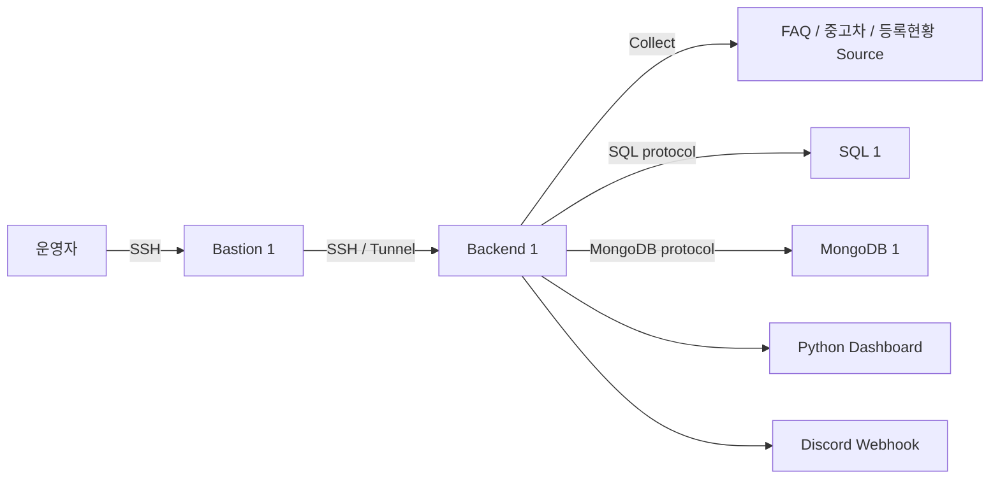

# Architecture — 중고차 데이터 수집·전처리·운영 MVP

- document_id: ARCH-MLO-001
- version: v1
- document_state: Review
- brd_reference: BRD-MLO-001@v3
- prd_reference: PRD-MLO-001@v3
- baseline_date: <TODO: YYYY-MM-DD>
- provenance: BRD·PRD AWS MVP 구성 요구사항
- owner_role: <TODO>
- reviewer_roles: [<TODO>]

## 1. 설계 원칙

- MVP 서버는 Bastion 1대, Backend 1대, SQL 1대, MongoDB 1대로 제한한다.
- 모든 수집·전처리·검증·적재는 Backend 내부의 Python 모듈 경계를 사용한다.
- 운영자의 Backend·DB 접근은 Bastion을 경유한다.
- SQL과 MongoDB는 Private Subnet에 배치하고 Public inbound를 허용하지 않는다.
- Source의 차단·Schema 불일치·증분 계약 부재 시 우회하거나 추정 데이터를 적재하지 않는다.
- Business Key·Unique Index·Writer 접속 경계를 유지하여 향후 복제 구조로 확장한다.

## 2. 논리 구성



## 3. 서버와 접근 경계

| 호스트 | 수량 | 네트워크 | 역할 | 허용 접근 |
|---|---:|---|---|---|
| Bastion | 1 | Public Subnet | SSH 진입점, 포트 포워딩 | 운영자 허용 IP의 SSH |
| Backend | 1 | Private Subnet | Worker·Pipeline·Dashboard·로그·알림 | Bastion 경유 SSH, 내부 Source egress |
| SQL | 1 | Private Subnet | 정형 데이터·Run·quota·로그 | Backend, Bastion 관리 접속 |
| MongoDB | 1 | Private Subnet | FAQ Document | Backend, Bastion 관리 접속 |

192.168.0.51:4000은 사용자가 지정한 Source 주소이며, AWS Backend에서 해당 주소로 연결되는 VPN·전용 회선·허용 라우팅이 MVP 선행조건이다. 인증정보는 이 문서와 Git에 기록하지 않는다.

## 4. Pipeline 실행 경계

| Pipeline | 실행 주체 | 상태 단위 | 실패 시 |
|---|---|---|---|
| FAQ | 일일 Shell/cron → Python 실행 | Run 1개 | MongoDB write 없이 실패·로그·Discord |
| 중고차 | 장기 실행 Python Worker | Polling cycle / 초기 sync Run | 요청 중첩 금지, 마지막 성공 Checkpoint 유지 |
| 자동차등록현황보고 | 일일 Shell/cron → Python 실행 | Run 1개·API 1회 | quota 초과 금지, 월별 formList 지표 분해 |

## 4.1 중고차 관계형 적재 경계

중고차 API의 한 매물 응답은 매물 자체와 반복되는 참조 객체를 함께 반환한다. 전처리 단계는 다음 준비 계약을 만들고, 적재 단계만 SQL transaction과 테이블 순서를 안다.

```text
PreparedVehicleRecord
├─ listing          # 매물 본체와 model/location/dealer/business-area ID
├─ brand            # brand_id 기준
├─ model            # model_id, brand_id 기준
├─ location         # location_id 기준
├─ dealer           # dealer_code 기준
└─ business_area   # business_area_id, parent.business_area_id 기준
```

적재 순서는 `brand → model → location → dealer → business_area(parent first) → listing`이며, 한 Batch는 하나의 SQL transaction으로 commit한다. `vehicle_listings`에는 `brand_id`를 중복 저장하지 않고 `model_id → vehicle_models.brand_id → vehicle_brands`로 브랜드를 조인한다. 업무영역 부모명도 self-FK로 조회한다. 매물 가격·주행거리·상태·검사정보 등 매물별 값은 `vehicle_listings`에 남기고 API가 제공하지 않는 과거 상태 이력은 MVP 범위에서 만들지 않는다. 조회 로직은 필요한 FK를 기준으로 각 참조 테이블을 직접 조인한다.

## 5. 확장 경계

### SQL

MVP는 단일 SQL 서버와 하나의 논리적 Writer DSN을 사용한다. Business Key와 Unique Constraint를 유지하고, 데이터 접근 코드에 서버 IP를 흩어 쓰지 않는다. 이후 Primary–Replica(master–slave)와 읽기 전용 DSN을 추가할 수 있다.

### MongoDB

MVP는 단일 MongoDB 서버다. faq_id Unique Index와 표준 Driver Connection URI를 유지한다. 이후 3개 서버 Replica Set으로 확장하여 각 노드 1표, 과반수 2/3 기반 Primary 선출을 검증한다.

## 6. 운영 실패 경계

- Source route, HTTP 403/429, robots/license, Schema, 증분 기준값이 확인되지 않으면 FAILED 또는 blocked evidence로 남긴다.
- 중고차 Source가 증분 기준값을 주지 않으면 전체 1만건을 1초마다 반복하지 않고 incremental_contract_missing으로 중단한다.
- API 인증키·DB 비밀번호·Discord Webhook·개인정보는 로그와 Dashboard에 쓰지 않는다.
- 실제 HA·DR·자동 Failover·분산 Worker는 2단계 범위다.

## 7. 검토 기록

| reviewed_at | reviewer_role | review_result | note |
|---|---|---|---|
| <TODO: ISO-8601> | <TODO> | PENDING | 독립 검토 전 |
