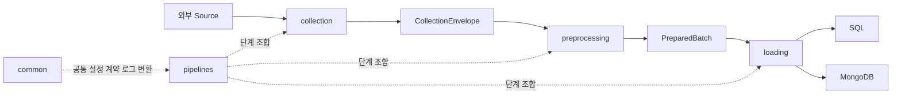

# `src/` 모듈 명세

## 목적

`src/`는 외부 데이터를 수집하고, 공통 계약에 맞게 전처리하고, 저장소에 적재하는 Python 실행 코드다. 각 단계의 운영 정책은 해당 패키지 안에 두며, 단계 조합은 `pipelines/`만 담당한다.

## 전체 흐름

## 패키지 책임

| 폴더 | 책임 | 알면 안 되는 것 |
|---|---|---|
| `common/` | 설정·계약·로그·공통 타입 변환 | Source별 수집·DB 테이블 정책 |
| `collection/` | HTTP·HTML·fixture 수집과 응답 envelope 검증 | SQL/MongoDB 적재 방식 |
| `preprocessing/` | Raw record를 준비 계약으로 변환·검증 | 네트워크 호출·DB transaction |
| `loading/` | JSONL·SQL·MongoDB 저장, Upsert, quota·checkpoint | Source pagination·HTML selector |
| `pipelines/` | Collect → Preprocess → Validate → Load 조합과 CLI | 세부 SQL 문장·HTML 파싱 규칙 |

## 핵심 규칙

- 단계 사이의 계약이 같으면 한 단계의 구현·운영 정책을 바꿔도 다른 단계는 수정하지 않는다.
- `collection/`, `preprocessing/`, `loading/`은 서로 직접 의존하지 않는다.
- 외부 설정은 `common.config.Settings`를 통해서만 읽는다.
- 실패·Reject·Checkpoint는 `run_id`와 구조화 로그로 추적한다.
- 중고차의 관계형 분리·FK 순서·Upsert는 `loading.usedcar`에만 둔다.

세부 명세는 각 패키지의 README를 기준으로 한다.

