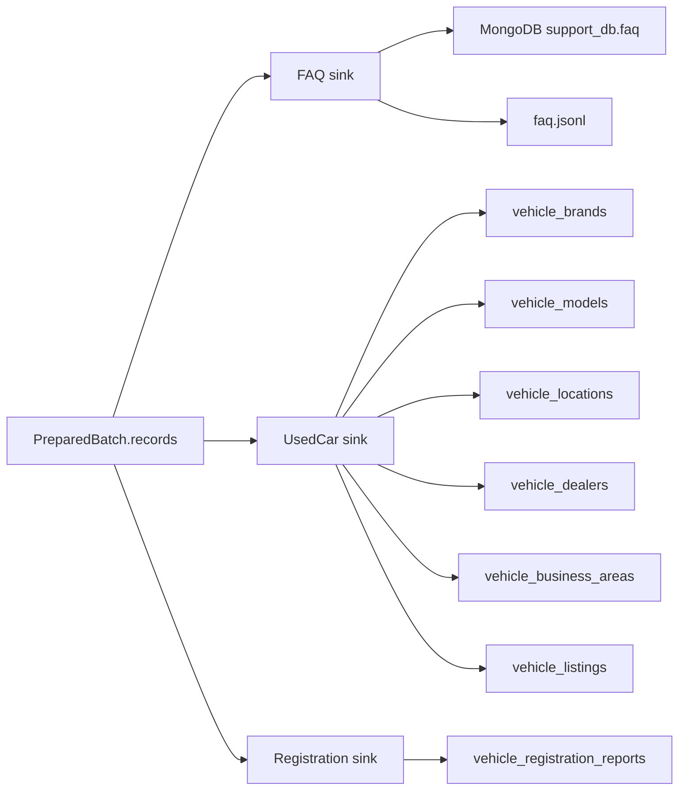

# `loading/` 내부 명세

## 책임

전처리 준비 계약을 JSONL·SQL·MongoDB에 저장하고, Upsert·transaction·quota·checkpoint·atomic file write 정책을 실행한다. Source endpoint나 HTML 구조를 알지 않는다.

## 파일·모듈

| 파일 | 모듈 | 담당 |
|---|---|---|
| `__init__.py` | `loading` | 적재 패키지 경계 |
| `common.py` | `loading.common` | 임시 파일 작성 후 rename하는 `atomic_write` |
| `faq.py` | `loading.faq` | FAQ JSONL Upsert, MongoDB validator/index 확인, `faq_id` Upsert |
| `usedcar.py` | `loading.usedcar` | used-car checkpoint, JSONL sink, 관계형 SQL dimension/listing Upsert |
| `registration.py` | `loading.registration` | 기간 state, JSON/SQL quota ledger, registration JSONL/SQL Upsert |

## 모듈 흐름

## 핵심

- 모든 SQL 입력은 parameterized query로 전달한다.
- 중고차 적재 순서는 `brand → model → location → dealer → business_area parent → listing`이다.
- `vehicle_listings`는 `model_id`만 보유하며 브랜드는 `vehicle_models → vehicle_brands`로 조인한다.
- 업무영역 부모명은 `vehicle_business_areas` self-FK로 조인하며 `parent_name`을 중복 저장하지 않는다.
- 중고차 참조 테이블과 `vehicle_listings`는 같은 Batch transaction 안에서 처리한다.
- 중고차·FAQ·등록현황은 각각 고유 Business Key로 재실행해도 중복이 생기지 않는다.
- 증분 record가 생략한 값은 기존 non-null 값을 보존하고, 성공한 적재 뒤에만 checkpoint를 전진시킨다.

## 외부 계약

### 입력

- `Settings`: SQL host/port/database/user/password, MongoDB URI/database/collection, output/state path
- FAQ: `faq_id` 기준 document
- 중고차: `listing` + 5개 참조 entity aggregate; listing의 브랜드 관계는 model entity를 통해 해석
- 등록현황: 5차원 Business Key와 `quantity`

### 출력

- `JsonlUpsertSink`, `JsonlFaqUpsertSink`, `JsonlRegistrationUpsertSink`: 로컬 파일과 적재 통계
- `SqlUpsertSink`: `sales_support_db`의 V001 관계형 테이블
- `MongoFaqUpsertSink`: `support_db.faq`와 `uq_faq_id` unique index
- `LoadStats` 계열: insert/update/unchanged 수

### SQL 기준선

- 스키마 기준: `migrations/sql/V001__mvp_schema.sql`
- 중고차 쓰기 모델: 참조 5개 테이블 + `vehicle_listings`; 조회는 필요한 FK를 기준으로 직접 조인
- 등록현황: `(report_month, sido_name, sigungu_name, vehicle_type, usage_type)`

## 의존성 경계

`common`과 `loading.common`만 사용한다. `collection`, `preprocessing`, `pipelines`, 외부 HTTP client를 import하지 않는다. 다른 저장 방침을 추가할 때도 이 준비 계약을 바꾸지 않는다.
