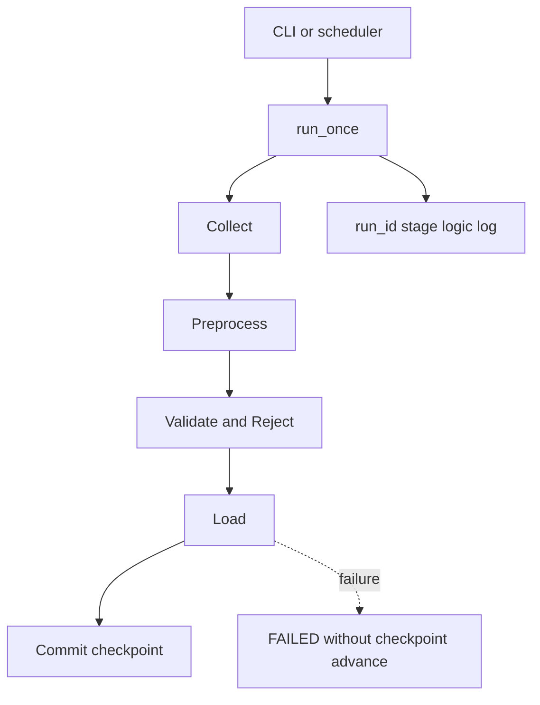

# `pipelines/` 내부 명세

## 책임

수집·전처리·적재를 실제 실행 단위로 조합하는 유일한 orchestration 패키지다. `run_id`, stage 로그, Reject 집계, checkpoint, CLI 결과를 관리한다.

## 파일·모듈

| 파일 | 모듈 | 담당 |
|---|---|---|
| `__init__.py` | `pipelines` | pipeline 패키지 경계 |
| `faq.py` | `pipelines.faq` | FAQ bounded run, fixture/live collector 선택, MongoDB·JSONL sink 선택 |
| `usedcar.py` | `pipelines.usedcar` | 초기 cursor sync·증분 changes run, 1초/500건 정책, checkpoint, used-car sink 선택 |
| `registration.py` | `pipelines.registration` | 하루 1회·논리적 API 1회, quota reserve, 월별 formList flatten run |

## 모듈 흐름

## 핵심

- 세 단계 패키지를 직접 조합하는 곳은 `pipelines/`뿐이다.
- 각 run은 `run_id`를 만들고 `Collect → Preprocess → Validate → Load` 순서로 로그를 남긴다.
- 적재 성공 전에는 checkpoint를 전진시키지 않는다.
- 중고차 `initial`은 cursor, `incremental`은 `after_seq` 기준이며 1초 간격과 500건 상한을 collector에 전달한다.
- 등록현황 run은 `start_dt=end_dt=YYYYMM`으로 논리적 API 호출 1회를 수행한다.

## 외부 계약

### 실행 입력

- 환경변수: `common.config.settings_from_env()`가 해석
- 공통 CLI: `--fixture`, `--sink`, `--dry-run`, `--output-dir`
- 중고차: `--mode auto|initial|incremental`
- 등록현황: `--period YYYY-MM`
- FAQ: `--sink json|mongo`

### 실행 출력

`run_once()`는 `status`, `run_id`, `mode`, 수집·유효·Reject·Insert·Update·Unchanged count, checkpoint 경로를 가진 JSON-serializable mapping을 반환한다. 실패 시 sanitized error code를 로그와 stderr에 남기고 예외를 상위 CLI에서 `FAILED`로 변환한다.

### 내부 계약

- collector → `CollectionEnvelope`
- transformer → `(valid_rows, rejected_rows)`
- pipeline → `PreparedBatch`
- sink → `LoadStats` 또는 pipeline별 확장 통계

## 의존성 경계

`pipelines`는 `common`, `collection`, `preprocessing`, `loading`을 모두 import할 수 있다. 반대로 stage package가 `pipelines`를 import하지 않도록 유지한다. SQL 문장과 HTML selector는 pipeline에 직접 작성하지 않는다.

