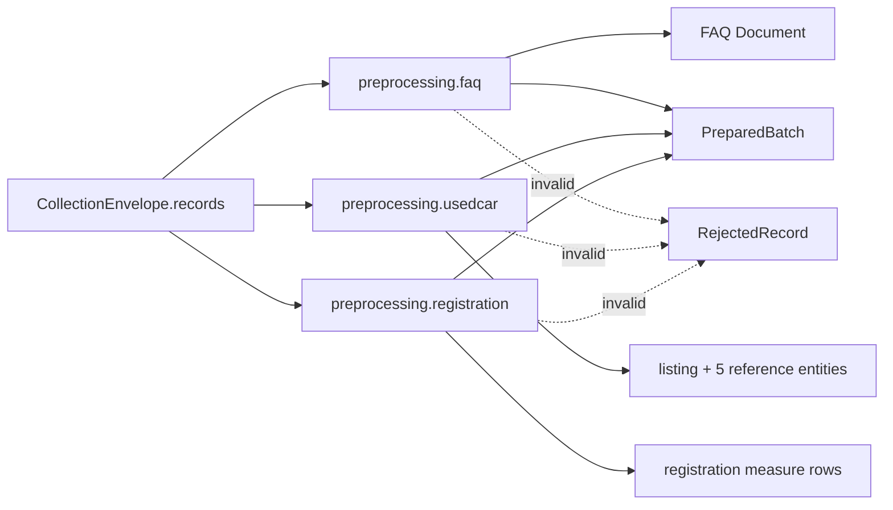

# `preprocessing/` 내부 명세

## 책임

수집된 Raw record를 저장 단계가 사용할 안정적인 준비 계약으로 변환하고, 필수값·타입·Business Key·content hash를 검증한다. 네트워크와 DB를 호출하지 않으며, SQL 문장을 생성하지 않는다.

## 파일·모듈

| 파일 | 모듈 | 담당 |
|---|---|---|
| `__init__.py` | `preprocessing` | 전처리 패키지 경계 |
| `faq.py` | `preprocessing.faq` | FAQ 텍스트·URL·날짜 정규화, faq_id fallback, license·attribution 검증, content hash |
| `usedcar.py` | `preprocessing.usedcar` | 중고차 scalar 정규화, 중첩 참조 엔터티 분리, 관계형 준비 aggregate, source event와 hash, Reject |
| `registration.py` | `preprocessing.registration` | `formList` 한 행을 월·시도·시군구·차량구분·용도구분·수량 Row로 분해, 최대 20개 지표 생성 |

## 모듈 흐름



## 핵심

- 수집 구현이 바뀌어도 입력 field 계약이 같으면 전처리 코드는 바꾸지 않는다.
- 저장 구현이 바뀌어도 준비 계약이 같으면 전처리 코드는 바꾸지 않는다.
- 중고차는 `listing`과 `brand`, `model`, `location`, `dealer`, `business_area`를 분리해 반환한다.
- 중고차 중첩 객체에 안정 ID가 없으면 Reject하며, relation을 만들 수 없는 값을 임의 문자열로 대체하지 않는다.
- 등록현황의 `승용>관용` 같은 결합 key는 개별 Row로 분해하고 Business Key를 보존한다.

## 외부 계약

### FAQ 출력

`faq_id`, `question`, `answer`, `brand`, `category`, `source_url`, `reviewed_at`, `license`, `attribution`, `content_hash`, `run_id`, `collected_at`를 가진 mapping을 반환한다.

### 중고차 출력

```text
{
  listing: {listing_id, listing_number, scalar facts, model/location/dealer/business-area IDs, provenance},
  brand: {brand_id, name, slug, country, provenance},
  model: {model_id, brand_id, name, slug, body_type, provenance},
  location: {location_id, province, city, sigungu, slug, provenance},
  dealer: {dealer_code, display_name, department, position, provenance},
  business_area: {
    business_area_id, name, slug, parent_business_area_id,
    parent: {business_area_id, name, slug}, provenance
  }
}
```

### 등록현황 출력

`report_month`, `sido_name`, `sigungu_name`, `vehicle_type`, `usage_type`, `quantity`, `source_name`, `source_url`, `run_id`, `collected_at`, `content_hash`를 가진 mapping을 반환한다.

모든 변환기는 `(valid_records, rejected_records)`를 반환하며 Reject에는 index, error code, 가능한 stable key가 포함된다.

## 의존성 경계

`common.config`만 사용한다. `collection`, `loading`, `pipelines`, HTTP client, SQL driver, MongoDB driver를 import하지 않는다.
