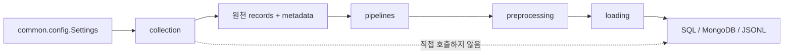
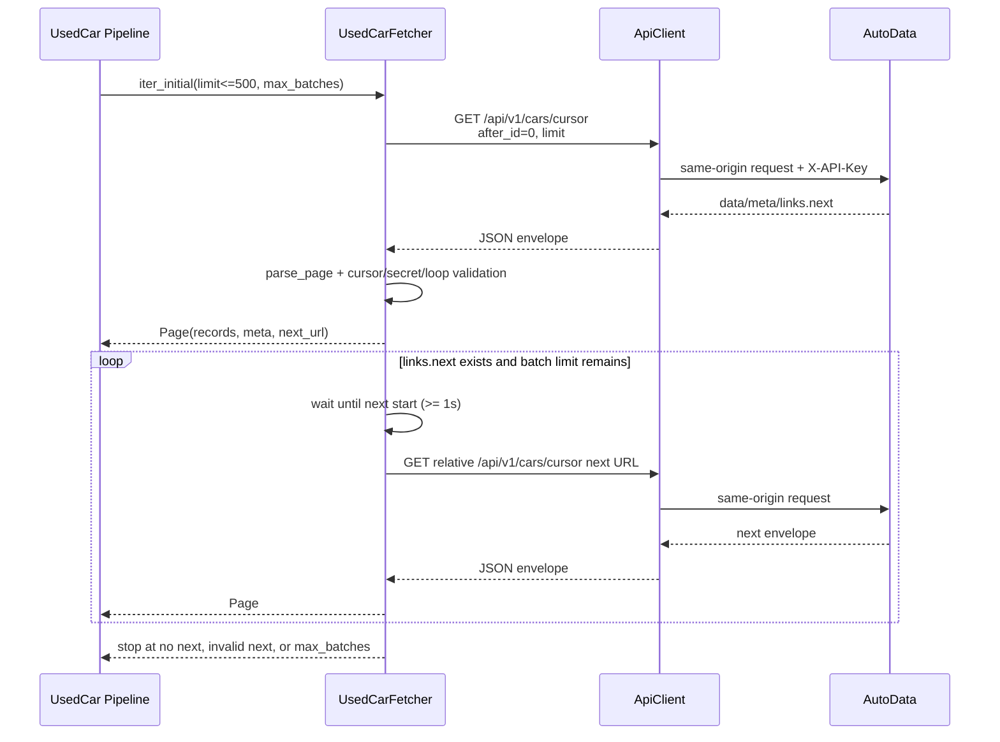
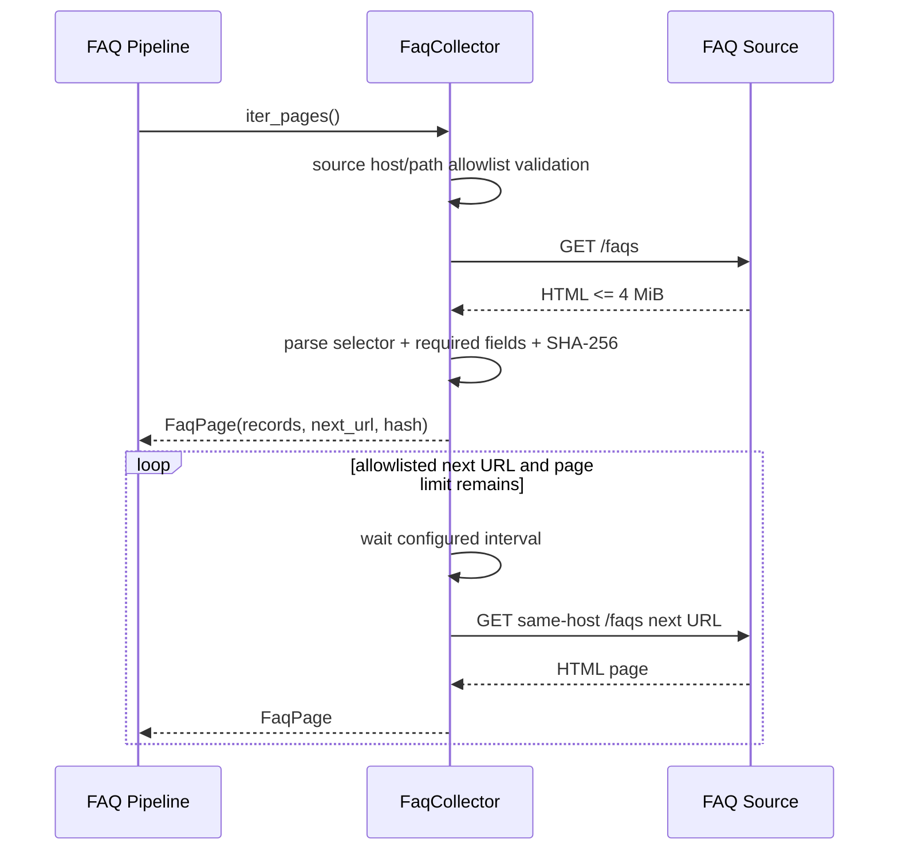
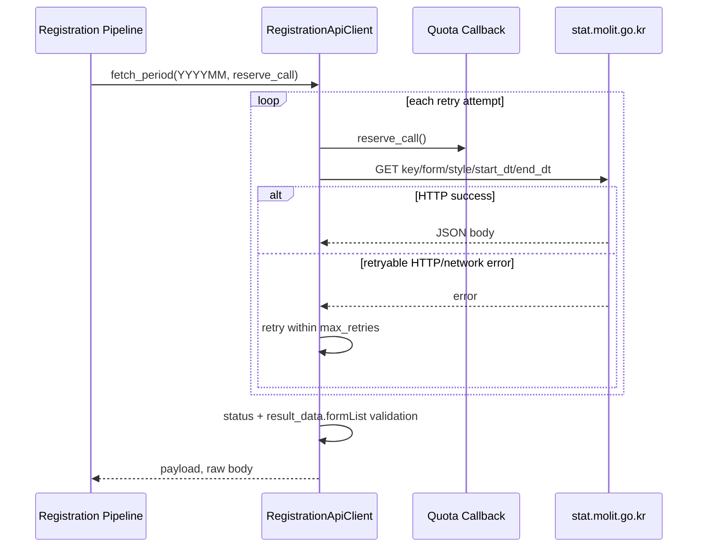

# `collection/` 내부 계약 및 구현 명세

## 1. 기준과 책임

이 문서는 현재 저장소의 `src/collection` 구현과 지시된 AutoData API 문서를 기준으로 한다.

- 운영 API 문서: [AutoData `/docs`](http://43.203.233.157/docs)
- `/Users/ahh/project/mlo-01-p1-team3-a`는 구현·fixture·검증을 비교하기 위한 참고 폴더다.
- 참고 폴더의 문서·코드·commit은 이 저장소의 SSOT가 아니다.
- 외부 계약이 변경되면 API 문서와 실제 응답을 먼저 확인하고, 이 문서·fixture·단위 테스트·구현을 같은 변경 단위로 갱신한다.

`collection`은 외부 Source의 HTTP·HTML·JSON 응답을 수집하고 원천 응답 계약을 검증한다. 전처리, DB 적재, checkpoint 영속화, polling schedule의 소유자는 collection이 아니다.



## 2. 모듈 구성

| 파일 | 공개 모듈 | 책임 | 반환 경계 |
|---|---|---|---|
| `api.py` | `collection.api` | AutoData 공통 HTTP/JSON transport, origin 검증, API key header, 403 refresh, retry | JSON object/list 또는 `ApiError` |
| `usedcar.py` | `collection.usedcar` | 초기 ID cursor 목록, 증분 change 목록, cursor pagination, 1초 순차 호출, fixture | `Page` iterator 또는 원천 record list |
| `faq.py` | `collection.faq` | FAQ HTML parsing, host/path allowlist, 페이지 수집, response hash | `FaqPage` iterator 또는 `FaqError` |
| `registration.py` | `collection.registration` | 통계누리 기간 요청, quota callback, `formList` envelope 검증 | 원천 payload/bytes 또는 `RegistrationError` |
| `cars.py` | `collection.cars` | 기존 호출자를 위한 API key/request compatibility entrypoint | payload와 현재 key |
| `__init__.py` | `collection` | package 경계 설명 | 외부 Source adapter package |

### 의존성 경계

- collection은 `common.config`를 설정 경계로 사용하며, `collection.api`를 transport 공통 경계로 사용한다.
- collection은 `preprocessing`, `loading`, SQL driver, MongoDB driver를 import하지 않는다.
- collection은 DB에 직접 쓰지 않는다.
- `requests`, `beautifulsoup4`는 collection runtime dependency다.
- `pytest`는 collection 단위 테스트 dependency다.

## 3. 내부 계약

### 3.1 공통 오류 계약

| 오류 | 소유 모듈 | 의미 |
|---|---|---|
| `FetchError` | `api.py`, `usedcar.py` | Source envelope, cursor, allowlist, fixture 계약 위반 |
| `ApiError` | `api.py` | HTTP, network, JSON, retry 종료 오류. `status`, `url`, `retryable`, `code`를 보유할 수 있음 |
| `FaqError` | `faq.py` | FAQ HTML, selector, content type, 페이지, allowlist 오류 |
| `RegistrationError` | `registration.py` | registration 기간, API status, envelope, fixture 오류 |

오류 메시지에는 API key, query secret, authorization 값 등 비밀값을 포함하지 않는다. Source schema가 깨졌을 때 빈 성공 결과로 변환하지 않는다. 단, registration API가 공식적으로 `INFO-200` 무데이터를 반환하면 `extract_record_list()`는 빈 목록을 반환한다.

### 3.2 AutoData `Page` 계약

`collection.usedcar.Page`는 다음 값을 보유한다.

```text
Page(
    records: list[dict[str, Any]],
    meta: dict[str, Any],
    next_url: str | None,
)
```

`parse_page()`는 다음을 보장한다.

1. root에 `data`, `meta`, `links`가 모두 있어야 한다.
2. `data`는 object 목록이어야 한다.
3. 각 record에는 top-level `id` 또는 `listingNumber`, 또는 차량 식별자가 포함된 허용 nested object가 있어야 한다.
4. field rename, flatten, SQL/MongoDB 변환을 수행하지 않는다.
5. `links.next`는 비어 있지 않은 문자열 또는 `null`이어야 한다.
6. `meta`와 `links`는 object여야 한다.

`Page.has_more`는 `meta.has_more`, `meta.hasMore`를 우선 사용하고, 두 필드가 없으면 `links.next` 존재 여부로 결정한다.

### 3.3 FAQ `FaqPage` 계약

```text
FaqPage(
    source_url: str,
    records: list[dict[str, Any]],
    next_url: str | None,
    response_sha256: str,
)
```

각 FAQ record는 최소한 다음 필드를 가져야 한다.

```text
faq_id, brand, category, reviewed_at, source_url, question, answer
```

`question`, `answer`는 nested HTML을 공백 기준 text로 변환한다. `reviewed_at`은 외부 FAQ의 날짜-only `YYYY-MM-DD` 원천값을 보존한다. preprocessing은 이 값을 내부 `source_updated_at` 형식으로 정규화한다. `response_sha256`는 수집한 원본 bytes의 SHA-256이며, 적재 key가 아니다.

### 3.4 Registration 반환 계약

`RegistrationApiClient.fetch_period()`와 `FixtureRegistrationClient.fetch_period()`는 다음을 반환한다.

```text
(payload: JSON object, body: bytes)
```

`extract_record_list(payload)`는 정상 응답의 `payload.result_data.formList`만 원천 record로 전달한다. `INFO-200`, `200` 또는 `"200"` 무데이터 status는 빈 목록으로 처리한다. 다른 status와 envelope 변경은 `RegistrationError`로 중단한다.

## 4. 외부 계약

### 4.1 AutoData 공통 API

| 항목 | 계약 |
|---|---|
| Base URL | `Settings.base_url`의 HTTP(S) origin |
| 공개 key | `GET /api/v1/public-key` |
| 인증 | `X-API-Key` header. API key를 query string에 넣지 않음 |
| origin | 설정된 scheme과 netloc과 동일해야 함 |
| 403 | 공개 key를 한 번 refresh한 뒤 원 요청 재시도 |
| retry | `408`, `429`, `500`, `502`, `503`, `504` 등 retryable status만 제한적으로 재시도 |
| response | JSON parsing 실패 시 `ApiError(code="json_schema")` |

### 4.2 중고차 초기 ID cursor 목록

초기 수집은 대량 적재용 ID cursor endpoint만 사용한다.

```text
GET /api/v1/cars/cursor?after_id=0&limit=<1..500>
```

초기 첫 요청은 항상 다음과 같다.

```python
client.get(
    "/api/v1/cars/cursor",
    params={"after_id": 0, "limit": limit},
)
```

`links.next`는 상대 URL이어야 하며, path가 `/api/v1/cars/cursor`와 같아야 한다. 절대 URL, 다른 host, 다른 path, secret query parameter, 이미 요청한 URL은 거부한다.

### 4.3 중고차 증분 change 목록

```text
GET /api/v1/changes?after_seq=<non-negative checkpoint>&limit=<1..500>
```

초기와 증분 모두 `data`, `meta`, `links` envelope를 사용한다. 증분의 `after_seq`는 pipeline이 마지막 성공 batch에서 계산한 checkpoint를 전달하는 입력이다. collection은 checkpoint를 저장하지 않고 `page_checkpoint()` 후보값만 반환한다.

### 4.4 FAQ HTML Source

| 항목 | 계약 |
|---|---|
| Source URL | `Settings.faq_source_url`, 기본 path `/faqs` |
| allowlist | 설정된 scheme/netloc와 `FAQ_ALLOWED_PATHS` |
| selector | `article.faq-item` |
| 필수 identifier | `data-faq-id` 또는 `data-field="faq-id"` |
| 필수 text | `data-field="question"`, `data-field="answer"` |
| 확인일 | `data-reviewed-at` 또는 `data-field="reviewed-at"`의 `YYYY-MM-DD` |
| next | 동일 host이며 allowlisted path인 `a[rel~="next"]`만 허용 |
| body 제한 | 페이지당 4 MiB |
| page 제한 | `FAQ_MAX_PAGES`, 기본 100 |
| 요청 간격 | `FAQ_INTERVAL_SECONDS`, 기본 1초 |

### 4.5 자동차등록현황보고 API

| 항목 | 계약 |
|---|---|
| endpoint host | `stat.molit.go.kr` |
| 기본 endpoint | `https://stat.molit.go.kr/portal/openapi/service/rest/getList.do` |
| API key | 이 공식 API adapter에서만 `key` query parameter로 전달 |
| form | `form_id=5498`, `style_num=2` |
| 기간 | `start_dt=end_dt=YYYYMM` |
| response | `result_data.formList` |
| quota | 실제 요청 전 `reserve_call()` 호출. retry도 요청마다 quota 소비 |
| response 제한 | 8 MiB |

AutoData의 header-only key 정책과 달리, 통계누리 endpoint의 `key` query parameter는 해당 외부 API 계약의 예외다. 두 transport 정책을 하나의 공통 client로 합치지 않는다.

## 5. 로직 정의

### 5.1 `UsedCarFetcher` 초기 수집

1. `limit`은 1 이상 500 이하인지 검증한다.
2. `max_batches`는 양수인지 검증한다.
3. 첫 요청 전 현재 monotonic 시각을 기준으로 다음 요청 시작 시각을 예약한다.
4. `/api/v1/cars/cursor`에 `after_id=0`, `limit=limit`으로 요청한다.
5. 응답을 `parse_page()`로 검증하고 그대로 yield한다.
6. `has_more`가 false이면 종료한다.
7. `has_more`가 true인데 `links.next`가 없으면 `cursor_link_missing`으로 중단한다.
8. next URL의 상대 path·secret query·중복 여부를 검증한 뒤 다음 요청으로 사용한다.
9. 요청 시작 시각 간격이 1초보다 짧으면 sleep하고, 응답이 1초 이상 걸리면 응답 직후 다음 요청을 시작한다.
10. `max_batches`에 도달하면 추가 요청 없이 종료한다.



### 5.2 `UsedCarFetcher` 증분 수집

초기 수집과 동일한 page parser·간격·loop 방어를 사용하되 첫 요청만 다음과 같이 다르다.

```python
client.get(
    "/api/v1/changes",
    params={"after_seq": after_seq, "limit": limit},
)
```

`after_seq < 0`은 입력 오류다. `page_checkpoint()`는 응답 `meta`의 `until_id`, `dataset_epoch`, `high_water_seq`를 우선하고, 없으면 record의 최대 `id`, `seq`를 fallback으로 사용한다.

### 5.3 FAQ 수집

1. source URL이 HTTP(S)이고 허용 path인지 확인한다.
2. 현재 URL을 요청하고 Content-Type이 HTML인지 확인한다.
3. body를 4 MiB 이하로 제한한다.
4. `parse_faq_html()`로 모든 `article.faq-item`을 검증한다.
5. next link가 있으면 동일 host와 allowlisted path인지 확인한다.
6. 같은 URL 재요청, page limit 초과, 외부 URL은 오류로 종료한다.



### 5.4 registration 수집

1. 기간을 `YYYYMM`으로 정규화한다.
2. endpoint host와 API key를 확인한다.
3. 매 attempt 직전에 quota callback을 호출한다.
4. `key`, `form_id`, `style_num`, `start_dt`, `end_dt`를 query로 구성한다.
5. response body를 8 MiB 이하로 읽는다.
6. HTTP/API status를 해석한다.
7. JSON을 해석하고 `result_data.formList`를 추출한다.
8. `(payload, body)`를 pipeline에 반환한다.



## 6. compatibility entrypoint 계약

`collection.cars`는 기존 호출자의 전환을 위해서만 유지한다.

- `get_api_key(settings)`: `ApiClient.refresh_public_key()`를 호출하고 현재 key를 반환한다.
- `request_api(url, api_key)`: `ApiClient.from_url()`로 client를 만들고 한 번 요청한 뒤 `(payload, current_key)`를 반환한다.
- 신규 로직은 `collection.usedcar.UsedCarFetcher`를 직접 사용한다.

## 7. 단위 테스트 계약

단위 테스트는 collection 모듈의 정상·실패 경계를 검증하며 preprocessing, loading, DB, 전체 pipeline 정상 동작을 보장하지 않는다.

| 테스트 파일 | 검증 범위 |
|---|---|
| `tests/test_collection_usedcar.py` | cursor 초기/증분 요청, next path, loop, envelope, checkpoint, fixture |
| `tests/test_collection_api.py` | same-origin, header-only key, secret query, 403 refresh, JSON 오류 |
| `tests/test_collection_faq.py` | nested HTML, 필수 field, next allowlist, page limit, response page |
| `tests/test_collection_registration.py` | 기간 계산, `formList`, no-data, quota, query, host/key |
| `tests/test_collection_cars.py` | legacy API key/request compatibility |

실행 명령:

```bash
source /opt/homebrew/Caskroom/miniforge/base/etc/profile.d/conda.sh
conda activate sandbox
python -m pytest -q tests
```

현재 구현 변경의 완료 조건은 위 collection 단위 테스트 전체 결과가 온전히 출력되고 통과하는 것이다. 이 결과는 전체 pipeline의 정상 동작 또는 외부 live source의 가용성을 의미하지 않는다.

## 8. 변경 순서

계약 변경 시 다음 순서를 지킨다.

1. `tests/`에 실패하는 계약 테스트를 먼저 추가한다.
2. collection 구현을 최소 범위로 수정한다.
3. collection 단위 테스트 전체를 실행한다.
4. 이 README의 내부 계약·외부 계약·로직·sequence diagram을 구현과 동기화한다.
5. pipeline/전처리/적재 영향은 별도 모듈 테스트로 확인한다.
