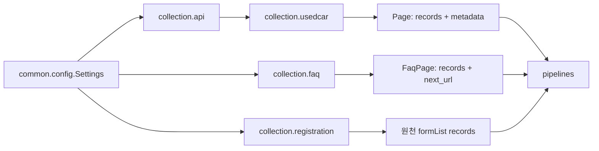

# `collection/` 내부 명세

## 책임

외부 Source의 HTTP·HTML·JSON 응답을 수집하고, 페이지·응답 envelope·허용 URL·재시도·fixture 형식을 검증한다. 수집 결과는 원본에 가까운 mapping으로 반환하며 SQL 컬럼이나 MongoDB document로 변환하지 않는다.

## 파일·모듈

| 파일 | 모듈 | 담당 |
|---|---|---|
| `__init__.py` | `collection` | collector 패키지 경계 |
| `api.py` | `collection.api` | AutoData 공통 HTTP/JSON client, 공개 API key 조회, 동일 origin allowlist, 403 1회 key refresh, 제한 재시도 |
| `usedcar.py` | `collection.usedcar` | `/api/v1/cars/cursor` 초기 cursor 수집, `/api/v1/changes` 증분 수집, 500건·1초 순차 정책, checkpoint metadata, fixture fetcher |
| `faq.py` | `collection.faq` | BeautifulSoup 기반 `/faqs` HTML parser, FAQ allowlist·페이지 수집, fixture page reader |
| `registration.py` | `collection.registration` | 통계누리 form 5498/style 2 기간 요청, `result_data.formList` 응답 추출, quota callback, fixture client |
| `cars.py` | `collection.cars` | 기존 중고차 pipeline의 `get_api_key()`·`request_api()` 호환 진입점 |

## 모듈 흐름

## 핵심

- 수집기는 DB에 직접 쓰지 않는다.
- `collection.usedcar.UsedCarFetcher`는 요청을 겹치지 않게 하고 cursor의 `links.next`를 문서화된 endpoint 안에서만 따라간다.
- `collection.api.ApiClient`는 AutoData API key를 query string에 넣지 않고 `X-API-Key` header로만 전달한다.
- live 응답과 fixture는 같은 page/envelope 규칙으로 파싱한다.
- Source schema가 깨지면 빈 결과를 성공으로 반환하지 않고 `FetchError`, `ApiError`, `FaqError`, `RegistrationError`로 중단한다.

## 외부 계약

### AutoData API

- 공개 key: `GET /api/v1/public-key`
- 초기: `GET /api/v1/cars/cursor?after_id=0&limit<=500`
- 증분: `GET /api/v1/changes?after_seq=<checkpoint>&limit<=500`
- 목록 envelope: `{ "data": [...], "meta": {...}, "links": {"next": ...} }`
- 중고차 객체 또는 변경 이벤트 내부 차량 객체의 `id`, `listingNumber`, `brand`, `model`, `location`, `dealer`, `businessArea`를 원형에 가깝게 보존한다.
- `meta`의 `until_id`, `dataset_epoch`, `high_water_seq`는 `page_checkpoint()`를 통해 pipeline checkpoint 후보로만 전달한다.

### FAQ

- Source: `FAQ_SOURCE_URL` (기본값 `http://192.168.0.51:4000/faqs`)
- 수집 단위: 허용된 FAQ HTML 영역의 `FaqPage.records`
- `article.faq-item`을 선택하고 `data-field`·`data-*` 속성으로 FAQ 필드를 추출한다.
- BeautifulSoup의 `html.parser`를 사용해 질문·답변 내부의 중첩 HTML도 텍스트로 정리한다.
- `a[rel~="next"]`가 있으면 같은 host 및 `FAQ_ALLOWED_PATHS`에 속한 URL만 따라간다.
- HTML selector·필수 identifier가 바뀌면 write 없이 오류 처리한다.

### 자동차등록현황보고

- endpoint host: `stat.molit.go.kr`
- 요청: `form_id=5498`, `style_num=2`, `start_dt=end_dt=YYYYMM`
- 응답: `result_data.formList` 원천 행만 전처리 단계에 전달한다.
- 실제 호출 전 quota callback을 실행하며 retry 호출도 quota에 포함한다.
- 통계누리 공식 계약상 API key는 이 collector 내부에서만 `key` query parameter로 전달한다. 이는 AutoData의 header-only 정책 예외다.

## 의존성 경계

`collection`은 `common.config`와 `collection.api`만 사용한다. `preprocessing`, `loading`, SQL driver, MongoDB driver를 import하지 않는다. 외부 설정값은 `common.config.Settings`가 읽고, pipeline이 collector·전처리·적재 단계를 조합한다.
