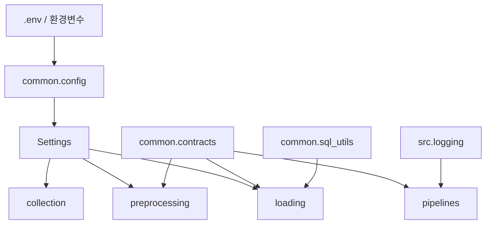

# `common/` 내부 명세

## 책임

모든 단계가 공유하는 설정, stage 경계 계약, 비밀정보 마스킹 로그, SQL 타입 변환을 제공한다. Source 수집 규칙이나 특정 DB의 Upsert 정책은 이 폴더에 넣지 않는다.

## 파일·모듈

| 파일 | 모듈 | 담당 |
|---|---|---|
| `__init__.py` | `common` | 주요 설정·계약 타입 재export |
| `config.py` | `common.config` | `.env`·환경변수 해석, SQL JDBC URL 파싱, MongoDB URI 조합, 기본값·빈 비밀번호 `None` 처리, production 자격증명 검증 |
| `contracts.py` | `common.contracts` | `RawRecord`, `PreparedRecord`, `CollectionEnvelope`, `PreparedBatch`, `RejectedRecord`, `LoadStats`, `RunContext` |
| `logging_utils.py` | `common.logging_utils` | UTC JSONL 이벤트 기록, stderr mirror, API key·password·URI·Webhook 마스킹 |
| `sql_utils.py` | `common.sql_utils` | ISO datetime/date와 JSON 값을 SQL 입력값으로 변환 |

## 모듈 관계

## 핵심

- `Settings.from_env()`와 `settings_from_env()`가 운영·로컬 환경의 유일한 설정 진입점이다.
- 구조화 로그 구현은 `common.logging_utils.JsonlLogger`가 소유한다.
- `src.logging.logging_utils`는 기존 import 경로를 위한 호환용 re-export만 제공한다.
- 코드 어디에도 API key, DB password, host를 하드코딩하지 않는다.
- 빈 계정 비밀번호는 Python `None`으로 취급한다.
- `APP_ENV=production`에서는 SQL 사용자·비밀번호와 명시적 MongoDB URI 및 인증정보가 없으면 설정 생성을 거부한다.
- `CollectionEnvelope`는 수집 결과와 metadata를 전처리로 전달한다.
- `PreparedBatch`는 유효 데이터와 Reject 요약을 적재로 전달한다.
- `common.contracts.LoadStats`가 공통 적재 통계의 기준 타입이며, 각 loader의 기존 `*LoadStats` 이름은 호환 alias다.
- 로그에는 API key, DB password, MongoDB URI, Discord/Webhook URL을 남기지 않는다.
- SQL 날짜·시간은 UTC 기준으로 변환하며, timezone 정보가 없는 입력은 UTC로 해석한다.

## 외부 계약

### 입력

- 환경변수: `USED_CAR_*`, `FAQ_*`, `REGISTRATION_*`, `SQL_*`, `MONGODB_*`, `LOG_PATH`, `OUTPUT_DIR`
- 로컬 `.env`: 단순 `KEY=VALUE` 형식이며, 이미 설정된 운영 환경변수는 덮어쓰지 않는다.
- Python 호출부: `Settings`, `CollectionEnvelope`, `PreparedBatch`

### 출력

- 설정: immutable `Settings` 객체
- 시간: 로그와 SQL 변환은 UTC 기준 ISO 문자열 또는 timezone-aware datetime
- 로그: UTF-8 JSONL 한 줄 한 이벤트
- 공통 적재 통계: `inserted_count`, `updated_count`, `unchanged_count`

### 환경변수 호환

- 중고차: `USED_CAR_BASE_URL`, `USED_CAR_API_KEY`, `USED_CAR_BATCH_SIZE`, `USED_CAR_*`
- 등록현황 API key: `REGISTRATION_API_KEY` 우선, 기존 `MOLIT_API_KEY`도 허용
- SQL: `SQL_*` 우선, 기존 `MYSQL_*`와 `MYSQL_JDBC_URL`도 허용
- MongoDB: `MONGODB_*` 우선, 기존 `MONGO_*`도 허용

## 의존성 경계

표준 라이브러리만 사용하며 `collection`, `preprocessing`, `loading`, `pipelines`를 import하지 않는다. 공통 계약을 바꾸면 collection·preprocessing·loading·pipeline contract test를 먼저 갱신한다.
