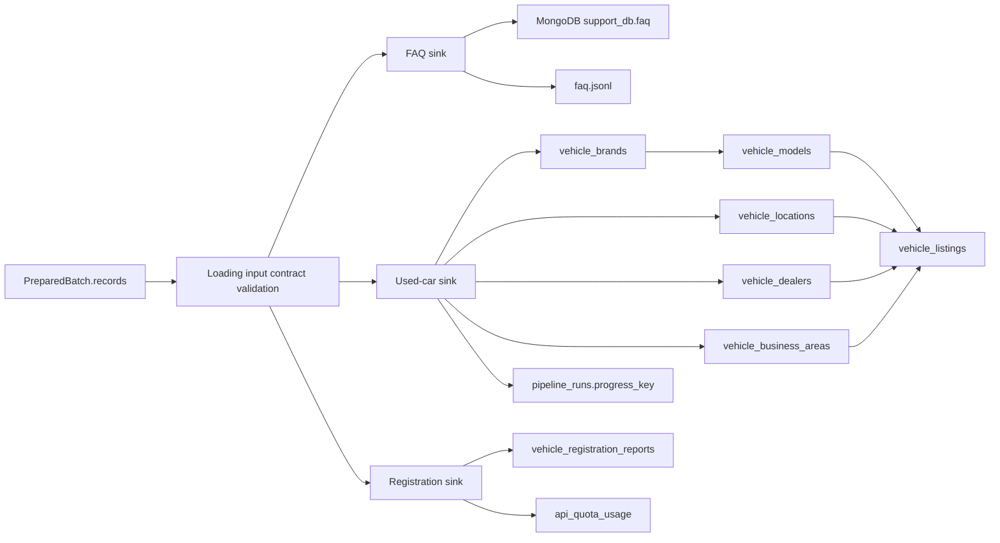
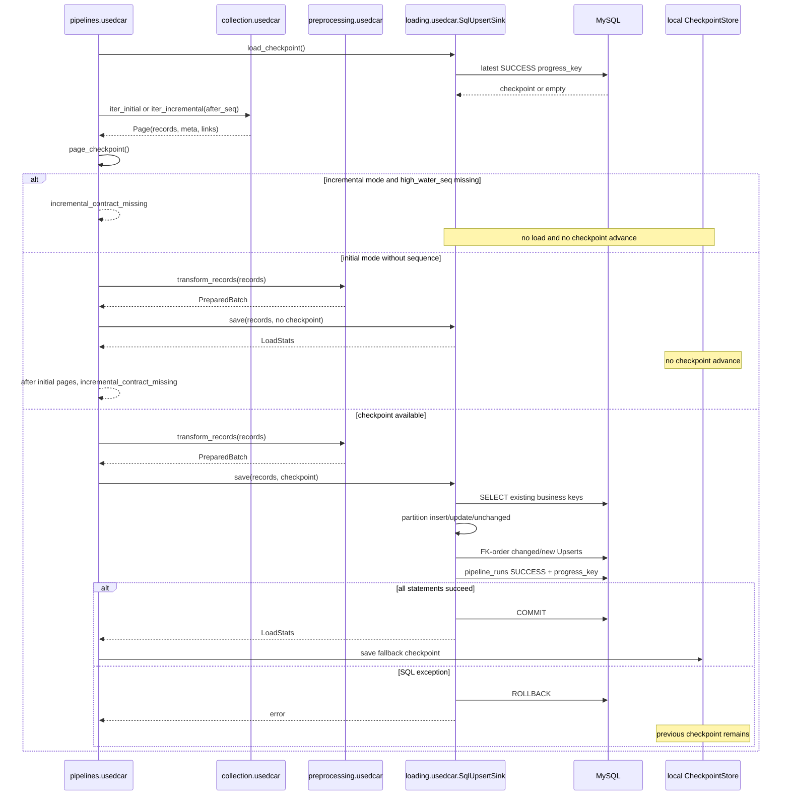
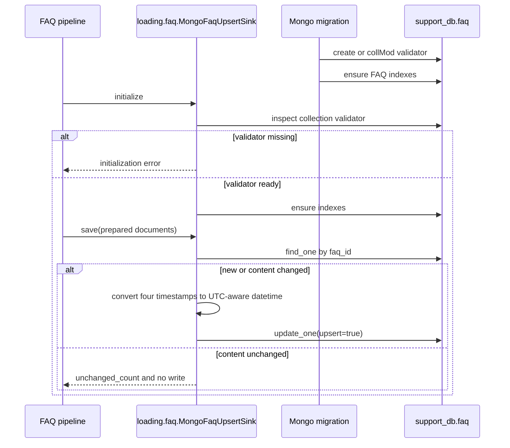

# `loading/` 내부 명세

## 1. 책임과 범위

`loading`은 preprocessing 단계가 만든 `PreparedBatch`를 JSONL·MySQL·MongoDB에 저장한다. 이 계층은 business key 기반 Upsert, 신규·변경·unchanged 분류, SQL transaction과 rollback, load-owned timestamp, 운영 checkpoint, atomic file write, quota 예약을 소유한다.

`loading`은 source endpoint, API key, HTML selector, 원천 응답 envelope를 알지 않는다. collection과 preprocessing의 원천 파싱·정규화 규칙을 직접 재구현하지 않는다.

## 2. 파일과 모듈

| 파일 | 모듈 | 담당 |
|---|---|---|
| `__init__.py` | `loading` | 적재 패키지 경계 |
| `common.py` | `loading.common` | 임시 파일 작성·fsync 후 교체하는 `atomic_write()` |
| `faq.py` | `loading.faq` | FAQ 입력 검증, JSONL Upsert, validator가 준비된 MongoDB Upsert |
| `usedcar.py` | `loading.usedcar` | 중고차 JSONL/SQL Upsert, SQL checkpoint 조회·기록 |
| `registration.py` | `loading.registration` | 등록현황 검증, state, quota ledger, JSONL/SQL Upsert |
| `../pipelines/usedcar.py` | `pipelines.usedcar` | source checkpoint 후보 검증, sink 성공 뒤 local fallback 저장 |
| `../../migrations/sql/V001__mvp_schema.sql` | SQL migration | 관계형 테이블·`pipeline_runs`·quota schema |
| `../../migrations/sql/run.py` | SQL migration runner | checksum을 확인하는 forward-only migration 실행 |
| `../../migrations/mongo/ensure_indexes.py` | Mongo migration | FAQ collection validator와 세 개 index |

## 3. 모듈 흐름



## 4. 내부 계약

### 4.1 입력 경계

입력은 `common.contracts.PreparedBatch.records`이며, sink는 preprocessing이 출력하는 준비 계약을 받는다. sink는 직접 호출된 malformed record도 저장하지 않도록 최소 계약을 다시 확인한다.

#### FAQ prepared document

| 필드 | 규칙 |
|---|---|
| `faq_id` | 비어 있지 않은 문자열 |
| `question`, `answer`, `brand`, `category` | 비어 있지 않은 문자열 |
| `source_url` | 절대 `http` 또는 `https` URL |
| `source_updated_at`, `collected_at` | ISO 8601 datetime |
| `license`, `attribution` | 비어 있지 않은 문자열 |
| `content_hash`, `run_id` | 비어 있지 않은 문자열 |
| `is_active` | boolean |

`created_at`과 `updated_at`은 loading이 생성하는 값이므로 입력값을 신뢰하지 않는다. 기존 행의 `created_at`은 유지하고 실제 변경 시에만 `updated_at`을 새로 생성한다.

#### Used-car prepared aggregate

- `listing`은 mapping이어야 한다.
- `listing.listing_id`는 필수 business key다.
- `brand`, `model`, `location`, `dealer`, `business_area`는 mapping 또는 `null`이다.
- 각 참조 entity의 stable ID는 preprocessing 계약을 따른다.
- 증분 record가 생략한 값은 SQL에서 기존 non-null 값을 보존한다.

#### Registration prepared row

- Business Key: `report_month`, `sido_name`, `sigungu_name`, `vehicle_type`, `usage_type`
- `quantity`는 음이 아닌 정수 또는 `null`
- 실행 metadata: `source_name`, `source_url`, `run_id`, `collected_at`
- 변경 비교값: 비어 있지 않은 `content_hash`

등록현황의 `created_at`과 `updated_at`도 loading이 소유한다.

### 4.2 LoadStats 의미

`LoadStats`는 실제 저장 동작을 기준으로 계산한다.

| 값 | 의미 |
|---|---|
| `inserted_count` | business key가 기존에 없어 저장한 행 |
| `updated_count` | 기존 행과 비교하여 실제 변경되어 저장한 행 |
| `unchanged_count` | 기존 행과 동일하여 SQL/Upsert write를 생략한 행 |

동일 batch 재실행 시 `unchanged_count`가 증가하고 `updated_at`, `run_id`, `collected_at`이 변경되지 않아야 한다.

### 4.3 Timestamp 계약

- `created_at`: 최초 저장 시각. 기존 행은 Upsert에서 갱신하지 않는다.
- `updated_at`: 실제 business/source 값이 변경되어 write하는 시각.
- `collected_at`: source 수집 시각이며, unchanged 재실행만으로 갱신하지 않는다.
- SQL datetime은 UTC 기준 MySQL `DATETIME`으로 변환한다.
- JSONL timestamp는 canonical UTC ISO 8601 문자열을 사용한다.
- MongoDB repository 경계에서는 `source_updated_at`, `collected_at`, `created_at`, `updated_at` 네 값을 `common.time_utils.to_utc_datetime()`으로 timezone-aware UTC `datetime`으로 변환한 뒤 BSON Date로 저장한다. 준비 계약과 JSONL의 문자열 표현은 이 경계 전까지 유지한다.

### 4.4 SQL idempotent Upsert 로직

중고차와 등록현황 SQL sink는 다음 순서를 지킨다.

1. 한 batch 안에서 business key 중복을 제거한다.
2. 같은 business key의 기존 행을 조회한다.
3. 기존 행과 비교하여 `insert`, `update`, `unchanged`로 분류한다.
4. `insert`와 `update`만 `executemany()` 대상에 포함한다.
5. load timestamp를 신규·변경 write 대상에만 적용한다.
6. 중고차는 `brand → model → location → dealer → business area parent/child → listing` 순서로 저장한다.
7. SQL sink가 checkpoint를 전달받으면 `pipeline_runs` 성공 기록도 같은 transaction에 포함한다.
8. 모든 단계가 성공한 뒤 한 번 commit한다. 예외가 발생하면 전체 rollback하고 checkpoint를 전진시키지 않는다.

중고차 dimension에는 별도 `content_hash`가 없으므로 business key와 저장 대상 source 필드를 비교한다. incoming 값이 `null`이면 기존 non-null 값을 보존하는 `COALESCE` 계약을 유지한다.

### 4.5 Checkpoint 계약

- 운영 SQL sink의 canonical checkpoint는 `sales_support_db.pipeline_runs.progress_key`다. pipeline은 batch마다 별도 `pipeline_runs.run_id`를 사용하여 성공 이력을 덮어쓰지 않는다.
- `progress_key`는 JSON object text로 저장하며 `after_seq`, `after_id`, `dataset_epoch`, `initialized`를 포함할 수 있다.
- SQL sink는 최신 `SUCCESS` progress key를 읽어 `auto` 모드의 시작점으로 사용한다.
- local `CheckpointStore`는 SQL checkpoint가 없을 때의 fallback이며, SQL 성공 후에만 저장한다.
- 증분 page에 `high_water_seq`가 없으면 적재 전에 `incremental_contract_missing`으로 중단한다. 초기 cursor 적재에서 끝까지 증분 기준이 없으면 데이터 write는 완료하되 checkpoint를 전진시키지 않고 같은 오류로 종료한다.
- checkpoint는 sink 적재 성공 이후에만 전진한다.

### 4.6 MongoDB validator 계약

MongoDB FAQ sink는 validator 없는 collection을 자동 생성하여 정상 처리하지 않는다.

1. `migrations/mongo/ensure_indexes.py`를 먼저 실행한다.
2. migration은 FAQ collection이 없으면 validator와 함께 생성한다.
3. 기존 collection의 validator가 없거나 날짜 타입 계약과 다르면 `collMod`로 validator를 갱신한다.
4. sink는 validator가 준비된 collection만 받아 세 개의 index를 보장한다.
5. validator의 네 timestamp field는 `bsonType: date`여야 하며, 이 조건이 맞지 않으면 sink 초기화에서 실패한다.

필수 index는 `uq_faq_id`, `ix_faq_brand_category`, `ix_faq_updated_at`이다.

## 5. 외부 계약과 저장 schema

### 5.1 JSONL

| Sink | 파일 | Key |
|---|---|---|
| `JsonlFaqUpsertSink` | `faq.jsonl` | `faq_id` |
| `JsonlUpsertSink` | `vehicle_listings.jsonl` | `listing.listing_id` |
| `JsonlRegistrationUpsertSink` | `vehicle_registration_reports.jsonl` | 등록현황 5차원 key |

모든 JSONL 출력과 `CheckpointStore`, `RegistrationStateStore`는 임시 파일을 만들고 flush·fsync 후 `os.replace`한다.

### 5.2 SQL

SQL schema 기준은 [`migrations/sql/V001__mvp_schema.sql`](../../migrations/sql/V001__mvp_schema.sql)이다.

clean checkout에서는 `python migrations/sql/run.py`로 forward migration을 적용한다. runner는 `schema_migrations`의 checksum을 확인하고, 이미 적용된 버전의 파일이 바뀌면 중단한다.

- 중고차: `vehicle_brands`, `vehicle_models`, `vehicle_locations`, `vehicle_dealers`, `vehicle_business_areas`, `vehicle_listings`
- 등록현황: `vehicle_registration_reports`
- 운영 checkpoint: `pipeline_runs`
- 등록현황 quota: `api_quota_usage`

SQL 값은 모두 `%s` parameter로 전달한다. table·column 이름은 코드의 고정 상수에서만 구성한다.

### 5.3 MongoDB

Mongo schema 기준은 [`migrations/mongo/ensure_indexes.py`](../../migrations/mongo/ensure_indexes.py)다.

- database: `support_db`
- collection: `faq`
- validator: FAQ prepared document 필수 필드와 타입. `source_updated_at`, `collected_at`, `created_at`, `updated_at`은 BSON `date`다.
- index: FAQ business key·조회·변경시각 index

### 5.4 의존성

loading은 현재 코드에서 사용하는 `pymysql`과 `pymongo`를 sink 선택 시 지연 import한다. 신규 DB abstraction, mocking library, file lock library는 추가하지 않는다. dependency 선언은 현재 import와 일치해야 한다.

## 6. 시퀀스 다이어그램

### 6.1 중고차 SQL batch



### 6.2 FAQ MongoDB batch



## 7. 호환성 및 계층 경계

- `StateStore`는 `RegistrationStateStore`의 alias다.
- `JsonlRegistrationSink`는 `JsonlRegistrationUpsertSink`의 alias다.
- `registration.sink_for(settings, "json")` 기존 호출을 유지한다.
- loading은 `common`과 `loading.common`만 사용하며 collection·preprocessing·pipeline을 역참조하지 않는다.
- `pymysql`과 `pymongo`는 선택된 DB sink에서만 import한다.
- `JsonQuotaLedger`·`RegistrationStateStore`·local `CheckpointStore`의 다중 worker 경합 보호는 이번 범위에 포함하지 않는다.

## 8. 검증 명령과 승인 기준

Python 실행은 저장소 지침에 따라 Conda `sandbox` 환경을 사용한다.

```text
python -m pytest -q tests/test_loading_time_contract.py
python -m pytest -q
python -m compileall -q src/loading src/pipelines migrations
python -m ruff check src/loading src/pipelines migrations tests/test_loading_time_contract.py
git diff --check
```

loading 모듈은 JSONL 정상·변경·unchanged·입력 오류, SQL 신규·변경·unchanged·FK 순서·rollback, `pipeline_runs.progress_key`, Mongo validator·index, 등록현황 quantity·business key·hash 검증을 모두 확인해야 정상 동작으로 승인한다.
