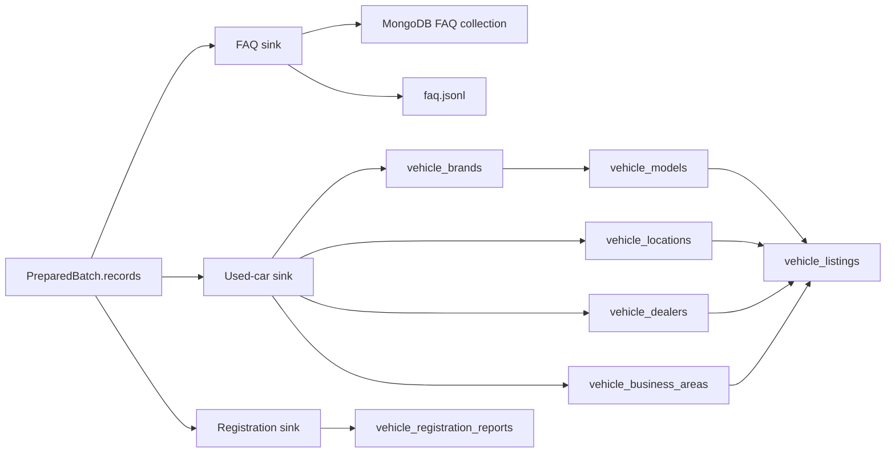

# `loading/` 내부 명세

## 책임

전처리 단계가 만든 준비 계약을 JSONL·MySQL·MongoDB에 저장하고, Upsert·transaction·quota·checkpoint·atomic file write 정책을 실행한다. Source endpoint, API key, HTML selector, 원천 응답 envelope는 알지 않는다.

## 파일·모듈

| 파일 | 모듈 | 담당 |
|---|---|---|
| `__init__.py` | `loading` | 적재 패키지 경계 |
| `common.py` | `loading.common` | 임시 파일 작성·fsync 후 교체하는 `atomic_write()` |
| `faq.py` | `loading.faq` | FAQ JSONL Upsert, MongoDB index 생성, `faq_id` 기준 Upsert |
| `usedcar.py` | `loading.usedcar` | 중고차 checkpoint, JSONL Upsert, 관계형 MySQL dimension/listing Upsert |
| `registration.py` | `loading.registration` | 등록현황 state, JSON/SQL quota ledger, JSONL/SQL Upsert |

## 모듈 흐름

## 핵심

- SQL 값은 문자열 조합이 아니라 parameterized query의 parameter로 전달한다.
- 중고차 SQL 적재 순서는 `brand → model → location → dealer → business_area parent/child → listing`이다.
- 중고차 참조 entity와 listing은 한 Batch transaction에서 처리하고, 실패하면 전체 rollback한다.
- `vehicle_listings`는 `model_id`만 보유하고 브랜드 관계는 `vehicle_models → vehicle_brands`로 해석한다.
- 업무영역의 부모는 `vehicle_business_areas.parent_business_area_id` self-FK로 표현하며 부모명을 listing에 중복 저장하지 않는다.
- 증분 중고차 record에서 빠진 값은 SQL Upsert의 `COALESCE`를 통해 기존 non-null 값을 보존한다.
- checkpoint 저장 시점은 pipeline이 결정하며, 성공한 적재 뒤에만 `CheckpointStore.save()`를 호출한다.
- 중고차·FAQ·등록현황은 각 Business Key 기준으로 재실행해도 중복을 생성하지 않는다.
- JSONL 및 checkpoint/state 파일은 `atomic_write()`로 완성된 파일만 교체한다.

## 외부 계약

### 입력

- 설정: `common.config.Settings`가 제공하는 SQL·MongoDB 접속 정보와 output/state 경로
- FAQ: `faq_id`, `content_hash`를 포함한 준비 document
- 중고차: `listing`과 `brand`, `model`, `location`, `dealer`, `business_area` 준비 aggregate
- 등록현황: `report_month`, `sido_name`, `sigungu_name`, `vehicle_type`, `usage_type`, `quantity`, `content_hash`

### 출력

- `JsonlUpsertSink`: `vehicle_listings.jsonl`과 `LoadStats`
- `JsonlFaqUpsertSink`: `faq.jsonl`과 `FaqLoadStats`
- `JsonlRegistrationUpsertSink`: `vehicle_registration_reports.jsonl`과 `RegistrationLoadStats`
- `SqlUpsertSink`: 중고차 관계형 테이블의 transaction Upsert
- `SqlRegistrationUpsertSink`: 등록현황 5차원 Business Key Upsert
- `MongoFaqUpsertSink`: `faq_id` unique index와 FAQ document Upsert
- `CheckpointStore`, `RegistrationStateStore`: 다음 실행을 위한 atomic JSON state
- `JsonQuotaLedger`, `SqlQuotaLedger`: 통계누리 일일 호출량 예약 및 잔여량

### Business Key

- 중고차: `listing.listing_id`
- FAQ: `faq_id`
- 등록현황: `(report_month, sido_name, sigungu_name, vehicle_type, usage_type)`
- quota: `(quota_date, api_name)`

### SQL 기준선

- 스키마 기준: `migrations/sql/V001__mvp_schema.sql`
- 중고차: 참조 entity 테이블과 `vehicle_listings`
- 등록현황: `vehicle_registration_reports`
- quota: `api_quota_usage`

## 기존 코드 호환

- 자동차등록 standalone pipeline의 `StateStore`는 `RegistrationStateStore`의 alias다.
- `JsonlRegistrationSink`는 `JsonlRegistrationUpsertSink`의 alias다.
- `registration.sink_for(settings, "json")` 호출을 유지하며, 통합 구조에서는 `"sql"`도 선택할 수 있다.
- 기존 `loading.mysql`·`loading.mongo`의 기능은 각각 `loading.usedcar`·`loading.faq`로 통합한다. SQL 관계형 분리와 Upsert 정책을 여러 파일에 중복하지 않는다.

## 의존성 경계

`loading`은 `common`과 `loading.common`만 사용한다. `collection`, `preprocessing`, `pipelines`, 외부 HTTP client를 import하지 않는다. `pymysql`과 `pymongo`는 해당 DB sink를 실제 선택할 때만 지연 import한다.
