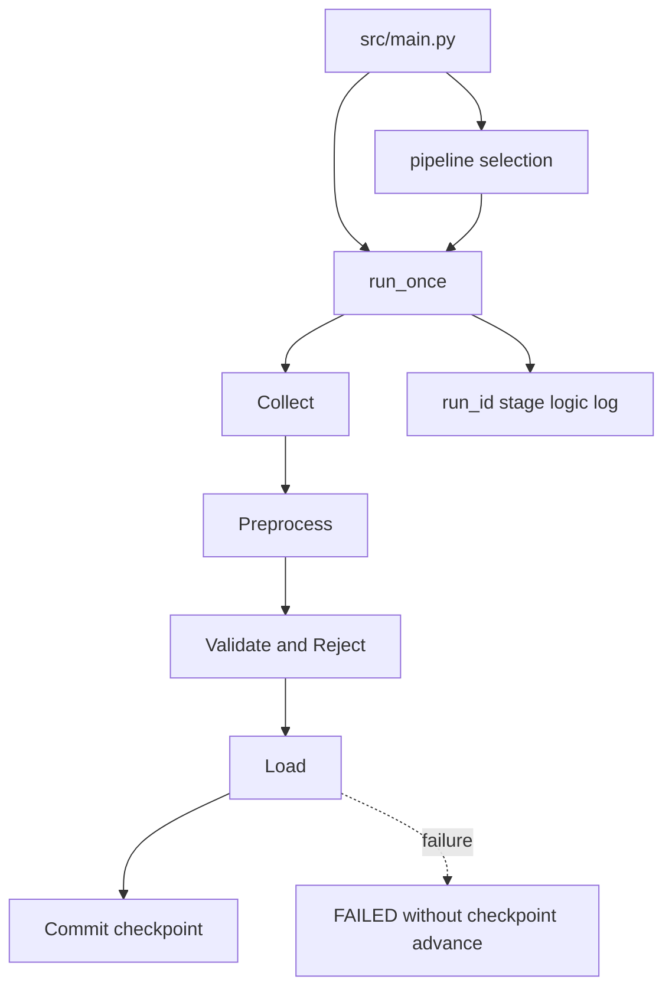

# `pipelines/` 내부 명세

## 책임

수집·전처리·적재를 로직별 실제 실행 단위로 조합한다. 각 모듈은 해당 source의 비즈니스 규칙·요구사항·Reject·checkpoint 정책을 소유하고 `run_once()`를 제공한다. 공통 실행 진입점은 [`src/main.py`](../main.py)이며, 이 패키지는 유일한 진입점이 아니다.

## 파일·모듈

| 파일 | 모듈 | 담당 |
|---|---|---|
| `__init__.py` | `pipelines` | pipeline 패키지 경계 |
| `faq.py` | `pipelines.faq` | FAQ allowlist·1초 간격·최대 2 page·page당 10문항, provenance, MongoDB·JSONL sink |
| `usedcar.py` | `pipelines.usedcar` | 초기 cursor·증분 changes, 1초/500건 정책, dataset epoch·checkpoint, used-car sink |
| `registration.py` | `pipelines.registration` | `form_id=5498`·`style_num=2`, 기준월 1회, quota, wide-to-long run |
| `../main.py` | `src.main` | `--pipeline` 선택, fixture/live profile, 공통 output, top-level run ID |

## 모듈 흐름

## 핵심

- 세 단계 패키지를 직접 조합하는 business run은 각 `pipelines.<logic>` 모듈이 소유하고, 공통 선택·실행은 `src/main.py`가 담당한다.
- 각 run은 `run_id`를 만들고 `Collect → Preprocess → Validate → Load` 순서로 로그를 남긴다.
- 적재 성공 전에는 checkpoint를 전진시키지 않는다.
- SQL sink를 선택하면 마지막 `pipeline_runs.status=SUCCESS`의 `progress_key`를 우선 checkpoint로 사용하고, SQL 성공 뒤 local JSON checkpoint를 fallback으로 저장한다.
- 전체 실행의 구조화 로그 `run_id`와 SQL `pipeline_runs`의 batch별 `run_id`는 분리하여 batch 성공 이력을 보존한다.
- 중고차 증분 page에 `high_water_seq`가 없으면 `incremental_contract_missing`으로 중단하여 source 기준 없는 증분 실행을 허용하지 않는다. 초기 cursor 적재에서 증분 기준이 끝까지 없으면 checkpoint를 남기지 않고 동일 오류로 종료한다.
- 중고차 `initial`은 cursor, `incremental`은 `after_seq` 기준이며 1초 간격과 500건 상한을 collector에 전달한다.
- 등록현황 run은 `start_dt=end_dt=YYYYMM`으로 논리적 API 호출 1회를 수행한다.
- FAQ run은 allowlist source만 사용하고 page 최대 2개, page당 질문 최대 10개, 요청 간격 최소 1초를 적용한다. 문서·정책 경계가 불명확하면 적재하지 않고 중단한다.
- 등록현황 run은 공식 `form_id=5498`, `style_num=2` 계약을 고정하고 기준월 하나만 요청한다. fixture와 live는 같은 response validator·transformer를 통과한다.
- 중고차 run은 source의 안정 식별자와 `dataset_epoch`를 보존하고, 마지막 성공 적재 page의 `high_water_seq` 또는 cursor만 checkpoint로 사용한다.

## 외부 계약

### 실행 입력

- 환경변수: `common.config.settings_from_env()`가 해석
- 구조화 로그: `common.logging_utils.JsonlLogger`가 기록하고 비밀값을 마스킹
- 공통 진입점: `python -m src.main --pipeline <faq|registration|usedcar|all>`
- profile: `--profile fixture|live` (fixture가 기본이며 live는 명시적으로 선택)
- 공통 CLI: `--once`, `--loop-interval-seconds`, `--fixture`, pipeline별 fixture, `--dry-run`, `--output-dir`
- `--profile live`는 기본적으로 회차 사이 60초를 기다리며 계속 실행한다. `--once`를 지정하면 1회만 실행하고 종료한다. `SIGINT`·`SIGTERM`은 진행 중인 회차를 마친 뒤 반복을 종료한다. fixture profile은 반복하지 않는다.
- 중고차: `--mode auto|initial|incremental`
- 등록현황: `--period YYYY-MM`
- FAQ: `--sink json|mongo`

### 실행 출력

`run_once()`는 `status`, `run_id`, `mode`, 수집·전처리·유효·Reject·Insert·Update·Unchanged count, `dry_run`, checkpoint 경로를 가진 JSON-serializable mapping을 반환한다. checkpoint가 없는 FAQ는 `checkpoint_path: null`을 반환한다. 실패 시 sanitized error code를 로그와 stderr에 남기고 `src/main.py`가 `FAILED`로 변환한다.

### 내부 계약

- collector → `CollectionEnvelope`
- transformer → `(valid_rows, rejected_rows)`
- pipeline → `PreparedBatch`
- sink → `LoadStats` 또는 pipeline별 확장 통계

## 의존성 경계

`pipelines`는 `common`, `collection`, `preprocessing`, `loading`을 모두 import할 수 있다. 반대로 stage package가 `pipelines`를 import하지 않도록 유지한다. SQL 문장과 HTML selector는 pipeline에 직접 작성하지 않는다. 내부 요구사항 기준은 다음 자료를 함께 검토한다.

- `http://43.203.233.157/docs`
- `https://praxolve.vercel.app/encore/mlops2026/day-22/encore.chapter1.vehicle-faq-ingestion-storage-workshop`
- `/Users/ahh/Downloads/site-reference/*`
