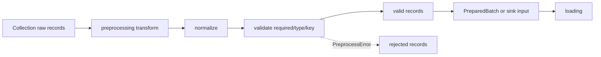
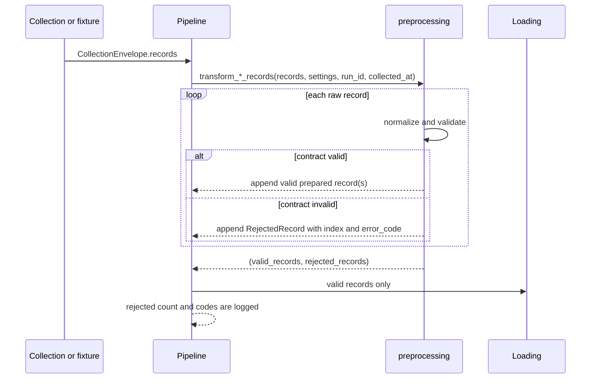

# `preprocessing/` 내부 명세

## 1. 책임과 적용 범위

`preprocessing`은 collection이 반환한 Raw record를 loading과 pipeline이 사용할 준비 계약으로 변환한다. 이 모듈은 값 정규화, 필수값·타입·Business Key 검증, content hash 생성, Reject 분리를 담당한다.

다음 작업은 이 모듈의 책임이 아니다.

- 네트워크 호출, HTTP retry, API pagination
- JSON/HTML 원문 수집과 source selector 해석
- DB 연결, SQL 문장 생성, MongoDB write, transaction
- checkpoint·quota·pipeline stage orchestration
- 누락값을 임의의 문자열이나 숫자로 채우는 보정

참고 폴더인 `/Users/ahh/project/mlo-01-p1-team3-a`는 과거 구현을 참고하기 위한 자료다. 실행·검수·통과의 근거는 현재 저장소의 `tests/`와 현재 commit으로 한정한다.

## 2. 파일·모듈

| 파일 | 모듈 | 주요 함수 | 담당 |
|---|---|---|---|
| `__init__.py` | `preprocessing` | 패키지 경계 | 전처리 패키지 경계 |
| `faq.py` | `preprocessing.faq` | `transform_faq_record(s)` | FAQ 텍스트·URL·날짜 정규화, `faq_id` fallback, license·attribution 검증, content hash |
| `usedcar.py` | `preprocessing.usedcar` | `transform_record(s)` | 중고차 scalar 정규화, 중첩 참조 entity 분리, 관계형 준비 aggregate, source event·hash·Reject |
| `registration.py` | `preprocessing.registration` | `transform_registration_row`, `transform_registration_records` | `formList` 행을 월·지역·차량구분·용도구분·수량 Row로 분해, source metric 보존 |

## 3. 모듈 위치와 시퀀스

전처리기는 같은 입력 계약을 사용하는 collection과 loading 사이에 위치한다. 각 변환기는 Raw record를 독립적으로 처리하며, 한 record의 오류가 같은 batch의 다른 record 처리를 중단시키지 않도록 valid와 rejected를 분리한다.





## 4. 공통 내부 계약

### 4.1 함수 입력

세 변환기는 collection이 만든 mapping iterable을 입력으로 받는다.

| 모듈 | 필수 실행 인자 | 입력 단위 |
|---|---|---|
| FAQ | `settings`, `run_id`, `collected_at` | FAQ 한 record |
| 중고차 | `settings`, `run_id`, `dataset_epoch` | listing 또는 change envelope 한 record |
| 등록현황 | `period`, `settings`, `run_id`, `collected_at` | `formList` 한 row |

`settings`는 `common.config.Settings`를 사용한다. 전처리기는 환경변수를 직접 읽지 않으며, 인자를 통해 전달된 실행 문맥만 사용한다.

### 4.2 반환 형식

모든 batch 변환기는 다음 tuple을 반환한다.

```text
(valid_records: list[dict], rejected_records: list[RejectedRecord])
```

| 모듈 | Reject 타입 | 보존하는 식별 정보 |
|---|---|---|
| FAQ | `FaqRejectedRecord` | `index`, `error_code`, `faq_id` |
| 중고차 | `RejectedRecord` | `index`, `error_code`, `record_id` |
| 등록현황 | `RegistrationRejectedRecord` | `index`, `error_code`, `sido_name`, `sigungu_name`, `vehicle_type`, `usage_type` |

단일 record 변환기가 `FaqPreprocessError`, `PreprocessError`, `RegistrationPreprocessError`를 발생시키면 batch 변환기가 해당 record를 rejected로 옮긴다. Reject된 record는 준비 데이터로 loading하지 않는다.

### 4.3 공통 metadata와 시간 표현

- `run_id`은 호출자가 제공한 실행 문맥을 그대로 보존한다.
- `collected_at`과 원천 datetime은 `common.time_utils.format_utc_datetime()`으로 `YYYY-MM-DDTHH:MM:SS+00:00`으로 정규화한다.
- 날짜만 의미하는 source 값은 `common.time_utils.format_utc_date()`로 `YYYY-MM-DD`로 표준화한다.
- `created_at`, `updated_at`은 DB 적재 시각이라는 상위 계약을 따른다. 현재 전처리 출력 호환성을 위해 필드를 전달하지만, 적재 시각 생성·갱신 책임은 loading에 둔다.
- 시간대 없는 중고차 datetime은 UTC로 해석하고, 시간대가 있으면 UTC로 변환한다.
- 입력 source 날짜가 형식 또는 달력상 유효성을 만족하지 않으면 임의 보정하지 않고 Reject한다.

## 5. FAQ 계약

### 5.1 외부 입력 계약

FAQ collection record는 다음 field를 사용한다.

| 입력 field | 필수 | 규칙 |
|---|---:|---|
| `faq_id` | 아니오 | 없으면 `source_url`과 정규화된 `question`으로 SHA-256 fallback ID 생성 |
| `question` | 예 | HTML entity·control character·연속 whitespace를 정규화한 뒤 비어 있지 않아야 함 |
| `answer` | 예 | `question`과 동일한 text 정규화 적용 |
| `brand` | 예 | 정규화 후 비어 있지 않아야 함 |
| `category` | 예 | 정규화 후 비어 있지 않아야 함 |
| `source_url` | 예 | 절대 `http` 또는 `https` URL. fragment는 제거 |
| `reviewed_at` | 예 | `YYYY-MM-DD` 또는 `YYYYMMDD` 날짜 전용 형식. ISO datetime은 허용하지 않음 |
| `license` | 조건부 | record 값이 없으면 `Settings.faq_license` 사용 |
| `attribution` | 조건부 | record 값이 없으면 `Settings.faq_attribution` 사용 |

`license` 또는 `attribution`이 record와 Settings 양쪽 모두에 없으면 Reject한다. 날짜는 정규식만 통과한 값도 실제 달력 날짜인지 검증한다. 예를 들어 `2026-02-31`은 거부한다.

### 5.2 내부 출력 계약

`transform_faq_record()`는 다음 canonical mapping을 반환한다.

```text
{
  faq_id,
  question,
  answer,
  brand,
  category,
  source_url,
  source_updated_at,
  license,
  attribution,
  content_hash,
  is_active,
  run_id,
  collected_at,
  created_at,
  updated_at,
}
```

`reviewed_at`은 Raw 입력 field이고, 준비 계약의 canonical source timestamp field는 `source_updated_at`이다. 이는 중고차 준비 계약과 loading의 source timestamp 명명과 맞추기 위한 결정이다. 하위 계층은 `source_updated_at`을 사용하며, 동일 의미의 `reviewed_at`을 준비 출력에 중복 생성하지 않는다.

`content_hash`는 다음 정규화된 안정 field만으로 계산한다.

```text
faq_id, question, answer, brand, category,
source_url, source_updated_at, license, attribution
```

`run_id`, `collected_at`, `created_at`, `updated_at`, `is_active`는 실행·상태 metadata이므로 hash 계산 대상이 아니다. 같은 내용의 record를 다른 run에서 처리해도 content hash는 같아야 한다.

### 5.3 FAQ 처리 순서

1. text와 URL을 정규화한다.
2. question, answer, brand, category, source URL을 검증한다.
3. `faq_id`가 없으면 stable fallback ID를 생성한다.
4. `reviewed_at`을 UTC 자정의 `source_updated_at`으로 변환한다.
5. record 값 또는 Settings에서 license와 attribution을 확정한다.
6. 안정 field로 content hash를 계산한다.
7. 실행 metadata를 추가하여 valid document를 반환한다.

## 6. 중고차 계약

### 6.1 외부 입력 계약

중고차 초기 listing 또는 증분 change record를 입력으로 받는다. 증분 envelope는 `record`, `vehicle`, `car`, `payload`, `entity`, `data` 중 허용된 nested object를 unwrap하며, 상위 `eventId`와 `seq`는 각각 `_event_id`, `_change_seq`로 보존한다.

| 입력 영역 | 필수 조건 |
|---|---|
| listing identifier | `id` 또는 `listingNumber` 중 하나 |
| `brand`, `model`, `location` | object가 존재하면 stable `id` 필수 |
| `dealer` | object가 존재하면 stable `code` 필수 |
| `businessArea` | object가 존재하면 stable `id` 필수. parent가 있으면 parent `id` 필수 |
| numeric fields | 정수 또는 정수로 해석 가능한 문자열. 음수·boolean은 Reject |
| `status` | 존재하면 `AVAILABLE`, `RESERVED`, `SOLD` 중 하나로 대문자 표준화 |
| `createdAt`, `updatedAt` | 존재하면 ISO 8601 datetime |
| `firstRegistration` | 존재하면 `YYYY-MM-DD` 날짜 |

중첩 object가 존재하는데 stable ID가 없으면 임의 문자열을 생성하지 않고 Reject한다. `price`가 object이면 `amount`, 그 다음 `value`를 사용한다.

### 6.2 내부 출력 계약

반환 aggregate는 다음 다섯 reference entity와 listing을 가진다.

```text
{
  listing: {...},
  brand: {...} | None,
  model: {...} | None,
  location: {...} | None,
  dealer: {...} | None,
  business_area: {...} | None,
}
```

`listing`의 핵심 field는 다음과 같다.

```text
listing_id, listing_number, title, description, trim,
model_id, location_id, dealer_code, business_area_id,
model_year, first_registration, mileage_km, price_krw,
currency, source_status, fuel_type, transmission, color,
displacement_cc, accident_count, owner_change_count,
inspection_status, source_event_id, source_sequence,
content_hash, source_url, source_created_at, source_updated_at,
run_id, collected_at, created_at, updated_at
```

reference entity의 관계 ID는 다음 규칙을 따른다.

- `model.brand_id`는 `brand.brand_id`를 가리킨다.
- `listing.model_id`, `listing.location_id`, `listing.dealer_code`, `listing.business_area_id`는 각 entity를 가리킨다.
- `business_area.parent`는 parent ID·name·slug를 가진다.
- SQL table 순서와 Upsert는 loading의 책임이며 preprocessing은 aggregate만 반환한다.

### 6.3 중고차 처리 순서

1. change envelope를 unwrap하고 event ID·sequence를 보존한다.
2. listing ID를 확인한다.
3. nested entity의 object 형식과 stable ID를 검증한다.
4. scalar, enum, number, date, datetime을 표준화한다.
5. brand·model·location·dealer·business area entity를 생성한다.
6. listing reference와 source URL을 생성한다.
7. 안정 field로 listing content hash를 계산한다.
8. 하나의 prepared aggregate로 반환한다.

## 7. 등록현황 계약

### 7.1 외부 입력 계약

`formList`의 한 row는 지역 정보와 차량구분·용도구분별 metric을 가진다.

| 입력 영역 | 허용 형식 |
|---|---|
| `period` | `YYYY-MM`, `YYYYMM` 또는 구분자가 포함된 동일 숫자 표현 |
| 기준일 field | `월`, `기준월`, `date`, `reference_month`, `referenceDate` 등. 없으면 함수의 `period` 사용 |
| 지역 | 시도명과 시군구명. 한 쪽이라도 없으면 Reject |
| metric | `차량구분>용도구분` key. source 순서를 보존 |
| 직접 fixture shape | `vehicle_type`, `usage_type`, `quantity` 또는 동등 alias |
| quantity | 정수, comma가 포함된 정수 문자열, `-` 또는 `–`는 NULL |

현재 공식 API row의 source metric은 최대 20개라는 입력 계약을 가진다. 변환기는 source 순서의 metric을 개별 row로 보존하며, 값을 임의로 합치거나 잘라내지 않는다. 20개를 초과하는 원문은 source 계약 위반 여부를 별도로 확인해야 하며, preprocessing은 조용히 truncation하지 않는다.

### 7.2 내부 출력과 Business Key

각 metric은 다음 mapping 한 건으로 변환된다.

```text
{
  report_month,       # YYYY-MM-01
  sido_name,
  sigungu_name,
  vehicle_type,
  usage_type,
  quantity,           # non-negative integer or NULL
  source_name,        # molit_car_registration
  source_url,
  run_id,
  collected_at,
  created_at,
  updated_at,
  content_hash,
}
```

Business Key는 다음 다섯 field의 조합이다.

```text
(report_month, sido_name, sigungu_name, vehicle_type, usage_type)
```

한 raw row에서 metric 하나가 잘못되면 해당 raw row 전체를 Reject하며, partial valid row를 반환하지 않는다.

### 7.3 등록현황 처리 순서

1. period와 row 기준일을 `YYYY-MM-01`로 표준화한다.
2. 시도명과 시군구명을 확인한다.
3. composite metric 또는 direct fixture shape을 찾는다.
4. metric key를 차량구분과 용도구분으로 분리한다.
5. quantity를 정수·NULL로 표준화하고 음수·boolean·비정수 값을 Reject한다.
6. Business Key를 포함한 stable mapping을 생성한다.
7. 각 output row의 content hash와 실행 metadata를 추가한다.

## 8. 오류와 안정성 계약

| 오류 타입 | 발생 모듈 | 의미 |
|---|---|---|
| `FaqPreprocessError` | FAQ | 필수 FAQ field, URL, 날짜, license/attribution 또는 hash 입력 계약 위반 |
| `PreprocessError` | 중고차 | listing ID, nested relation, scalar, enum, date/datetime 계약 위반 |
| `RegistrationPreprocessError` | 등록현황 | period, location, metric 또는 quantity 계약 위반 |

오류 code는 batch Reject의 `error_code`로 보존한다. 오류 메시지와 출력 record에는 API key, DB password, MongoDB URI 같은 비밀정보를 포함하지 않는다.

정상 record의 처리 실패가 다른 record의 valid 결과를 제거하지 않도록 batch 변환기는 record 단위로 예외를 격리한다. 단, 등록현황 한 raw row 내부의 metric 중 하나가 실패하면 그 raw row의 partial rows는 반환하지 않는다.

## 9. 의존성 경계

전처리 모듈은 `common.config.Settings`와 `common.time_utils`만 외부 프로젝트 모듈로 사용한다. 다음 import는 금지한다.

```text
collection
loading
pipelines
HTTP client
SQL driver
MongoDB driver
```

전처리 모듈은 pure transformation 경계를 유지하므로 같은 입력과 실행 인자를 사용하면 네트워크·DB 상태에 의존하지 않는 결과를 반환해야 한다. 현재 대상 저장소의 AST 경계 테스트가 이 조건을 확인한다.

## 10. 단위 테스트와 완료 기준

테스트는 참고 폴더가 아니라 현재 저장소의 `tests/`에서 실행한다.

```text
python -m pytest -q
```

pytest 설정의 `testpaths=tests`로 `ref/` 내부 테스트가 대상 테스트 수집과 import 경계에 개입하지 않도록 한다. 참고 폴더의 테스트 통과 결과는 대상 모듈의 구현 통과 근거로 사용하지 않는다.

preprocessing 모듈 단위 테스트는 다음을 포함해야 한다.

- FAQ 정상 정규화, fallback ID, 날짜 형식, 필수값 Reject, hash와 metadata
- 중고차 change envelope, nested entity 관계, scalar/date/enum 검증, Reject
- 등록현황 composite metric, 직접 fixture shape, quantity 정규화, Business Key, Reject
- `valid_records`와 `rejected_records` 분리
- stage·외부 driver import 금지 경계

이 테스트의 통과는 preprocessing 모듈의 정상 동작을 의미한다. collection → preprocessing → loading → DB를 포함한 전체 pipeline의 정상 동작을 보장하지 않는다. 전체 pipeline 검증은 각 pipeline 및 loading의 별도 테스트와 실제 또는 격리된 sink 검증으로 수행한다.
